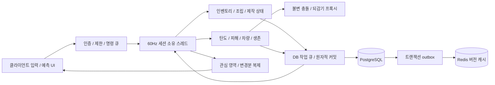
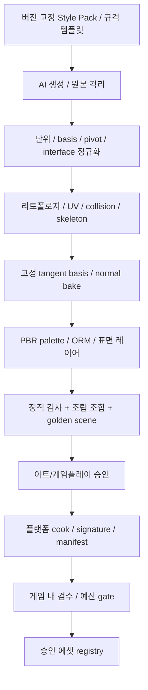

# 20인 심리스 오픈 월드 좀비 생존 게임 — 시스템 아키텍처 및 기술 명세

문서 버전: 1.0 · 작성 기준일: 2026-09-07 · 대상: PC / 현세대 콘솔 · C++20 / 전용 서버

이 문서는 구현 계약이다. `MUST`는 빌드·출시 차단 조건, `SHOULD`는 변경 근거를 기록해야 하는 기본 정책이다. **수치 예산, 밸런스 계수, 허용 오차는 본 프로젝트의 제안값이며 실측 결과나 현실의 총기·방탄·의학 인증값이 아니다.** 코드는 엔진 독립 참조 구조와 의사코드이며, 완성된 게임 구현이나 성능 보증을 뜻하지 않는다.

## 0. 기술 결정과 보증 범위

| 항목 | 채택 규격 | 근거 / 제한 |
|---|---|---|
| 엔진 | UE5, C++20 게임플레이 코어, Chaos 강체·접촉, World Partition | 선택한 엔진 마이너·소스 commit·콘솔 SDK·cook 버전을 릴리스 manifest에 고정 |
| 세션 | 4,000 × 4,000m, 최대 20인, 하나의 전용 서버가 월드 상태 소유 | 셀 경계는 스트리밍 경계이며 서버 권한 이전 경계가 아님 |
| 서버 | Linux x86-64 기준, 고정 60Hz | 8개 전용 물리 코어 / 32GiB RAM / NVMe를 초기 측정 환경으로 제안; 실제 SKU 확정은 부하 시험 후 |
| 클라이언트 | Windows PC, PS5 / Xbox Series급을 가정, 60fps 목표 | 공개되지 않은 콘솔 예산·인증 조건을 추정하지 않으며 각 SDK 환경에서 별도 검증 |
| 총알 | 자체 SIMD 탄도 적분 + 자체 단순 충돌 프록시 질의 | Chaos/PhysX 발사체 액터 사용 안 함; 수류탄·물체 낙하는 Chaos |
| 차량 | 자체 휠 접지·타이어·동력계 + Chaos 단일 차체 강체 | PhysX Vehicle을 UE에 추가 통합하지 않음; 차량 충돌 엔진을 별도로 만들지 않음 |
| 저장 | PostgreSQL이 영속 권위, Redis는 버전 있는 캐시 | Redis의 유실·재시작이 소유권을 변경할 수 없음 |
| 아이템 원자성 | 같은 DB: 예약 후 하나의 SQL 트랜잭션 | 애플리케이션의 두 단계와 분산 DB의 진짜 2PC를 구분 |
| 진짜 2PC | 둘 이상의 영속 Resource Manager를 넘는 이동에 A.7 규격 적용 | 현재 단일 월드 경로에는 불필요하지만 요청 범위에 따라 프로토콜·복구까지 완전 정의 |
| 에셋 통일성 | 버전 고정 style pack + 자동 게이트 + 아트 승인 | 자동 검사만으로 미학적 완전 일관성을 수학적으로 보증하지 않음 |
| 0.001mm 소켓 | 정규 소켓의 제작용 로컬 데이터 정밀도 | 전체 4km 월드의 float 메시·물리·렌더 결과에 같은 오차를 약속하지 않음 |

UE World Partition은 스트리밍 소스와 셀을 기준으로 로딩을 관리한다. 이 기능을 사용하되 저장·네트워크 관심 영역·AI 활성화는 별도 정책으로 둔다. [Epic World Partition](https://dev.epicgames.com/documentation/en-us/unreal-engine/world-partition-in-unreal-engine)

읽는 순서: 공통 계약 → A 인벤토리/거래 → B 총기/탄도 → C 방어구/생체 → D 차량 → E 제작/영속화 → F 에셋 → 검수 기준.

## 1. 시스템 소유권, 월드, 실행 순서



### 1.1 실제 모듈 경계

| 모듈 | 소유 데이터 | 외부에 제공하는 계약 |
|---|---|---|
| Catalog | 변경 불가 Item/Part/Recipe/Material/Socket 정의 | ID 조회, 호환성 검사, 콘텐츠 해시 |
| Inventory | 아이템, 컨테이너 트리, 배치, 예약 | Move/Split/Merge/Consume/Attach 명령 |
| Assembly | 공통 부모-소켓 관계, 총기/방어구/차량 계산 결과 | ValidateBuild, RebuildDerivedState |
| Combat | 발사, 탄도, 역사 충돌, 피해 사건 | FireIntent → ShotAccepted / DamageEvent |
| Survival | 생체·대사·환경 노출 | 누적 생존 상태, 상태 전이 사건 |
| Vehicle | 엔진/휠/차체 상태, 운전 입력 히스토리 | 입력 적용, 상태 스냅샷 |
| Crafting | 작업 큐, escrow, 작업대 상태 | Start/Pause/Resume/Cancel/Collect |
| World | 설치물, 구조 지지, 전력 연결, 셀 상태 | 설치·파괴·언로드 가능 여부 |
| Persistence | 거래·journal·snapshot·outbox | durable 결과, 복구 및 fencing |
| AssetCook | 에셋 검증, 고정 포맷 cook | 서명된 콘텐츠 묶음과 검수 보고서 |

하나의 아이템을 Inventory와 Assembly 양쪽에서 복제 보유하지 않는다. 부품 장착은 같은 `ItemId`의 위치를 `Grid`에서 `Socket`으로 옮기는 행위다. 렌더 컴포넌트는 상태의 뷰다. 가방 안의 못 100개에 Actor 100개를 만들지 않는다.

### 1.2 공간 단위와 스트리밍

- 논리 셀은 125m 정사각형, 32×32=1,024개. World Partition의 실제 렌더 셀 크기는 플랫폼 cook 프로파일로 별도 조정한다.
- 서버는 전 월드의 가벼운 정적 탄도 BVH·충돌 메타데이터·영속 인덱스를 유지한다. 고비용 엔진 액터와 AI만 활성 구역에서 생성한다.
- 게임플레이 활성 반경 초기값: 도보 300m, 운전 600m. 실제 수요는 20인의 영역 합집합으로 계산한다. 한 명의 중심만 사용하지 않는다.
- 차량 선행 로딩 거리는 `v_max × (p99_load_time + safety_time) + braking_distance`. 45m/s, 2초 로딩, 1초 여유만으로도 135m가 필요하며 제동 거리는 추가한다.
- 셀은 플레이어·차량·충돌 중 발사체·진행 중 거래·작업·파괴 사건의 pin을 가진다. pin과 미완료 저장이 남으면 해제하지 않는다.
- 스트리밍 실패 시 서버 충돌은 유지한다. 차량을 로딩되지 않은 낭떠러지로 진입시키지 않고 경계 전에 감속·정지시킨다.
- 2km 이상 저격 지원을 위해 먼 정적 충돌을 클라이언트 렌더 로딩에 종속시키지 않는다. 최대 발사체 사거리 제안은 2,500m, 수명 6초이며 탄약별로 더 짧게 설정할 수 있다.

UE의 Large World Coordinates는 넓은 월드 정밀도를 개선하지만 프로젝트의 소켓 정밀도 검사를 대신하지 않는다. [Epic Large World Coordinates](https://dev.epicgames.com/documentation/en-us/unreal-engine/large-world-coordinates-in-unreal-engine-5)

### 1.3 한 틱의 순서와 동시성

1. 인증된 입력 큐 및 이전 틱 DB 완료 결과를 읽는다. 중복·오래된 입력을 제거한다.
2. durable 완료된 거래를 메모리에 한 번 적용하고 해당 컨테이너 예약을 해제한다.
3. 소유 스레드에서 조립·아이템 명령을 검증하고 불변 write-set을 만들어 DB worker로 보낸다.
4. 이동 입력과 차량 힘을 계산한다. Chaos 60Hz를 실행하며 접촉 결과를 틱 경계에서 수집한다.
5. 실제 서버 포즈를 바탕으로 히트박스/플레이트/문/차량 역사 프록시를 기록한다.
6. 탄도 worker가 불변 역사 프록시를 읽어 결과 버퍼에 쓴다. `(effectiveTick, fraction, shotId, contactIndex)` 순으로 피해를 합친다.
7. 해당 주기의 생체·제작·전력·AI를 업데이트한다. 즉시 출혈/사망/파괴 전이는 같은 틱 사건으로 반영한다.
8. 복제 스냅샷과 dirty 묶음을 만들고 다음 틱으로 넘어간다.

worker는 UObject나 소유 맵을 직접 변경하지 않는다. job 입력은 핸들+generation 또는 불변 복사본이다. 비동기 결과의 `worldEpoch / stateRevision`이 다르면 버리거나 재계산한다. DB I/O·에셋 로드·압축을 게임 스레드에서 기다리지 않는다.

| 처리 | 주기 | 잠든 상태 |
|---|---:|---|
| 이동/차체/접촉/피해 처리 | 60Hz | 정지 차체 sleep |
| 탄도 적분 | 240Hz(서버 틱당 4 substep) | 활성 탄환만 |
| 출혈/스태미나 | 10Hz | 유휴 회복은 같은 게임 시간 적분 |
| 체온/칼로리/감염 | 1Hz | 제한된 경과 시간 적분 |
| 작업대/전력 | 10Hz | 이벤트 기반 활성화 |
| 좀비 근거리 이동 | 30Hz, 접촉은 60Hz | 먼 무리 집계 1Hz |
| 좀비 의사결정/청각 | 5~10Hz | 활성 사건 주변만 |
| 근접 복제/원거리 복제 | 20 / 5Hz | dormancy, 변경 시 갱신 |

### 1.4 16.67ms CPU 예산과 부하 한계

아래 수치는 **서버 틱 critical path의 목표 벽시계 시간**이다. 병렬 job의 코어 사용량과 단순 합산하지 않는다.

| 구간 | p95 예산 |
|---|---:|
| 입력/명령/거래 적용 | 0.8ms |
| 플레이어 이동 | 1.0ms |
| 20대 활성 차량 + Chaos 접촉 | 3.0ms |
| 탄도 + 역사 질의 + 피해 | 2.0ms |
| 좀비 | 2.5ms |
| 생존/작업대/구조/전력 | 0.8ms |
| 관심 영역/직렬화 | 1.2ms |
| 스트리밍 결과/기타 | 0.7ms |
| 합계 / 남는 여유 | 12.0ms / 4.67ms |

기준 장면: 20인, 움직이는 차량 20대(최대 6휠), 근거리 좀비 200체, 저빈도 활성 좀비 600체, 살아 있는 탄도 경로 2,048개, 설치물 10,000개, 영속 아이템 200,000개. 각각 독립 최대치가 아니라 이 조합으로 시험한다. 샷건 pellet도 탄도 경로에 포함한다. 콘텐츠 fire-rate/펠릿/TTL 조합이 한계를 넘으면 콘텐츠 빌드를 실패시키고, 런타임에서는 입장·발사 수락 전에 자원을 예약한다. 이미 수락한 탄환을 비용 때문에 삭제하지 않는다.

과부하 시 원거리 AI·시각 사건 빈도부터 줄인다. 소유권 검증, 총알 접촉, 서버 시간의 진행량을 생략하지 않는다. 지속 p99>16.67ms이면 출시 게이트 실패다. 성능 부족을 감춘 가변 dt는 허용하지 않는다.

## 2. 공통 C++ 메모리·단위·네트워크 계약

### 2.1 단위와 핸들

SI 물리 단위는 m, s, kg, N, J, K다. UE 경계에서 길이×100을 적용하며 힘·토크·관성은 차원에 맞게 변환한다. 관성 `kg·m² → kg·cm²`는 ×10,000이다. 영속 수량은 정수다: 질량 g, 부피 mL, 액체 mL, 시간 tick 또는 ms. 무게 제한 UI는 kg로 표시하지만 실제 합산은 질량이다.

`ItemId/EntityId`는 서버가 생성하는 128bit 영속 ID다. 재접속·스트리밍으로 바뀌지 않는다. 네트워크에서는 연결별 32bit NetId와 16bit generation을 쓴다. generation 순환 전 ID를 폐기하고, 영속 ID를 위치나 메모리 주소에서 만들지 않는다. 정의 ID는 cook manifest 내 32bit ID이고, 라이브 업데이트에서 재사용하지 않는다.

SQL 매핑 계약: 일반 definition ID는 1..INT32_MAX, u64로 다루는 영속 revision/sequence는 0..INT64_MAX로 제한한다. 0은 해당 필드에서 명시한 경우에만 none sentinel이다. materialId/로컬 protection zone의 compact 인덱스는 0..65535이며 cook 시 범위를 검사한다. 네트워크의 16bit zoneId는 manifest의 로컬 매핑이지 전역 32bit ID의 단순 truncation이 아니다.

```cpp
#include <cstdint>
#include <cstddef>
#include <type_traits>
struct Id128 { std::uint64_t hi, lo; };          // 16B, align 8
struct Handle { std::uint32_t index, generation; }; // 8B
struct Vec3f { float x, y, z; };                // 12B
struct Quatf { float x, y, z, w; };             // 16B
struct alignas(8) ItemState {
    Id128 id;                                  // 0..15
    std::uint64_t revision;                     // 16..23
    std::uint32_t defId, quantity;              // 24..31
    std::uint32_t extraIndex, flags;            // 32..39
    std::uint16_t durability, contamination;    // 40..43, UNORM16
    std::uint16_t wetness, temperatureOffset;   // 44..47
    std::uint64_t birthEvent;                   // 48..55
    std::uint64_t reservedBy;                   // 56..63, runtime tx handle
};
static_assert(sizeof(ItemState) == 64);
static_assert(offsetof(ItemState, revision) == 16);
static_assert(std::is_trivially_copyable_v<ItemState>);
```

`durability/65535`는 상태 비율이며 내구도 최대치·재료 강도와 다르다. `contamination`은 혼합 독성의 UI 대표치이며 실제 감염·화학·방사성 노출은 별도 성분 버퍼가 관리한다. 온도는 `(temperatureOffset / 100) - 100` °C로 정의한다(-100~555.35°C); 더 넓은 범위가 필요한 설비는 전용 float K를 사용한다. `extraIndex=UINT32_MAX`는 확장 없음이다. 확장 버퍼는 세대 핸들로 관리하거나 ItemState 수명 동안 슬롯을 재사용하지 않는다.

**위 레이아웃은 지원 C++ ABI에 대한 검증 대상이며 wire 포맷이 아니다.** 포인터·`bool`·`size_t`·enum의 암묵 크기·`USTRUCT` padding을 전송하지 않는다. `#pragma pack(1)`로 hot state를 압축하지 않는다. wire는 필드별 little-endian serializer가 담당하고 역직렬화 전에 길이를 검사한다. 저장에는 별도 `schemaVersion`을 사용한다.

### 2.2 패킷 운송과 공통 머리말

플랫폼/엔진의 검증된 인증·암호화 transport를 사용한다. 직접 암호 알고리즘을 구현하지 않는다. 연결 인증을 계정·세션·플랫폼 ticket과 결합하며 서버-DB 통신도 TLS 및 최소 권한을 적용한다. 인증된 클라이언트도 모든 게임 필드를 위조할 수 있다고 가정한다.

| 공통 헤더 필드 | 바이트 | 의미 |
|---|---:|---|
| protocolVersion / messageType | 2 / 2 | 미지원 버전 즉시 거절 |
| worldEpoch | 8 | 재시작·권한 교체 fencing |
| sequence / ackSequence / ackBits | 4 / 4 / 4 | 패킷 중복/손실 추적; 영속 idempotency 대체 불가 |
| senderTick | 4 | 래핑 비교 사용, 장기 저장에는 64bit tick |
| payloadBytes / flags | 2 / 2 | 전체 헤더 32B |

보안 transport 헤더·인증 태그는 위 32B 밖이다. 애플리케이션 데이터그램 목표는 1,200B 이하이며 실제 path MTU에서 transport 비용을 빼 검증한다. 큰 스냅샷은 64KiB 이하 페이지로 나누어 reliable stream으로 보내고 페이지별 `(snapshotId, page, pageCount, checksum)`을 검증한다. 전체 재조립 상한은 연결당 2MiB다. 작은 거래 ACK가 대형 에셋/스냅샷 전송 뒤에 막히지 않게 채널을 분리한다.

| 채널 | 순서/신뢰성 | 예 |
|---|---|---|
| Control | reliable ordered | 접속, NetId 매핑, 장착 manifest |
| Transaction | reliable ordered, requestId 재시도 | 아이템·제작·설치 |
| Input | unreliable sequenced, 최근 3입력 중복 탑재 | 이동/차량/발사 intent |
| State | unreliable sequenced, ACK된 baseline 기준 delta | 위치·생체·차량 |
| FX | unreliable, eventId dedupe | 먼 총성·파편·타격 VFX |

입력은 한 사람의 계정에서 최대 60개/초, 인벤토리 명령은 10개/초·burst 20, 상호작용 범위 2.5m를 초기값으로 둔다. 연결당 outstanding 거래 최대 8개, 같은 아이템에 의존하는 명령은 직렬화한다. 범위·LOS·접근 권한·기절/사망·작업 상태·epoch·revision·수량·정수 overflow를 서버가 검증한다. 전역·계정·컨테이너별 제한을 함께 사용한다.

### 2.3 관심 영역과 치트 표면

컨테이너 내용은 유효한 열람 lease를 가진 플레이어만 받는다. 멀리 있는 플레이어의 가방 내용, 미발견 상자의 loot seed, 모든 적 위치를 일괄 송신하지 않는다. 접근성 검사 실패 시 `NotAccessible`로 응답하여 내부 소유자 정보를 노출하지 않는다. 총소리를 들었다고 발사자의 정확한 인벤토리를 보내지 않는다.

관심 영역은 거리+공간 셀+가청 사건+직접 관측으로 구성한다. visibility 갱신에는 히스테리시스를 적용해 출입 시 깜빡임을 막는다. 소유자 UI 상태·거래 ACK·가까운 공격자·차량 운전자 상태가 최우선이며 원거리 장식이 후순위다. 악성 입력은 거절하고 계측하되 한 번의 지연·포즈 오차만으로 자동 제재하지 않는다.

네트워크 목표: client uplink 평균 ≤32KiB/s, downlink 평균 ≤128KiB/s, 전투 p95 ≤256KiB/s/인. 20인 평균 128KiB/s는 약 2.5MiB/s(약 21Mbit/s) 서버 송신이며 transport/재전송 여유 30%를 추가한다. 실제 relevance 분포와 full snapshot burst로 검증한다.

## A. 심층 파밍, 인벤토리와 ACID 거래

### A.1 정의와 동적 상태의 분리

```cpp
struct ItemDef {
    std::uint32_t id, massG, outerVolumeMl, maxStack;
    std::uint16_t gridW, gridH, classId, materialId;
    std::uint32_t containerDefId, partDefId, assetId, flags;
}; // 40B: 불변 catalog, 공통 질량은 여기에만 저장
struct alignas(8) ContainerState {
    Id128 id, ownerItem;                         // 0..31; root면 ownerItem=0
    std::uint64_t revision;                      // 32..39
    std::uint64_t subtreeMassG;                  // 40..47, 자기 껍질 제외
    std::uint32_t usedVolumeMl, capacityMl;       // 48..55
    std::uint16_t width, height, entryCount;      // 56..61
    std::uint8_t depth, flags;                   // 62..63
};
struct Placement {
    Id128 item, container;                       // 32B
    std::uint32_t socketId;                      // 32..35; grid면 0
    std::uint16_t x, y;                          // 36..39
    std::uint8_t rotation, kind;                 // 40..41
    std::uint16_t reserved;                      // 42..43, 반드시 0
    std::uint32_t ordinal;                       // 44..47
};
static_assert(sizeof(ItemDef) == 40);
static_assert(sizeof(ContainerState) == 64);
static_assert(sizeof(Placement) == 48);
```

`kind`: Grid=0, Slot=1, Socket=2, Escrow=3, World=4. 바닥 아이템도 해당 월드 셀의 논리 컨테이너에 속한다. 차량 트렁크·갑옷 주머니는 차량/갑옷 아이템의 owned container이며, 각 소켓도 용량 1의 논리 위치로 취급한다. 손·장전실·탄창 내부·시체 역시 명시적 위치다. Actor를 삭제했다고 아이템 행을 삭제하지 않는다.

그리드 최대 32×32, 행당 `uint32_t` 점유 비트맵 32개=128B. `(w,h)` 또는 회전 시 `(h,w)`의 직사각형 footprint만 허용한다. `x+w≤width`, `y+h≤height`를 넓은 정수형으로 검사한다. w=32이면 mask는 `UINT32_MAX`; `1u<<32`는 금지한다. grid→grid 교환은 두 원본을 모두 임시 제거한 scratch bitmap에서 검증한다.

비정형 다각형 아이템 packing은 초판 범위에 필요하지 않다. 총기 개머리판 접기처럼 footprint가 달라지는 상태는 catalog에 명시한다. 공간이 부족하면 접기 해제·부착 명령을 거절한다.

### A.2 트리 불변식과 무게/부피

1. 살아 있는 `ItemId`는 정확히 하나의 Placement를 갖는다. tombstone 아이템은 활성 Placement가 없다.
2. 하나의 container는 root이거나 정확히 하나의 ownerItem을 갖는다. ownerItem은 다른 container에 배치된다.
3. 트리에 cycle이 없으며 owned-container 중첩 깊이는 최대 4, 한 root의 자손 아이템은 최대 1,024, 직접 자식은 최대 256이다.
4. 자기 자신·자손으로 이동하거나 탈것을 자기 트렁크에 넣을 수 없다. 클래스/소켓/크기/소유 관계를 모두 검사한다.
5. 컨테이너를 옮기면 그 자손의 접근 권한과 root 질량이 함께 바뀐다. 자손을 임시로 바닥에 복제하지 않는다.
6. 질량·부피·수량의 합은 `uint64_t` checked arithmetic으로 계산한다. 입력을 clamp해 승인하지 말고 범위 위반으로 거절한다.

`M(item)=massG(def)×quantity + liquidMass + Σ M(children)`.

가방의 내부 부피와 외부 점유 부피는 다르다. 외부 컨테이너의 `usedVolume`에는 가방의 **외부 envelope** 한 번만 더한다. 안의 파우치 부피를 외부에서 다시 더하지 않는다. 유연 가방은 catalog의 `emptyEnvelope + packedVolume×compressionFactor`를 사용하며 압축계수의 최솟값을 정해 무한 수납을 막는다. 질량은 항상 모든 자손을 포함한다. slot/grid/부피/질량 제한은 동시에 만족해야 한다.

stack 가능 조건은 defId와 상태 key가 동일하고 container/uniquePart가 아닌 것이다. 내구도·오염·온도·유통기한이 다른 물건은 기본적으로 합치지 않는다. 액체 혼합은 별도 레시피로 `newConcentration=(c1·v1+c2·v2)/(v1+v2)`를 계산하고 위험 물질 성분을 보존한다. 오염도 대표치만 평균 내 감염원을 지우지 않는다.

### A.3 loot 생성·분해와 식별자 계보

상자 spawn에는 `(worldId, lootSourceId, spawnCycle)` UNIQUE를 둔다. 서버만 loot table·세계 seed·spawnCycle을 선택하고 내용과 spawn event를 한 거래로 기록한다. 열 때마다 재추첨하지 않는다. 동일 위치의 Actor 재생성이 새로운 spawnCycle을 만들지 않는다.

split은 원본 수량 감소+새 ItemId 생성+계보 event를 하나의 거래로 처리한다. merge는 목적 수량 증가+원본 tombstone을 함께 처리한다. 분해 output ID는 `(jobId, outputIndex)`에 UNIQUE 제약을 둔다. 같은 작업을 재시도해도 출력은 하나다. RNG 결과는 prepare 전에 서버가 결정해 write-set에 넣고 requestId 재시도로 reroll하지 않는다.

### A.4 거래 요청/응답 wire 규격

| TxnRequest 고정 필드 | 바이트 |
|---|---:|
| requestId(UUID), actionSeq | 16 + 8 |
| operation, opCount, reserved | 1 + 1 + 2 |
| clientBaseline, interactionLease | 8 + 8 |
| 합계 | 44 |

`operation`: Move, Swap, Split, Merge, Drop, Pickup, Attach, Detach, Consume, CraftStart, CraftCollect, Build. 한 request에 최대 8개의 MoveEntry를 포함한다.

| MoveEntry | 바이트 |
|---|---:|
| itemId, sourceContainer, targetContainer | 16 × 3 |
| expectedItemRev, expectedSourceRev, expectedTargetRev | 8 × 3 |
| quantity, socketId | 4 + 4 |
| x, y, rotation, reserved[3] | 2 + 2 + 1 + 3 |
| 합계 | 88 |

전체 최대 `32+44+8×88=780B`(보안 transport 제외). 같은 requestId에 다른 payloadHash가 오면 `IdempotencyMismatch`로 거절한다. 계정 ID는 인증 세션에서 얻고 wire 주장을 신뢰하지 않는다. hash는 서버에서 canonical payload로 계산한다.

동일 requestId가 이미 pending이면 같은 Pending/Resolving 상태를 반환하고 DB 작업을 추가 생성하지 않는다. 계정당 한 월드의 조작 lease는 하나이며 재접속은 기존 요청 조회/lease 교체를 먼저 수행한다. actionSeq는 서버와 합의한 다음 범위 안에서만 받아들이고 최대 gap 1,024를 넘는 도약은 거절한다. high-watermark는 미완료 gap을 건너 전진시키지 않는다.

`TxnResult`: requestId(16), status(u8), reason(u16), reserved(u8), commitSeq(u64), durableWorldEpoch(u64), changedCount(u16), followed by 변경 항목. 큰 변경은 결과에 snapshotVersion과 페이지 토큰만 실어 보낸다. 상태는 `Pending / Committed / Rejected / Resolving`이며 **timeout은 Rejected가 아니다.**

클라이언트에 보내는 오류 집합: RevisionConflict, Busy, InvalidPlacement, CapacityExceeded, CycleDetected, NotAccessible, MissingPart, InvalidQuantity, IdempotencyMismatch, PersistenceUnavailable. DB 내부 오류·행 존재 여부는 그대로 노출하지 않는다.

### A.5 같은 월드: 예약 → 하나의 원자적 DB 커밋

```text
Receive(authenticated request)
  -> resolve idempotency key (account, world, requestId)
  -> if final result exists: return it
  -> verify epoch, actionSeq, limits, source ownership and interaction
  -> discover item + source/target + all affected ancestors
  -> reserve in stable ID order; re-check ancestry and revisions
  -> simulate ALL changes in scratch state; validate final invariants
  -> enqueue immutable write-set + payload hash + captured context
DB worker:
  BEGIN ISOLATION LEVEL SERIALIZABLE
  lock world owner fence and touched root rows in stable order
  verify DB revisions and lease epoch
  claim unique request key; reject hash mismatch
  mutate items, placements, cells, counts, revisions
  append event + final result + outbox in same transaction
  COMMIT (required WAL durability acknowledgement)
Game tick:
  apply committed versions once; unlock reservations; replicate result
```

예약은 메모리의 pending map이며 DB prepare와 동일한 보증을 갖지 않는다. 명령 도착 시점의 거리/LOS를 권위 있는 admission context로 확정한다. 커밋을 기다리는 동안 플레이어가 걸었다는 이유만으로 이미 승인한 이동을 취소하지 않는다. 사망·소유권 변경·장착 등 상충하는 명령은 같은 root 예약 뒤에서 순서대로 처리한다. 한 root를 검증하면서 관련 없는 전 월드를 잠그지 않는다.

DB 실패가 확실하면 scratch만 폐기한다. COMMIT 결과가 불명확하면 해당 예약을 유지하고 request 결과를 DB에서 조회한다. 타임아웃 후 임의로 새 requestId를 발급하거나 반대 거래를 실행하면 안 된다. serialization 실패는 전체 거래를 동일 requestId로 제한 재시도한다. 콘텐츠 입력 자체가 잘못된 경우 재시도하지 않는다.

PostgreSQL SERIALIZABLE에서도 직렬화 실패 처리가 필요하다. 고정 잠금 순서와 재시도는 생략할 수 없다. [PostgreSQL Transaction Isolation](https://www.postgresql.org/docs/current/transaction-iso.html)

20명이 같은 소총을 가져가면 첫 커밋 하나만 성공한다. 다른 요청은 item revision 또는 Placement가 달라 실패한다. 20명이 서로 다른 아이템을 같은 상자에서 가져가도 container revision 충돌로 재시도할 수 있다. 초판은 상자 단위 잠금으로 명확히 직렬화한다. 이 경합이 측정상 문제일 때만 개별 슬롯 예약으로 세분화한다.

### A.6 DB 제약과 ACID의 책임

```sql
CREATE TABLE item (
  world_id uuid NOT NULL, item_id uuid NOT NULL,
  def_id integer NOT NULL, quantity bigint NOT NULL CHECK (quantity >= 0),
  revision bigint NOT NULL CHECK (revision >= 0),
  state bytea NOT NULL, deleted boolean NOT NULL DEFAULT false,
  CHECK ((deleted AND quantity = 0) OR (NOT deleted AND quantity > 0)),
  PRIMARY KEY (world_id, item_id)
);
CREATE TABLE placement (
  world_id uuid NOT NULL, item_id uuid NOT NULL, container_id uuid NOT NULL,
  kind smallint NOT NULL, socket_id integer, x smallint, y smallint,
  rotation smallint NOT NULL CHECK (rotation IN (0,1)),
  PRIMARY KEY (world_id, item_id),
  FOREIGN KEY (world_id,item_id) REFERENCES item(world_id,item_id)
    DEFERRABLE INITIALLY DEFERRED
);
CREATE UNIQUE INDEX occupied_socket ON placement(world_id,container_id,socket_id)
  WHERE socket_id IS NOT NULL;
CREATE TABLE occupied_cell (
  world_id uuid NOT NULL, container_id uuid NOT NULL,
  x smallint NOT NULL, y smallint NOT NULL, item_id uuid NOT NULL,
  PRIMARY KEY(world_id,container_id,x,y),
  FOREIGN KEY(world_id,item_id) REFERENCES placement(world_id,item_id)
    DEFERRABLE INITIALLY DEFERRED
);
CREATE TABLE request_result (
  world_id uuid NOT NULL, account_id uuid NOT NULL, request_id uuid NOT NULL,
  action_seq bigint NOT NULL, payload_hash bytea NOT NULL, result bytea NOT NULL,
  PRIMARY KEY(world_id,account_id,request_id),
  UNIQUE(world_id,account_id,action_seq)
);
```

위 SQL은 핵심 제약 발췌다. 실제 migration에는 `container` 행·FK, kind 범위, grid 좌표 범위, `world_owner`, event/outbox, 삭제와 배치의 일관성 검사를 추가해야 한다. occupied_cell은 x,y 원점만이 아니라 아이템이 차지한 **모든 칸**을 기록한다. Grid가 아닌 Placement는 칸을 만들지 않는다. 교환 시 두 아이템의 기존 점유 행을 먼저 삭제하고 마지막 상태를 삽입한다.

활성 item의 정확히 하나인 Placement, 트리 cycle, cell footprint 일치는 커밋 전 validator와 DB deferred constraint trigger로 확인한다. 게임 서버는 전용 서비스 역할만 사용하고 일반 클라이언트는 DB에 접근할 수 없다. admin 도구도 같은 거래 함수를 거친다. DB CHECK 하나가 트리 전체를 검증해 준다고 가정하지 않는다.

- **Atomicity:** 수량·위치·출력·결과·outbox가 하나의 커밋에서 모두 바뀐다.
- **Consistency:** ID·수량·점유·트리·질량·권한 불변식이 최종 상태에서 성립한다.
- **Isolation:** root 예약+정렬된 DB 잠금+직렬화 가능 격리. 캐시는 소유권 판단 근거가 아니다.
- **Durability:** 요구된 PostgreSQL WAL flush 및 동기 복제 ACK 후에만 `Committed`를 보낸다.

네트워크는 exactly-once delivery가 아니다. 재전송 + durable idempotency + 조건부 mutation으로 **게임 효과를 한 번만 적용**한다. 최종 결과 보관 기간은 30일을 초기값으로 두되 계정별 actionSeq high-watermark와 미완료 gap ledger는 계속 유지한다. 오래된 결과를 지워도 같은 actionSeq를 다시 실행하지 않고 resync를 요구한다.

### A.7 둘 이상의 영속 저장소를 넘는 진짜 2PC

이 절은 타 월드 이동·별도 계정 금고처럼 서로 다른 PostgreSQL RM을 반드시 건너야 할 때 적용하는 필수 규격이다. 클라이언트와 Redis는 participant가 아니다. 현재 20인 단일 월드 이동을 두 DB로 쪼갤 이유는 없으므로 A.5를 기본 경로로 유지한다.

**Coordinator**는 durable transaction decision store를 가지고, `TxId`, 요청 hash, immutable participant 목록, 각 준비 결과, `UNDECIDED/COMMIT/ABORT`, coordinator epoch를 기록한다. participant는 SourceRM, DestinationRM 등 각자 WAL을 가진 DB다. 이전 coordinator가 살아 있어도 새 epoch 이후 결정을 쓰지 못하도록 fencing한다.

```text
1. BEGIN(tx): coordinator가 participant 전체 목록을 durable 기록
2. PREPARE(tx, writeSetHash, fence): 각 RM이 권한/용량/수량을 검증
3. 각 RM: BEGIN; mutate; PREPARE TRANSACTION 'txId:rmId'; -> PREPARED
4a. 모두 PREPARED: coordinator가 COMMIT 결정을 durable 기록
4b. 하나라도 확정 실패: coordinator가 ABORT 결정을 durable 기록
5. 결정에 따라 각 RM에 COMMIT PREPARED / ROLLBACK PREPARED 재전송
6. 전 participant 완료를 확인한 뒤 Finalize/Committed를 클라이언트에 전달
```

| RM 메시지 필드 | 표현 |
|---|---|
| txId / coordinatorEpoch / participantId | UUID / u64 / u32 |
| phase / decision / writeSetVersion | u8 / u8 / u16 |
| writeSetHash / decisionRecordId | SHA-256 32B / UUID |
| expectedVersions / writeSet | 길이 제한된 내부 포맷; 서버 간 mTLS |

한 RM이 commit된 뒤 다른 RM이 아직 prepared이면 외부 observer가 한쪽만 볼 수 있다. 따라서 **2PC만으로 애플리케이션 전역 동시 가시성을 얻는다고 주장하지 않는다.** 교차 이전 물품은 transfer gate를 통해서만 접근하고 전체 완료 전 Source/Destination 모두 소비·재거래 불가다. coordinator의 확정 decision과 모든 completion을 읽은 뒤 gate를 연다. 2PC 중간 행을 직접 gameplay 조회에 노출하지 않는다.

복구 규칙:

| 장애 지점 | 복구 행동 |
|---|---|
| coordinator BEGIN 전 | participant를 호출하지 않았으므로 안전하게 새 요청 처리 |
| 일부만 PREPARED, decision 없음 | 권위 있는 coordinator 복구가 ABORT를 durable 기록; 참여 RM을 전부 조사 |
| 모든 RM PREPARED, decision 없음 | 복구 coordinator가 기록을 읽고 하나의 결정을 확정; 아직 commit 명령은 전송되지 않았어야 함 |
| COMMIT durable 후 통신 단절 | COMMIT만 재전송; 절대로 ABORT로 변경하지 않음 |
| RM 재시작 | `pg_prepared_xacts`와 coordinator decision을 대조 |
| coordinator decision store 접근 불가 | prepared 상태 유지, 사용자에게 Resolving; 자체 timeout rollback 금지 |
| COMMIT PREPARED 응답 유실 | RM의 completion ledger를 확인, 상태가 없다고 blind rollback하지 않음 |
| 오래된 coordinator 재등장 | epoch fence로 요청 거절; durable 결정과 다른 명령 거절 |

`PREPARE TRANSACTION`은 잠금을 유지하며 방치하면 vacuum 등에 영향을 준다. 반드시 복구 관리자·미완료 거래 경보·상한을 갖추고, 진짜 2PC 경로를 배포하지 않는 DB에서는 `max_prepared_transactions=0`을 유지한다. 이 값과 복제·장애 조치 설정은 채택 버전의 지원 범위에 맞춰 검증한다. [PostgreSQL PREPARE TRANSACTION](https://www.postgresql.org/docs/18/sql-prepare-transaction.html)

준비된 거래는 2초에 경고, 30초에 운영 장애로 올리되 경보 시간이 rollback 권한이 되지 않는다. 결정 로그는 모든 RM completion과 감사 보존 조건을 충족하기 전 삭제하지 않는다. 2PC는 네트워크 partition 중 가용성을 희생한다. 원자성과 동시에 항상 진행되는 가용성을 약속하지 않는다.

### A.8 낙관적 UI와 물리 분리

UI는 `confirmedSnapshot + orderedPendingOverlay`로 구성한다. 드래그 즉시 반투명 위치·수량을 표시하되 pending 아이템은 장착·발사·추가 분해에 사용하지 못한다. 독립 컨테이너 조작은 계속 가능하다. 승인이 오면 revision이 맞는 overlay를 제거하고 authoritative 변경을 적용한다.

실패 시 과거 인벤토리 전체를 덮어쓰지 않는다. 마지막 confirmed 상태 위에 아직 유효한 pending 명령만 순서대로 재적용한다. 새 authoritative baseline보다 낮은 delta는 무시하고, baseline이 없으면 full snapshot을 요청한다. 연결 종료는 거래 취소를 의미하지 않으며 재접속 시 requestId로 조회한다.

드롭은 DB에서 기존 위치→World 위치를 커밋한 뒤 Actor를 생성한다. 커밋 후 Actor 생성 실패 시 재시도하고 아이템을 원본 가방에 복구하지 않는다. 줍기는 world Placement를 옮기고 바닥 Actor를 제거한다. 삭제가 늦은 Actor는 tombstone/version으로 상호작용을 거절한다. 낙하 중 위치·속도는 저우선 스냅샷이며, 소유권은 그와 독립적인 critical 상태다.

### A.9 AI 에셋 규격 연결

ItemDef에는 `assetId, silhouetteClass, gridW/H, outerVolumeMl, massG, collisionProxyId`를 명시한다. AI 바운딩 박스에서 질량·그리드·가방 용량을 자동 추정해 상용 수치로 승인하지 않는다. 파우치/가방은 open/closed cavity와 손잡이 pivot, 손 장착 pose를 별도 검수한다. 아이콘은 F의 같은 카메라·조명·배율 규칙으로 생성한다. 물리 프록시가 거대한 인벤토리 아이콘 실루엣을 숨기는 속임수나 축소를 허용하지 않는다.

## B. 모듈형 총기와 결정론적 탄도

### B.1 조립 트리와 데이터

총기 root는 리시버 아이템이다. barrel, stock, magazine, optic, muzzle이 소켓에 붙고 optic 아래 adapter 등 최대 4단계까지 허용한다. 최대 파츠 32개이며 cycle과 한 소켓 다중 점유는 금지한다. 부품마다 replicated Actor를 만들지 않고 root Actor 하나에 렌더 컴포넌트를 붙인다.

```cpp
struct AssemblyNode {
    Id128 item, parentItem;                      // 0..31
    std::uint32_t socketId, partDefId;            // 32..39
    std::uint64_t revision;                      // 40..47
};
struct alignas(8) WeaponState {
    Id128 rootItem;                              // 0..15
    std::uint64_t assemblyRevision;              // 16..23
    std::uint32_t receiverDef, chamberAmmoDef;    // 24..31; 0=empty
    std::uint64_t lastAcceptedFireTick;          // 32..39
    float heatK, fouling;                        // 40..47
    std::uint64_t shotCounter;                   // 48..55
    std::uint32_t chamberRoundIndex, flags;      // 56..63
};
struct DerivedWeapon {
    float massKg, comX, comY, comZ;
    float inertiaPitch, inertiaYaw, ergonomics, adsSeconds;
    float muzzleSpeedScale, dispersionRad, recoilPitch, recoilYaw;
    float wearPerShot, heatPerShotK, coolingPerSecond, firePeriodS;
};
static_assert(sizeof(AssemblyNode) == 48);
static_assert(sizeof(WeaponState) == 64);
static_assert(sizeof(DerivedWeapon) == 64);
```

`WeaponState`의 chamber 정보는 원장의 캐시다. 실제 탄약은 chamber 위치의 아이템/round record다. 탄창은 동일 탄약의 연속 run을 `(ammoDef, count, conditionKey)`로 저장해 혼합탄 순서를 보존한다. 장전 FSM은 `Idle→ExtractMagazine→InsertMagazine→Chamber→Ready`이며 각 위치 이동이 A의 원자 명령이다. 중단 시 완료된 단계까지만 유지한다. 탄창이 없어도 장전실에 탄이 있고 무기 정의가 허용하면 1발 발사할 수 있다.

| PartDef 필드 | 구현 계약 |
|---|---|
| mountProfileId / acceptedProfiles | 버전 있는 정확 접합 규격 ID |
| requiredTags / forbiddenTags | 후보 필터; 최종 호환 판정은 profile과 geometry |
| cartridgeFamilyId / chamberProfileId | 탄약·장전실 일치; 외형 유사성으로 허용하지 않음 |
| providedSockets[] / requiredSockets[] | 제공 소켓과 동작에 필수인 소켓 |
| occupiedEnvelope / exclusionVolumes | 조준경 간섭, stock 접힘, muzzle 간섭 |
| massKg / localCOM / localInertia | 기계적 합성 입력 |
| effectProfileId / wearCurveId | 밸런스·상태 반응 곡선 |

서버가 작업대·도구·소유권·장전/발사 중 여부·간섭 체적을 검사한 뒤 장착한다. 필수 총열이 빠진 무기는 소지·운반 가능하지만 발사 불가다. 발사 원점·조준축은 승인된 소켓에서 오며 AI 메시 구멍의 중심을 추정하지 않는다.

### B.2 스탯 합성과 무기 상태

재계산 키는 `(정렬된 PartDefId/ItemId/conditionRevision, catalogHash)`다. 설치/탈착·상태 구간 변경 시 조립 스탯을 계산하고, 샷마다 탄약·온도·자세 보정만 계산한다. 처리 순서는 기하/질량 → 가산 → 곱셈 그룹 → 상태 곡선 → 최종 제한이다. 파츠 추가 순서가 결과를 바꾸면 실패다.

```text
M = Σ m_i; COM = Σ(m_i*r_i)/M
v0 = AmmoBaseV * BarrelVelocityCurve(profile,lengthClass)
     * ChamberSealCurve(condition) * TemperatureCurve(ammoK)
σ² = σ_ammo² + σ_barrel²(condition,heat) + σ_mount² + σ_shooter²
Ergo = clamp(E_receiver + Σ additive_i - massPenalty - balancePenalty,0,100)
ADS = clamp(ADS_base * ErgoCurve(Ergo) * FatigueCurve(stamina),minADS,maxADS)
Wear = baseWear * PressureClassFactor * FoulingCurve * HeatCurve
J_recoil = recoilScale * (m_projectile*v0 + gasImpulseProfile)
Δω = inverse(I_weapon+I_grip) * (r_bore × J_recoil_vector)
```

탄속은 총열 길이에 영구 선형 비례하지 않는다. 탄약-총열 계열별 승인 곡선을 사용한다. MOA는 `radian=MOA×π/(180×60)`로 변환한다. 본 문서 `dispersionRad`는 각도 표준편차다. UI의 95% 원반 직경은 실제 샘플 분포에 맞춰 별도로 계산하며 반경/직경을 혼동하지 않는다.

반동 pattern은 shotCounter와 서버 seed로 선택한다. 회복은 시간 기반 감쇠 스프링 `θ''+2ζωθ'+ω²θ=0`에 shot impulse를 더한다. 실제 조준 상태와 카메라 shake는 분리한다. 서버에 recoil이 반영된 muzzle direction을 저장하여 클라이언트의 카메라 효과 제거가 실제 반동 제거로 이어지지 않게 한다.

고장은 `p_jam=clamp(p_base+f_heat+f_fouling+f_mag+f_condition,0,p_max)`의 게임 곡선으로 판정한다. RNG는 서버가 선택하고 결과를 shot event에 고정한다. 재시도로 고장 여부를 reroll하지 않는다. spread 샘플링에는 서버 secret에서 파생한 샷 seed와 고정 알고리즘을 쓰며 클라이언트 seed는 받지 않는다.

### B.3 SIMD 메모리와 결정론 범위

```cpp
template<std::size_t N> struct alignas(64) BulletBlock {
    std::int64_t px[N], py[N], pz[N];       // micrometre
    std::int64_t vx[N], vy[N], vz[N];       // micrometre / second
    std::uint64_t shotId[N];
    std::uint32_t ammoDef[N], ageSubsteps[N];
    std::uint16_t remainingContacts[N], flags[N];
};
static_assert(sizeof(BulletBlock<8>) == 576);
```

8개 lane의 useful data는 6×64+64+2×32+2×16=544B이며 align64로 크기는 576B다. 활성 mask는 별도 block metadata다. 위치/속도/계수별 SoA로 cache locality를 유지한다. AVX2 및 플랫폼 SIMD backend는 scalar reference와 동일한 결과를 내야 한다. 64bit 나눗셈 등 일부 scalar 경로는 허용한다. SIMD 목적은 drag와 AABB 시험을 묶는 것이지 모든 연산을 강제 vectorize하는 것이 아니다.

**fixed dt와 float만으로 크로스 플랫폼 bitwise 결정론을 보증하지 않는다.** 권위 탄도는 다음 정수 계약을 사용한다. 클라이언트 cosmetic tracer는 float여도 된다.

| 항목 | 규격 |
|---|---|
| 위치 / 속도 / 가속도 | signed int64, μm / μm·s⁻¹ / μm·s⁻² |
| 시간 | 1/240s substep, 충돌 TOI는 Q0.24 |
| 중간 곱 | 필요한 경우 checked signed 128bit; 없는 compiler는 동일한 limb 함수 |
| 나눗셈 | signed round-to-nearest, ties-to-even; 음수 shift의 구현 의존성 금지 |
| sqrt | 정수 isqrt + 지정 반올림; libm 근사 사용 금지 |
| LUT | Cd/밀도/바람/온도·삼각함수 표를 quantized cook; 보간 순서 고정 |
| 범위 | 위치 map+margin ±8km, 속력≤2,000m/s, wind≤120m/s; 중간 overflow 검사 |
| 충돌 | 불변 BVH, 양자화된 history, 정수/명시적 반올림 질의 |
| 동률 | TOI → surfaceId → colliderId → triangleId |

`fast-math`, FMA 차이, reciprocal approximation에 판정이 의존하면 실패다. 여러 worker의 결과는 shotId 안정 순서로 합친다. 같은 history 입력에 대한 결과 hash가 scalar와 모든 ISA에서 같아야 한다. **원래 Chaos 차량 궤적까지 기종 간 동일해지는 것은 아니다.** 동일하게 양자화된 역사 입력을 받은 탄도 연산의 재현성이 보증 범위다.

### B.4 중력·항력·바람과 연속 충돌

공기 상대 속도 `u=v-w(x,t)`, 면적 `A=πd²/4`, Mach `Ma=|u|/a_sound`로 둔다.

\[
\dot x=v,\qquad \dot v=g-\frac{\rho C_D(Ma)A}{2m}|u|u.
\]

초기 profile은 `g=(0,0,-9.80665)m/s²`, `ρ=1.225kg/m³`다. 밀도와 음속은 승인된 날씨 profile에서 가져온다. 항력 크기 `½ρCdAv²`에서 속력은 공기에 대한 상대 속력이다. [NASA Drag Equation](https://www1.grc.nasa.gov/beginners-guide-to-aeronautics/drag-equation/)

`Cd(Mach)`는 형상 계열별 LUT이며 transonic 구간을 더 조밀하게 샘플한다. G1/G7 ballistic coefficient를 Cd 자리에 직접 넣지 않는다. 초판 모델은 point mass 3DOF로 스핀·Magnus·yaw·Coriolis를 제외한다. 이 한계는 profile에 기록하며 2.5km 게임 시험 범위를 넘는 정확도가 필요할 때 확장한다.

240Hz explicit midpoint(RK2)를 사용하며 `Q`는 위 정수 반올림이다.

```text
h = 1/240
a0 = Accel(x,v,t)
xMid = Q(x + v*h/2)
vMid = Q(v + a0*h/2)
aMid = Accel(xMid,vMid,t+h/2)
x1 = Q(x + vMid*h)
v1 = Q(v + aMid*h)
Sweep(x,x1,bulletRadius,[t,t+h])
```

900m/s 탄환은 substep당 3.75m를 이동한다. 끝점 overlap 대신 연속 segment/swept-sphere 질의가 필수다. 곡선-선분 오차 bound `e≤|a|max·h²/8`가 1mm를 넘으면 deterministic 이분하며 최대 8분할까지 허용한다. 한도를 넘는 ammo profile은 cook 실패다. runtime 예외는 보수적 충돌/중단 사건으로 남기고 얇은 벽을 통과시키지 않는다.

정적 충돌은 자체 triangle BVH/분석 프록시로 처리한다. 동적 capsule/OBB/plate는 history interval의 swept bounds를 사용한다. 좁은 단계에서 이동·회전에 대한 보수적 bound와 TOI 탐색을 적용한다. 프레임 끝 박스만 raycast하면 옆으로 움직이는 캐릭터를 놓칠 수 있다.

관통/도탄 뒤에는 남은 시간 `(1-TOI)h`를 적분한다. 0.1mm 표면 이탈 offset과 바로 직전 동일 표면 재접촉 억제를 사용하며, collider 전체를 남은 수명 동안 ignore하지 않는다. 전체 접촉 상한은 탄환당 16, substep당 8이다. 초과 시 오류 계측과 에너지 소진/중단으로 처리한다.

### B.5 두께·관통·도탄 수식

렌더 재질과 탄도 재질은 별도 ID다. 시각 material 교체가 방탄 성능을 바꾸면 안 된다. surface마다 `BallisticMaterialId, layerId, thicknessSource, normalConvention`을 가진다.

```cpp
struct BallisticMaterialDef {
    std::uint32_t id, responseCurveId;
    float resistanceJPerM, entryLossJ;
    float minPathM, maxPathM, ricochetCosLimit, ricochetEnergyKeep;
    float bluntFraction, damageRadiusM, spallFraction, reserved;
}; // 48B; 모든 계수는 게임용 calibration 데이터
```

두께는 닫힌 ballistic volume의 동일 volume 진입/이탈 거리, 승인된 벽/plate layer stack, 단일 천/유리의 shell 두께 순으로 산정한다. 출처가 없는 non-manifold 메시를 자동으로 방탄 벽으로 만들지 않는다. AI render mesh와 충돌 두께를 별도 승인한다.

진행 단위벡터 d, 바깥 법선 n에 대해 `μ=clamp(-d·n,0,1)`이다. 입사각 θ는 **법선 기준**이며 0°가 수직, 90°가 스침이다.

\[
E_{in}=\tfrac12mv^2,\quad
L_{eff}=\begin{cases}L_{exit}&\text{closed volume}\\t/\max(\mu,\mu_{min})&\text{planar shell}\end{cases},
\]
\[
E_{cost}=E_{entry}(q,ammo)+R_{mat}(q,ammo,v)L_{eff},\quad
E_{out}=\max(0,E_{in}-E_{cost}),\quad v_{out}=\sqrt{2E_{out}/m_{out}}.
\]

유한 shell의 옆 가장자리로 먼저 빠져나가면 실제 edge exit 거리와 위 shell 경로의 작은 값을 사용한다. 닫힌 volume의 정확한 경로를 명목 두께로 축소하지 않는다. 실제 경로가 maxPathM의 calibration 범위를 넘으면 불투과 처리한다. 안전 상한으로 경로를 잘라서 더 쉽게 관통시키지 않는다. grazing에서 μ_min의 인위적 결과가 나오기 전에 edge exit와 도탄을 판정한다. 관통으로 방향이 바뀌면 새 방향의 exit를 다시 계산한다.

위 식은 에너지 장부를 유지하는 **게임용 경험 모델**이다. 실제 탄종·세라믹 파쇄·core 변형을 실험 없이 정확히 예측하는 공식이 아니다. 재료 이름·현실 방탄 등급 하나를 상수로 환산하지 않고 승인 fixture로 response curve를 보정한다.

```text
if μ < material.cosThreshold and AmmoAllowsRicochet:
    p = RicochetProbability(material,μ,energy,localCondition)
    if ServerShotRandom < p:
        dReflect = d - 2*dot(d,n)*n
        dOut = bounded deterministic roughness cone around dReflect
        EOut = clamp(EIn * energyKeep(μ),0,EIn)
        surface absorbs only EIn-EOut
        continue remaining substep
otherwise evaluate penetration layers and stopping damage
```

spall/파편 생성 시 `ΣE_fragment+E_residual+E_deposited≤E_in`을 강제한다. gameplay 파편은 샷당 최대 8개, 나머지는 cosmetic이다. 도탄·관통·blunt 각각에 원래 에너지를 중복 배정하지 않는다. 같은 몸의 겹친 hitbox도 조직 경로를 한 번만 처리한다.

### B.6 발사 payload와 서버 승인

| FireIntent 필드 | 크기 |
|---|---:|
| inputSeq / fireSeq / clientFireTick | u32 × 3 |
| subtick | u16 |
| weaponNetId / generation | u32 + u16 |
| assemblyRevision | u64 |
| aimYaw / aimPitch | int16 × 2 |
| buttons / approvedViewDelayFrames | u8 + u8 |
| 합계 | 34B |

피해량·탄속·관통력·피격 대상·muzzle 위치는 클라이언트가 제출하지 않는다. 서버는 소유 무기, 조립 revision, 장전실, 발사 간격, trigger, 재장전/고장/사망, 서버 pose와 aim 허용 범위를 검증한다. fireSeq로 중복을 제거하고 지연 burst가 순간 초고속 발사가 되지 않게 한다. 자동화기는 승인된 trigger-on/off를 서버 시간으로 진행한다.

`ShotAccepted`: shotId(u64), fireSeq(u32), launchTick(u32), assemblyRev(u64), origin(cell+localPos), direction(quantized), v0(u16, 0.1m/s), ammoDef(u32), visualSeed(u32). 원격에는 필요한 tracer/음향만 전달하며 총알 transform을 60Hz 복제하지 않는다.

탄약 감소·내구도·shot event는 같은 critical 사건이다. 5ms 이하 WAL microbatch 커밋을 초기 목표로 두고 총구 FX는 예측한다. authoritative 피해·사망·loot의 durable 결과는 해당 shot event 뒤에 순서화한다. DB 장애 시 수락되지 않은 샷으로 피해를 확정하지 않는다. ammo 소비와 피해를 서로 다른 순서로 복구하지 않는다. 커밋 지연이 전투 감각을 해치면 DB 배치/인프라를 개선하며 내구성 보증을 몰래 낮추지 않는다.

### B.7 Server Rewind / Lag Compensation

히스토리는 60Hz·500ms 보관한다. 실제 보상 구간은 **전송 지연+승인된 view interpolation delay 합계 200ms**다. 나머지는 worker 지연/복구 여유다. history에는 `entityGeneration, pose, colliderRev, protectionRev, aliveEpoch, existenceInterval`을 기록한다.

1. ping/clock sample에서 서버 시간 offset을 제한적으로 추정한다. client tick을 그대로 신뢰하지 않는다.
2. 검증한 발생 시각을 t_fire, 서버 승인 보간 지연을 I라 두고 `now-t_fire+I≤200ms`를 강제한다. 미래·너무 오래된 발사·순서 역전을 거절한다.
3. 발사자는 t_fire의 authoritative 손/총구 pose를 쓴다. 관측 대상과 다른 동적 차폐물의 질의 시각은 `t_query=t_projectile-I`다. 이는 관측 지연을 보상하는 **명시적 혼합 시간 정책**이며 완전히 동시적인 현실 재현은 아니다.
4. 발사자 몸→총구 구간은 실제 t_fire의 장애물로 먼저 검사한다. 벽 밖 카메라나 벽 속 총구 발사를 막는다. 대상·문·차량·플레이트는 모두 같은 t_query로 조회한다.
5. t_fire부터 현재까지 탄도를 catch-up하면서 substep마다 해당 역사 시각을 질의한다. 긴 비행도 계속 `t_projectile-I`를 사용한다. 현재 표적 위치 한 번으로 과거 전체 비행을 시험하지 않는다.
6. 정적 월드는 immutable BVH, 파괴된 벽/문은 existence interval이 있는 역사 proxy를 쓴다. 현재 삭제됐다고 과거 벽을 통과시키지 않는다.
7. historical plate coverage와 lifeEpoch를 충돌 사건에 기록한다. 실제 Actor/Chaos scene을 과거로 움직이지 않는다.
8. 피해는 현재 권위 상태에 eventId별 한 번 적용한다. 이미 종료된 lifeEpoch에 새로운 사망/loot를 만들지 않고 과거 hit 때문에 갑옷을 다시 장착하지 않는다.

plate 내구도는 늦은 입력이 과거 상태를 되살리지 못하도록 승인 피해에서 단조 감소한다. 같은 처리 batch의 사건은 effective time과 shotId로 정렬하되 이미 확정한 과거 사건을 다시 정렬해 사망을 취소하지 않는다. 따라서 bounded lag compensation이지 전체 세계의 완전 재시뮬레이션은 아니다. 문을 닫은 직후 최대 보상 구간 동안 피격될 수 있다는 PvP 정책을 QA에 명시한다. I와 clock offset 변경 속도를 제한해 지연 조작으로 이득을 늘리지 못하게 한다.

32 proxy×20인×31샘플×64B≈1.21MiB는 플레이어 부분만의 계산이다. 차량·문·좀비·파괴 기록을 포함한 전체 history 목표는 32MiB 이하이며 실제로 측정한다. skeleton 전체·cloth vertex는 저장하지 않는다.

### B.8 물리/렌더 분리와 AI 총기 규격

| 서버 필수 | 클라이언트 표시 |
|---|---|
| 소켓 트리, 발사 FSM, 조준축, 탄도, 피격체 | 화염, 탄피, 연기, 카메라 shake |
| 무게/소음/열/고장/내구도 | bolt/slide 애니메이션, 렌즈 왜곡 |
| 정확한 bore/optic datum | 손가락 IK, 스트랩, 미세 흔들림 |

에셋은 공통 좌표와 `SCK_Barrel`, `SCK_Muzzle`, `SCK_Optic`, `SCK_Mag`, `SCK_Stock`, `REF_Bore`, `REF_SightLine`을 가진다. 접합 영역은 승인된 profile template이며 AI는 외부 형상·표면을 만들 수 있어도 접합부·총구축·clearance를 변경할 수 없다. 장전 시 magazine insertion path, bolt travel envelope, 손 IK를 검사한다.

소음기 길이가 늘면 obstruction proxy도 같은 revision에서 늘어난다. cosmetic LOD가 authoritative socket을 지우면 안 된다. 실제 부품 제조용 치수/공차 대신 버전 있는 게임 mount profile을 사용한다.

## C. 부위별 방어구와 생체 상태

### C.1 레이어와 메모리

착용 관계는 `BaseLayer→Carrier→PlatePocket→Plate`, `Carrier→Vest/Pouch`, `Head→Helmet→Visor`다. 장비 계층과 탄환이 교차하는 순서는 다르다. 실제 교차 레이어를 거리 순으로 처리한다. 등판이 가슴 앞면을, 헬멧이 얼굴 전체를 자동 보호하지 않는다.

```cpp
struct ProtectionZone {
    Id128 armorItem;                             // 0..15
    std::uint32_t zoneId, collisionProxyId;       // 16..23
    std::uint16_t boneIndex, materialId;          // 24..27
    std::uint16_t thicknessUm, flags;             // 28..31
    Vec3f localCenter;                           // 32..43
    Quatf localRotation;                         // 44..59
    std::uint32_t damageMapIndex;                // 60..63
};
struct BodyRegionState {
    std::uint16_t health, arterialBleed, venousBleed, fracture;
    std::uint16_t pain, infection, tissueDamage, flags;
}; // 16B; 출혈 필드는 wound buffer의 양자화 요약
struct alignas(8) VitalsState {
    float bloodMl, hydrationMl, energyKcal, staminaJ;
    float coreK, skinK, fatigue, oxygenDebt;
    std::uint64_t lastSimTick;
    std::uint32_t revision, statusFlags;
    BodyRegionState regions[8];
};
static_assert(sizeof(ProtectionZone) == 64);
static_assert(sizeof(VitalsState) == 176);
```

`thicknessUm`의 범위는 0~65.535mm다. 더 두꺼운 구조물에는 별도 u32 thickness layer schema를 쓴다. proxy asset에 shape·크기·두께장이 있고 boneIndex는 canonical skeleton manifest의 인덱스다. mesh export 순서에 의존하지 않는다.

신체 8부위: Head, Thorax, Abdomen, Pelvis, LeftArm, RightArm, LeftLeg, RightLeg. 부위당 여러 capsule/OBB를 사용하며 머리·흉부·복부의 치명 volume을 별도 정의한다. render skeleton LOD가 바뀌어도 canonical hit pose와 protection zone은 동일하다.

plate는 작은 convex shell 또는 앞뒤 surface와 폐곡선으로 정의한다. plate hit와 body hit를 독립 조회하고 뒤에 실제 몸 경로가 있는지 확인한다. 몸 밖으로 나온 plate edge만 맞았다고 몸 피해를 생성하지 않는다. 겹치는 layer는 TOI와 layerId로 안정 정렬한다.

### C.2 국소 손상과 조직 피해

| 재료 | 게임 반응 | 저장 상태 |
|---|---|---|
| Steel | 관통 임계·국소 변형·승인된 spall | 전체 상태 + sparse impact spots |
| Ceramic | 피격 주변 파쇄로 국소 저항 감소 | 16×16 uint8 integrity map, 256B/plate |
| Aramid/Kevlar | 섬유 손상·변형·젖음 반응 | integrity map + wetness + layer profile |
| Fabric | 환경/열 보호, 제한된 탄환 저항 | 섬유 상태·오염 |
| Visor | 투명 shell 파손·시야 저하 | 구조 상태 + cosmetic crack seed |

재료 이름 하나로 방탄력을 정하지 않는다. 두께·profile·탄약·입사각·피격 위치를 함께 조회한다. damage map은 시각 UV와 독립인 plate-local UV에서 갱신한다.

\[
q_{new}(u,v)=\max(0,q_{old}(u,v)-k_d E_{deposit}K(r)),
\quad E_{body}=E_{residual}+\beta_{blunt}E_{stopped}.
\]

`β_blunt∈[0,1]`는 게임 계수다. 에너지 장부에서 plate 흡수·파편·잔여를 먼저 나누고, 조직에 도달하는 경로에만 적용한다. 잔여 관통 에너지와 정지탄 blunt 에너지는 서로 다른 wound profile을 사용한다. `DamageProfile(Ebody,tissue,organIntersection)` 곡선으로 HP와 상처를 생성한다. 내구도 UI 비율과 국소 보호 성능은 같은 값이 아니므로 손상 영역을 따로 표시한다.

### C.3 생체·대사 수식

이 절은 **게임 시뮬레이션**이며 의료 예측이나 현실 처치 지침이 아니다. 인체 계수·치명 임계값은 플레이 테스트 데이터다. 실제 시간과 가속된 게임 시간의 배율을 두 번 적용하지 않는다.

\[
\dot B=-\sum_i(b_{a,i}+b_{v,i})f_{pressure}(B)f_{treatment,i}+r_B,
\]
\[
\dot H=H_{intake}-H_{baseline}-H_{exertion}-H_{sweat}-H_{illness},
\quad \dot E=E_{absorbed}-P_{metabolic}/4184,
\]
\[
\dot S=P_{recovery}(rest,nutrition,temp)-P_{movement}(mass,speed,slope),
\]
\[
C_b\dot T_c=P_{metabolic}-P_{work}-Q_{skin},
\quad C_s\dot T_s=Q_{skin}-Q_{conv}-Q_{evap}-Q_{rad}-Q_{ground}.
\]

B/H는 mL, E는 kcal, S는 J, P는 W, C는 J/K다. W→kcal/s는 4,184J/kcal로 변환한다. `Q_conv=hA(T_s-T_air)`, `Q_rad=εσA(T_s⁴-T_env⁴)`이며 온도는 K다. 바람·비·젖음·옷 insulation/permeability·실내 여부로 대류·증발·지면 전도를 결정한다.

섭취는 Consume 거래 확정 뒤 소화 reservoir에 넣는다. pending 물병에서 수분이 증가하면 안 된다. 흡수 속도·포만 제한·오염 성분을 함께 관리한다. 상처별 출혈원을 합산하며 치료된 상처가 다른 상처까지 지우지 않게 한다.

| 상태 | 전이 및 효과 계약 |
|---|---|
| 동맥/정맥 출혈 | wound별 mL/s, 처치/재손상 계수, 대표 UI만 합산 |
| 골절 | 부위·중증도·안정화 상태, 이동/조준 비용 |
| 저체온/고체온 | coreK 임계 + 누적 노출 + 진입/이탈 히스테리시스 |
| 감염 | pathogen별 dose, incubation, progression, immunity |
| 스태미나 고갈 | sprint 허용·흔들림·회복 지연 |
| 탈수/에너지 부족 | 저장량·흡수·피로·회복률·의식 상태 |
| 통증/쇼크 | pain과 혈액/oxygenDebt 기반 누적 상태 |
| 사망 | lifeEpoch 종료, corpse/inventory 이전은 한 critical 거래 |

감염 노출 예시 모델은 `p=1-exp(-k·dose)`이며 사건 seed로 한 번 판정한다. 재접속마다 다시 판정하지 않는다. pathogen과 화학 오염을 대표 contamination 평균으로 지우지 않는다. 상태 테이블 필드: `enterThreshold, exitThreshold, minDuration, maxSeverity, treatmentTags, effectCurve`.

출혈/스태미나는 10Hz, 온도/대사는 1Hz다. 치명 피해와 사망 전이는 즉시 반영한다. 큰 dt는 최대 0.1초 단위로 분할하고 값이 음수가 되지 않게 제한한다. 장기간 offline 시뮬레이션은 E의 정책만 적용하며 클라이언트 시계를 사용하지 않는다.

### C.4 복제·보안·물리 경계

소유자에게 `VitalsDelta(rev,tick,fieldMask,quantizedFields)`를 최대 10Hz, 주요 전이 즉시 보낸다. 혈액/수분은 u16 mL, 체온은 u16 centiKelvin, stamina는 UNORM16이다. 다른 플레이어에는 bleedFX/limp/unconscious/dead 등 관찰 가능한 상태만 보내고 정확 HP·감염 확률은 숨긴다.

`DamageEvent`: eventId(u64), shotId(u64), victimNetId(u32), lifeEpoch(u32), region(u8), kind(u8), zoneId(u16), damage(u16), flags(u16), serverTick(u32), newVitalsRevision(u32)=40B. 이 상세 사건은 서버 감사용이다. 공격자에는 hit confirmation 등 제한된 요약을 전송한다. zoneId=0은 보호구 미교차다.

치료·plate 교체는 Inventory 거래와 동작 FSM으로만 실행한다. `SetHealth`/`StopBleeding` 결과 RPC는 금지한다. 시체는 동일 corpseId로 재생성하며 Actor 실패 때문에 생존자 가방을 복제하지 않는다.

서버는 제한된 canonical pose/hitbox만 계산한다. full cloth와 세부 ragdoll은 client 전용이다. 시체 loot anchor는 서버 단순 강체다. ragdoll이 과도하게 멀어지면 렌더를 anchor로 보정한다. 서버 판정이 client cloth를 따라 이동하지 않는다.

### C.5 AI 의류/갑옷 규격

canonical skeleton·bind pose·bone hash·체형 morph 집합을 고정한다. skin influence는 최대 4개/vertex, weight 합은 1±1e-5다. 존재하지 않는 bone/NaN/음수 weight는 실패다. 의류마다 `layerClass, bodyHideMask, clearanceVolume, damageUV, insulationProfile, wetnessProfile, mountProfile`을 가진다.

조합 검수 pose는 crouch/prone/sprint/reload/driving 및 체형 극값이다. 기본 천 layer clearance는 3mm, rigid plate pocket은 profile별 승인값이다. 자동 팽창으로 클리핑을 감추며 pocket/보호영역을 바꾸지 않는다. cloth 접합 datum은 F의 정확 소켓을 따르되 천 표면 전체에 0.001mm 형태 유지를 요구하지 않는다. 외관 plate와 protection zone의 위치·크기 불일치는 에셋 실패다.

## D. 차량 프레임 조립과 주행 물리

### D.1 프레임/부품 그래프

chassis root 아래 engine, transmission, differential, drive shaft, suspension, wheel/tire, battery, fuel tank, armor, bumper를 연결한다. 구동계는 장착 트리와 별도 검증된 연결 그래프다. 물리적으로 붙어 있어도 토크 경로가 끊기면 구동하지 않는다. RWD/4WD는 유효한 drivenWheel mask와 differential profile로 표현한다. 최대 파츠 64, 휠 6, convex hull 24를 초기 상한으로 둔다.

```cpp
struct PartMassProps {
    float massKg;
    Vec3f localCOM;
    float ixx, iyy, izz, ixy, ixz, iyz; // kg*m^2, 부품 COM 기준
    std::uint32_t defId, flags;
}; // 48B
struct WheelState {
    float omegaRadS, steerRad, compressionM, previousCompressionM;
    float slipRatio, slipAngleRad, temperatureK, wear;
    Vec3f contactNormal;
    std::uint32_t contactFlags;
}; // 48B
struct alignas(8) VehicleState {
    Id128 chassisItem;                           // 0..15
    std::uint64_t assemblyRevision;              // 16..23
    float engineRpm, fuelMl, batteryWh, coolantK; // 24..39
    std::int16_t gear; std::uint16_t flags;       // 40..43
    std::uint32_t wheelCount;                    // 44..47
    std::uint32_t lastInputSeq, physicsRevision;  // 48..55
    Handle parts;                               // 56..63
};
static_assert(sizeof(PartMassProps) == 48);
static_assert(sizeof(WheelState) == 48);
static_assert(sizeof(VehicleState) == 64);
```

fuelMl/batteryWh는 물리 캐시이며 연료·배터리 자산량은 fixed-point 원장에서 관리한다. runtime float 소비 누적을 정수 단위로 변환할 때 fractional residual을 유지한다. 엔진은 `torqueCurve(rpm), idleRpm, redlineRpm, inertia, displacementClass, wearEfficiency, coolingProfile`을 가진다. 마력은 토크 곡선에서 `P=Tω`, 표시 hp는 `P_watt/745.7`로 산출한다. 배기량만으로 출력을 결정하지 않는다.

| 결손/손상 | 결과 |
|---|---|
| engine 없음/파손 | 구동 토크 0; 관성에 의한 굴림은 가능 |
| transmission/shaft 단절 | 연결된 wheel만 토크 차단 |
| battery 부족 | 시동/전자 장치 제한; 가동 엔진은 profile 규칙 |
| tire puncture | μ·유효 반지름·rolling resistance 변경 |
| suspension 파손 | travel/stiffness/damping 제한, wheel position 변화 |
| fuel leak | 서버 누출량·화재 조건·전력/열 사건 |
| armor 탈락 | 질량·관성·collision·보호 zone 함께 변경 |

### D.2 무게중심과 관성 텐서

부품 i의 질량 m_i, chassis 좌표 COM r_i, 부품 COM 관성 I_i, 회전 R_i를 사용한다.

\[
M=\sum_i m_i,\qquad c=\frac{\sum_i m_ir_i}{M},
\]
\[
I_C=\sum_i\left[R_iI_iR_i^T+m_i\left((d_i\cdot d_i)\mathbf1-d_id_i^T\right)\right],\quad d_i=r_i-c.
\]

화물·승객·연료도 포함한다. engine/갑옷의 내구도가 줄었다고 질량이 선형으로 사라지지 않는다. 탈락·연소·실제 연료 소모·cargo 이동 때만 질량이 바뀐다. body mesh AABB의 균일 밀도를 재계산해 전체 차량 질량으로 쓰지 않는다.

증분 계산용으로 `M`, 첫 모멘트 `S=Σm r`, 원점 관성 `I_O=Σ(RIRᵀ+m[(r·r)1-rrᵀ])`를 double로 누적한다. add/remove는 해당 항만 더하고 빼며 `c=S/M`, `I_C=I_O-M[(c·c)1-ccᵀ]`로 구한다. 작은 음의 eigenvalue를 무조건 clamp해 숨기지 않는다. 질량>0, 대칭 오차<1e-6 상대값, 양의 고유값, 적정 condition number를 검증하고 큰 위반은 부품 데이터 실패다.

엔진 backend가 대각 관성만 받으면 대칭행렬 고유분해로 principal axes와 mass-frame rotation을 계산한다. off-diagonal을 0으로 지우지 않는다. 질량 중심 변경 시 visual chassis frame이 움직이지 않도록 rigid body mass-frame offset을 변환한다.

장착/탈착·cargo 대량 이동은 정지(≤0.5m/s)·엔진 off·지지 조건에서 허용한다. 전투 중 파츠 탈락은 예외이며 운동량을 분배한다. 탈락 부품의 속도는 `v_i=v+ω×(r_i-c)`이고 초기 angular velocity는 기존 ω다. 고정 기준점 O에서:

```text
Pold = M*v; Lold = I_C*ω + c×Pold
Ppart = m_i*v_i
Lpart = (R_i*I_i*R_i^T)*ω + r_i×Ppart
Pnew = Pold-Ppart; Lnew = Lold-Lpart
vnew = Pnew/Mnew
ωnew = inverse(Inew)*(Lnew-cnew×Pnew)
```

분리 impulse가 있다면 차체와 부품에 반대 impulse를 추가한다. COM 변경 때 속도만 유지하거나 angular velocity를 임의로 0으로 만들면 에너지를 만들거나 삭제할 수 있다. 연료 소모는 누적 질량 변화 0.5kg 또는 1초마다 합성하되 최대 지연과 오차를 계측한다. 좌석 변경·큰 화물 이동은 즉시 physicsRevision을 증가시킨다.

### D.3 자체 휠 모델과 PhysX Vehicle 비교

| 항목 | 자체 raycast 휠 + Chaos body | PhysX Vehicle |
|---|---|---|
| 엔진 통합 | 기존 Chaos 접촉/월드 재사용 | UE의 Chaos 월드와 PhysX scene 연결 또는 엔진 변경 비용 |
| 모듈 부품 변경 | 토크 경로·휠 수·질량을 직접 제어 | 제공 모델에 맞춘 parameters/state 갱신 |
| 타이어/차동 검증 | 팀이 curve·접지·저속 안정화를 검증해야 함 | 준비된 suspension/tire/drivetrain 구조 활용 |
| 연석/폭 있는 타이어 | ray만으로 부족, sweep/보조 ray 필요 | ray/sweep 기반 접지 모델 제공 |
| 네트워크 | 입력/상태 replay를 직접 결합 | 여전히 게임의 서버 권한/복제 구현 필요 |
| 유지 비용 | 좁은 범위의 휠 모델과 튜닝 소유 | 다른 physics SDK 통합·버전/cook 검증 부담 |

PhysX Vehicle은 suspension/tire force와 차량 상태를 구성하며 raycast/sweep 접지 모델을 제공한다. 제품 존재 자체가 multiplayer 예측·권한·persistence를 해결한다는 뜻은 아니다. [NVIDIA PhysX Vehicles](https://nvidia-omniverse.github.io/PhysX/physx/5.1.1/docs/Vehicles.html), [NVIDIA Vehicle2 API](https://nvidia-omniverse.github.io/PhysX/physx/5.3.1/_api_build/group__vehicle2.html)

**채택안은 자체 휠 접지·동력계 + Chaos 단일 rigid body다.** 자체 general-purpose 충돌 solver를 만들지 않는다. Chaos Vehicles는 구현 전 비교 benchmark로 사용한다. 승인된 엔진 버전의 기존 Chaos Vehicles가 같은 모듈 변경 요구를 적은 수정으로 만족하면 그 코드를 재사용할 수 있지만, 결과는 이 문서의 상태/네트워크 계약을 충족해야 한다. Epic은 Chaos Vehicles를 UE의 차량 물리 시스템으로 제공한다. [Epic Chaos Vehicles](https://dev.epicgames.com/documentation/en-us/unreal-engine/chaos-vehicles)

### D.4 서스펜션·타이어·동력계 수식

각 휠의 suspension anchor에서 restLength+radius만큼 ray를 쏜다. 가까운 연석·고속·큰 경사 변화에서는 sphere sweep 또는 3ray로 보완한다. 바닥을 놓치면 contact force를 0으로 하고 이전 접지력을 유지하지 않는다.

아래 `l_hit`는 anchor→타이어 중심의 suspension 길이다. ray의 표면 hit 거리 `d_hit`를 그대로 넣지 않는다. suspension 위 방향 단위벡터 s, 지면 법선 n인 평면 접촉에서는 `l_hit=d_hit-radius/(n·s)`다. `n·s≤0.2`인 가파른 접촉은 이 근사를 쓰지 않고 sphere sweep/별도 side-contact 정책으로 처리한다. sweep는 중심의 이동 거리에서 길이를 얻는다. 모든 접지 방식은 같은 hub 위치/반지름 계약을 반환한다.

\[
x=\operatorname{clamp}(l_{rest}-l_{hit},0,x_{max}),\quad
F_s=\operatorname{clamp}(kx+c\dot x,0,F_{max}).
\]

압축 방향을 양수로 두며 `x_dot=(x-x_prev)/h`. 단순 차분의 충돌 spike는 승인 damping clamp와 contact hysteresis로 제한한다. `Fmax`는 bump stop profile을 포함한다. 힘은 contact point/승인 suspension application point에 적용하고 torque `τ=(r-c)×F`를 함께 계산한다.

k는 N/m, c는 N·s/m, F는 N, torque는 N·m다. Cκ는 N, Cα는 N/rad, wheel inertia는 kg·m²다. 제동 토크와 구동 토크를 force처럼 그대로 차체에 더하지 않는다.

\[
\kappa=\frac{r\omega-v_x}{\max(|v_x|,v_\epsilon)},\quad
\alpha=\operatorname{atan2}(v_y,\max(|v_x|,v_\epsilon)),
\]
\[
F_x^*=C_\kappa\kappa,\quad F_y^*=-C_\alpha\alpha,\quad
s=\max\left(1,\sqrt{(F_x^*/\mu_xF_z)^2+(F_y^*/\mu_yF_z)^2}\right),
\quad F_x=F_x^*/s,\quad F_y=F_y^*/s.
\]

Fz≤epsilon이면 tire force=0이다. μ는 ground material×tire compound×wetness×wear의 승인 곡선이다. 주행 방향 부호·reverse·브레이크 정지를 별도 검사한다. v_epsilon=0.5m/s를 초기값으로 두고 극저속은 slip 나눗셈 대신 static friction/정지 hold 모델로 전이한다. 이를 생략하면 정차 중 미끄럼/진동이 발생한다.

\[
I_w\dot\omega=T_{drive}-T_{brake}\operatorname{sign}(\omega)-rF_x-T_{rolling},
\quad T_{wheel,total}=T_{engine}(rpm)g_{gear}g_{final}\eta.
\]

엔진 RPM을 wheel speed에 즉시 고정하지 않는다. engine inertia, clutch capacity/slip, gear shift time, differential split을 적분한다. 4WD는 토크 총합을 보존해 앞뒤에 분배한다. wheel마다 전체 토크를 중복 적용하지 않는다. 연료는 engine load curve, 배터리는 `ΔWh=P_watt·dt/3600`으로 소비한다.

초판은 단일 차체의 질량에 바퀴 질량도 포함하고, 휠 회전 관성만 별도로 모델링한다. 독립적인 unsprung 수직 질량 진동은 생략한 한계이며 off-road 검증이 부족하면 추가한다. bump stop·공중 바퀴·전복·추락·물·reverse를 fixture로 검증한다. 타이어 상세 FEM과 일반적인 soft-body 차체는 요구 범위에 없다.

### D.5 60Hz 예측·데드 레커닝과 패킷

운전자 client는 60Hz로 같은 wheel force 모델을 예측한다. 서버가 최종 body/접촉/손상을 계산한다. 소유자는 최소 500ms input/state history를 보관하고 ACK된 틱의 서버 상태로 rewind한 뒤 미확정 입력을 재적용한다. 원격 차량은 20Hz snapshot 사이를 100ms buffer로 보간한다. 부족한 구간은 최대 200ms까지만 extrapolate한다.

엔진의 network physics resimulation은 이력 저장·입력 replay·보정을 위한 구조를 제공한다. 차체 body replication과 자체 transform 복제를 동시에 켜서 이중 보정하지 않는다. 이 프로젝트는 Network Physics에 입력/상태를 연결하거나 동등한 하나의 경로만 채택한다. [Epic Networked Physics](https://dev.epicgames.com/documentation/en-us/unreal-engine/networked-physics-overview)

| VehicleInput | wire |
|---|---|
| vehicleNetId / generation | u32 / u16 |
| sequence / tick | u32 / u32 |
| throttle / brake / steer | int16 / u16 / int16 |
| gearRequest / buttons | int8 / u8 |
| assemblyRevision | u64 |
| 합계 | 30B; 최근 3개를 중복 탑재 가능 |

| VehicleSnapshot | wire |
|---|---|
| NetId / generation / serverTick / ackInput | u32/u16/u32/u32 |
| assemblyRevision / physicsRevision | u64/u32 |
| cellX/cellY | int16×2, 125m 셀 |
| localX/localY/localZ | int32×3, 1mm; z는 셀 로컬 수직 기준 |
| quaternion | smallest-three int16×3 + omitted index/sign u16 |
| linearVelocity / angularVelocity | int16×3(0.01m/s) / int16×3(0.001rad/s) |
| engineRPM / gear / wheelCount | u16 / int8 / u8 |
| flags | u16 |
| wheelState[] | compression:u16, omega:int16, steer:int16, flags:u16 = 8B/wheel |

고정 부분은 68B, 4휠 100B, 6휠 116B다. 속도 범위를 넘으면 escape full state를 보내고 포화 값을 정상값으로 사용하지 않는다. quaternion은 decode 후 정규화하고 0벡터/NaN을 거절한다. 원격 DR은 `p(t)=p0+v0Δt+½a_estΔt²`, `q(t)=q0·exp(ωΔt/2)`이며 추정 가속도에 상한을 둔다.

보정 기준 초기값: 위치 오차>0.10m 또는 각도>2°면 replay, >2m/30°·큰 충돌·teleport면 hard correction. visual mesh offset은 100~150ms로 해소하되 collision body는 서버 권위 상태로 바로 보정한다. 이 임계값은 보안 허용 범위가 아니며 차체 충돌을 뚫게 하지 않는다.

서버는 운전석 점유·접근권한·입력 sequence·조향 변화율·스로틀 범위·실제 파츠/연료를 검증한다. client position/velocity를 권위 결과로 받지 않는다. 서로 충돌한 차량의 완전 결정론을 가정하지 않고 관련 body snapshot을 함께 보내 오차 전파를 줄인다. 보행자/좀비 충돌 피해와 차량 inventory는 replay가 중복 생성하지 않도록 server eventId로만 확정한다.

### D.6 비용 관리와 AI 차량 규격

20대×6휠×60Hz=7,200 기본 접지 질의/초다. 3ray이면 21,600/초이며 sweep·Chaos 접촉 비용은 별도로 측정한다. query batch, 단순 road collision, sleep, 정적 차체 dormancy를 사용한다. 움직이는 authoritative body의 physics dt를 거리에 따라 바꾸지 않는다. 물리 상호작용 범위 밖에서 완전히 잠든 차량만 저빈도 상태로 전이한다.

엔진/타이어/장갑은 공통 chassis datum과 버전 socket profile을 가진다. 각 부품에 승인 mass·COM·대칭 관성·wheel radius·suspension axis·travel limit·torque connection을 넣는다. AI가 볼트 머리를 추가했다고 mass를 자동 증가시키지 않는다. 도어/장갑의 swept clearance와 바퀴 최대 조향+압축 envelope가 차체를 관통하지 않아야 한다.

차체 서버 충돌은 최대 24 convex hull이며 hull당 vertex≤64를 초기 budget으로 둔다. 렌더 mesh와 collision은 별도 cook한다. 범퍼 스파이크는 단순 damage zone으로 판정하고 장식 스파이크마다 독립 rigid body를 만들지 않는다. 좌석·탑승/하차 anchor·핸들/페달 IK는 사람이 승인한다. 탈락 부품은 서버 단순 hull, 세부 파편은 cosmetic이다.

## E. 작업대·제작·분해·하우징·영속화

### E.1 Tier 1~4와 recipe schema

| tier | 시설 | 주요 capability | 자원/환경 |
|---|---|---|---|
| T1 | 손제작 / 휴대 공구 | 묶기·응급 수선·단순 조립 | 휴대 도구, 짧은 소음 |
| T2 | 간이 작업대 | 절단·기본 기계 조립·일반 분해 | 도구 마모, 선택적 연료/전력 |
| T3 | 정밀 금속 선반 / 기계 작업대 | 정밀 가공·정렬·엔진 재조립 | 전력, 냉각, 지속 소음/열 |
| T4 | 화학 / 전자기 실험대 | 고급 처리·전자 진단·고급 재료 | 안정 전력, 환기, 소모재, 위험 환경 |

T1은 손제작과 기초 공구를 포함한다. tier 숫자만으로 모든 하위 기능을 자동 제공하지 않는다. `CapabilityMask`가 실제 조건이며 T4 화학대가 금속 선반 역할을 자동 겸하지 않는다. 레시피 해금 DAG와 작업대 capability를 분리하고 순환 prerequisite는 cook 실패다.

```cpp
struct RecipeDef {
    std::uint32_t id, requiredCaps, inputStart, outputStart;
    std::uint16_t inputCount, outputCount, toolCount, tier;
    std::uint32_t toolStart, durationMs, energyJ, fuelUnits;
    float noisePower, heatWatts;
    std::uint32_t unlockId, flags;
}; // 56B, 불변 catalog
struct alignas(8) CraftJob {
    Id128 jobId, workbenchId, ownerAccount;        // 0..47
    std::uint64_t revision;                      // 48..55
    std::uint32_t recipeId, recipeVersion;        // 56..63
    std::uint64_t progressUs, consumedEnergyJ;    // 64..79
    std::uint64_t checkpointSeq;                 // 80..87
    std::uint32_t escrowIndex, outputIndex;       // 88..95
    std::uint8_t phase, pauseReason;
    std::uint16_t flags;
    std::uint32_t rngResultIndex;                // 96..103
};
static_assert(sizeof(RecipeDef) == 56);
static_assert(sizeof(CraftJob) == 104);
```

Input row: `defId/tagSet, quantity, minCondition, contaminationPolicy, consumeStage`. Tool row: `capability, minCondition, wearPerWorkUnit, exclusiveUse`. Output row: `defId, quantity, conditionCurve, contaminationTransfer, probability, outputIndex`. 각 배열은 수량 상한을 가지고 catalog에서 offset+count 범위를 검사한다. mass/energy/work 누적은 64bit fixed-point다.

레시피 데이터 예시는 현실 제조법이 아닌 게임 abstraction이다. 실제 총기·화학물의 제조 공정이나 배합을 재현하지 않는다. 서버는 client가 보낸 재료 목록이나 출력 품질을 신뢰하지 않고 recipeVersion과 catalogHash로 해석한다.

### E.2 원자적 작업 생명주기

```text
Queued -> Reserved -> Running -> OutputReady -> Collected
                     |    ^
                     v    |
                    Paused
Reserved/Running/Paused -> Cancelled 또는 Destroyed
```

Start는 입력 아이템과 도구 사용권을 검증하고 재료를 job escrow로 이동하며 job 행을 같은 거래로 만든다. 긴 작업 전체 동안 DB row lock을 유지하지 않는다. **escrow 소유권이 예약**이다. 도구는 장비 위치에 남길 수 있으나 activeJob lease가 있으면 거래·동시 사용을 막는다.

작업량은 `Δwork=dt×stationRate×toolConditionCurve×powerFraction`이다. 필요한 입력은 consumeStage에 따라 escrow에서 중간재로 바꾼다. 한 stage의 입력 감소·중간재 생성·도구 마모·에너지 소비·checkpoint는 같은 거래로 확정한다. 서버 메모리는 최대 1초의 진행량을 예측 표시할 수 있지만 그것만으로 output을 생성하지 않는다.

전력이나 연료가 부족하면 `Paused(ResourceUnavailable)`다. 더 적은 전력으로 느리게 진행 가능한 레시피와 정확한 정격이 필요한 레시피를 flags로 구분한다. 반복적인 on/off로 progress를 얻거나 consumedEnergy를 초기화하지 못하게 한다.

완료 transaction은 마지막 stage 소비, output 생성, `OutputReady` 전이, unique `(jobId,outputIndex)`를 함께 확정한다. 출력 공간은 station 전용 output escrow이므로 플레이어 가방이 꽉 차도 출력이 삭제되거나 바닥에 복제되지 않는다. Collect 때에만 목적 inventory 용량을 검증해 이동한다.

취소 시 이미 소비된 입력을 원형 그대로 환불하지 않는다. stage별 승인 refund table로 미사용 escrow와 중간재를 반환한다. 출력 RNG는 Start/해당 stage의 durable 사건에 고정하여 취소/재접속으로 reroll하지 않는다. 작업대 파괴는 job 상태 전이·미사용 escrow의 wreck container 이전·도구 lease 해제를 한 거래로 처리한다.

분해는 완성품/부분 조립품의 root 및 자손 목록을 검증한 뒤 입력을 escrow로 옮긴다. 지정된 회수 부품은 원래 ItemId와 손상을 보존해 detach하고, 원자재로 바뀌는 부품은 tombstone+newOutput lineage를 남긴다. 분해 결과를 새 완제품과 원래 부품 양쪽에 중복 생성하지 않는다.

### E.3 제작 패킷과 보안

`CraftStart`: requestId(UUID), stationNetId(u32), stationGeneration(u16), recipeId(u32), recipeVersion(u32), batchCount(u16), expectedStationRev(u64), inputContainer(UUID), expectedInputRev(u64)=64B. 개별 재료 선택이 필요하면 최대 32개 `(ItemId,quantity,expectedRev)` 항목을 별도 제한 payload로 받되 recipe 요구와 서버가 대조한다.

`JobDelta`: jobId(UUID), revision(u64), phase(u8), reason(u8), progressPermille(u16), remainingMs(u32), outputRevision(u64)=40B. 소유자/허용 작업대 사용자에게 2Hz, 주요 상태 전이 즉시 송신한다. 상대 플레이어에는 가동/소음/열 등 관찰 가능한 상태만 공개한다.

해금/권한/거리/LOS/공구/용량/작업대 상태/전력 자격/수량 상한을 서버가 검증한다. 오래된 recipeVersion은 실행하지 않고 catalog resync를 요구한다. batchCount 최대 100, station queue 최대 16, 계정 진행 작업 최대 8을 초기 제한으로 두며 곱셈 overflow를 검사한다. 진행 시간이 0인 레시피도 같은 거래 경로를 통과한다.

### E.4 전력·열·소음 이벤트 브로커

전력망은 명시적 cable edge와 발전기/배터리/소비 node의 연결 그래프다. 원격 거리만으로 전기가 전송되지 않는다. 그래프 변동 때 connected component를 재계산한다. 한 circuit 최대 node 256, edge 512, cable 길이는 정의값을 사용한다. 회로 cycle은 허용하되 같은 발전 전력을 두 경로로 중복 공급하지 않는다.

10Hz마다 공급량을 모으고 `(priority,entityId)` 안정 순서로 수요를 배분한다. 발전→필수 소비→작업대→배터리 충전 순이며 battery는 같은 틱에 자기 자신을 충전/방전하지 않는다. 병렬 발전기의 출력은 합산하고 전체 에너지 장부를 유지한다.

\[
E_{supply}=\sum P_g\Delta t+E_{discharge},\quad
\sum E_{load}+E_{charge}+E_{loss}\le E_{supply},
\quad E_{battery,new}=E_{old}+\eta_cE_{charge}-E_{discharge}/\eta_d.
\]

정수 Joule/잔여 fraction을 저장한다. 임계 순간의 craft stage 소비와 연료·배터리 감소를 하나의 energy allocation batch로 확정한다. 전력 snapshot 유실로 완료 output과 미소비 연료가 동시에 복구되면 안 된다.

```cpp
struct WorldStimulus {
    std::uint64_t eventId, tick;
    std::uint32_t sourceEntity, type;
    Vec3f positionM;
    float radiusM, soundPower, heatWatts;
    std::uint32_t durationMs, flags;
}; // 56B, align 8
```

로컬 bounded ring queue를 사용하며 외부 메시지 브로커를 게임 틱에 넣지 않는다. worker는 사건을 발행하고 AI/audio/환경 시스템이 공간 셀로 구독한다. sound type은 gunshot/engine/machine/impact, heat type은 continuous/transient다. 손상·경제 사건은 이 손실 허용 stimulus 큐에 넣지 않는다.

청각 초기 모델: `L_received=L_source-20log10(max(r,1m)/1m)-occlusionLoss`. dB를 단순 합산하지 않고 합산이 필요하면 `L_total=10log10(Σ10^(L_i/10))`를 사용한다. 도시 차폐는 단순 portal/LOS loss로 근사하며 실제 파동 음향은 scope 밖이다. 같은 source/cell의 지속 소음은 100ms 단위 에너지 합산으로 병합한다. 순간 총성을 조용한 배경에 덮어 버리지 않게 peak도 보존한다.

좀비는 가청 임계·종별 민감도·마지막 조사점·위협 누적으로 반응한다. 사건 한 번에 전 월드 좀비를 깨우지 않는다. 신규 path query를 틱당 budget으로 배분하되 현재 공격/피해 판정을 누락하지 않는다. gameplay 열장은 저해상도 셀에서 축적하고 fire/환기와 연결한다. Niagara 연기와 빛은 client 전용이며 AI 판단 근거가 아니다.

### E.5 하우징·방어·설치물

건축은 `Foundation / Wall / Floor / Roof / Door / Barricade / Trap / Utility` 정의를 사용한다. preview는 client, 최종 배치는 서버가 지형 slope·접지·충돌·socket·소유권·금지 구역·길 막힘·거리·자재를 검사한다. 승인 후 자재 소비와 StructureId 생성을 원자 커밋한다. preview transform은 1cm 건축 grid 또는 승인 socket으로 정규화하고 임의 scale은 금지한다.

`StructureState` 최소 필드: entityId(16), revision(8), defId(4), factionAclId(4), worldPoseRef(8), health(2), buildStage(1), flags(1), supportComponent(4), containerIndex(4), powerNode(4), lastDamageEvent(8)=64B. 완성도·보호층·출입문 잠금·내장 보관함을 정의와 연결한다.

구조 지지는 초판에서 중력 방향 support DAG로 계산한다. 더 낮은 접점이 parent, 같은 높이는 승인 socket 방향과 stable ID로 순서를 고정해 cycle을 제거한다. foundation의 지면 지지가 root다. 자중+최대 적재 하중을 topological order로 아래로 전달하고, 여러 유효 parent에 승인된 배분율(합=1)로 나눈다. 각 edge capacity와 member capacity를 넘으면 failed component를 큐에 넣고 연결된 부분을 재계산한다.

이 모델은 구조 FEM이 아닌 보수적인 게임 규칙이다. 수평 span·cantilever·재료 등급은 catalog 상한으로 제한한다. 지지 경로만 있다고 무한 다리를 허용하지 않는다. 대량 파괴는 영향 component를 한 번 dirty 처리하고 계산 완료 전 그 component의 신규 설치·소유권 이동을 보류한다. 시각 붕괴는 나눠 연출할 수 있지만 서버 충돌 제거·loot 이전 순서는 한 structural event revision으로 확정한다.

문/창문/벽은 ballistic layer와 존재 history를 가진다. door open·lock·breach는 server interaction이며 locked UI만으로 접근을 막지 않는다. trap은 소유권·arming state·trigger cooldown을 서버에서 관리하고 반복 overlap으로 피해를 중복 생성하지 않는다. shelter는 roof/closed volume·강수 차폐·열 손실을 통해 생존 상태와 연결한다.

### E.6 Dirty Check 저장과 RPO

| 데이터 | 권위 / 저장 | 장애 허용 |
|---|---|---|
| 아이템 소유권·수량·탄약·장착·제작 출력·사망/loot | PostgreSQL critical 거래 + event/outbox | ACK된 결과 RPO 0을 요구; 지정 WAL/동기 replica 장애 모델 안에서 |
| 제작 stage 소비·연료 배분 | critical stage checkpoint | 완료 output과 소비량의 원자성 필수 |
| 진행 animation·차량 pose·비치명 환경 누적 | async snapshot 5초 이하 | 최대 5초 rollback을 명시 |
| static catalog/asset | 서명된 build artifact | 게임 세이브에 복제하지 않음 |
| Redis cache | outbox projection | 전부 유실되어도 DB에서 재구성 |

RPO 0은 모든 복제본·백업의 동시 소실을 견딘다는 뜻이 아니다. 동기 standby를 포함한 배치 장애 모델, WAL flush, failover fencing을 운영 계약으로 고정한다. PostgreSQL 동기 복제 설정에 따라 응답 대기와 내구성 범위가 달라진다. [PostgreSQL Standby / Synchronous Replication](https://www.postgresql.org/docs/current/warm-standby.html)

critical inventory/ownership을 5초 dirty snapshot만으로 저장하지 않는다. 그렇지 않으면 드롭 후 crash에서 원본 가방과 월드 아이템이 모두 살아날 수 있다. 낮은 우선순위 pose 저장에 소유권·수량 필드를 섞어 오래된 snapshot이 거래 결과를 덮어쓰게 하지 않는다.

```cpp
struct DirtyRecord {
    Id128 entity;
    std::uint64_t revision, includedEventSeq;
    std::uint32_t schemaVersion, fieldMask;
    std::uint32_t payloadOffset, payloadBytes;
}; // 48B, payload는 immutable batch arena에 저장
```

dirty set은 EntityId별로 합친다. game thread가 틱 경계에서 불변 복사본을 만들고 worker가 serialize/compress/DB 저장한다. worker가 live entity를 읽지 않는다. 저장 ACK의 revision이 여전히 현재 revision과 같을 때만 dirty를 지운다. 그 사이 수정됐으면 dirty를 유지한다.

```sql
INSERT INTO entity_snapshot(world_id, entity_id, revision, event_seq, payload)
VALUES ($1,$2,$3,$4,$5)
ON CONFLICT(world_id,entity_id) DO UPDATE
SET revision=EXCLUDED.revision, event_seq=EXCLUDED.event_seq, payload=EXCLUDED.payload
WHERE entity_snapshot.revision < EXCLUDED.revision;
```

동일 revision에 다른 payload hash가 오면 silent overwrite하지 않고 invariant 오류를 낸다. 삭제 tombstone은 revision을 가지며 오래된 snapshot으로 부활하지 않는다. tombstone 정리는 모든 consumer watermark·백업 복구 범위·retention을 만족할 때만 수행한다.

### E.7 PostgreSQL·Redis 처리 순서와 복구

DB 표: `world_owner`, `item`, `container`, `placement`, `occupied_cell`, `assembly`, `craft_job`, `job_escrow`, `structure`, `entity_snapshot`, `world_event`, `request_result`, `outbox`. 공간 인덱스는 worldId/cellId이며 JSON만으로 소유권/수량 제약을 대체하지 않는다. 확장 payload에만 versioned binary/JSON을 사용한다.

`world_event`의 eventSeq는 world_owner 행을 잠근 커밋 batch에서 증가시킨다. SQL sequence의 할당 순서를 commit 순서라고 가정하지 않는다. `includedEventSeq`는 실제로 적용 완료된 prefix다. 이 world 단위 DB batch 직렬화는 20인 목표의 단순화이며 높은 처리량이 필요할 때 aggregate별 sequence와 barrier로 확장한다.

```text
Game immutable batch
  -> PostgreSQL BEGIN
     check worldEpoch / lease, revisions
     write critical state + events + request results + outbox
     COMMIT durable
  -> game tick apply once
Outbox worker
  -> Redis compare-version projection
  -> mark delivered (중복 재시도 허용)
```

Redis는 `(world,entity)` 값에 epoch/revision/payload를 저장한다. Lua/원자 명령으로 새 revision이 더 클 때만 바꾼다. tombstone도 같은 규칙이다. 캐시 실패는 거래 rollback 이유가 아니며 재시도한다. Redis RDB/AOF 정책에는 유실 가능성이 있으므로 자산 소유권 원장이나 진짜 2PC participant로 쓰지 않는다. [Redis Persistence](https://redis.io/docs/latest/operate/oss_and_stack/management/persistence/)

기동 복구 순서:

1. DB에서 world_owner lease를 원자 획득하고 epoch를 증가시킨다. 기존 owner가 같은 epoch로 쓰지 못하도록 fence한다.
2. in-doubt 2PC가 있으면 A.7 resolver로 처리하고 관련 자산을 gate한다.
3. critical 현재 테이블과 durable event high-watermark를 읽는다. 미완료 request는 최종 결과/미결정 상태로 복구한다.
4. noncritical snapshot을 읽고 필요한 후속 event를 revision 조건으로 replay한다. 이미 materialize된 critical 이벤트를 다시 적용하지 않는다.
5. 컨테이너 트리·수량·소켓·job escrow·tombstone 불변식을 검사한다. 불일치 자산은 격리하고 소유권을 추정해 두 곳에 생성하지 않는다.
6. 열려 있던 stage는 durable checkpoint에서 시작한다. 완료 output은 unique key로 조회한다. 차량은 저장 pose의 안전 충돌 위치에 배치하고 penetration을 해결한다.
7. 게임 상태 검증과 필요한 셀 로딩 후에만 클라이언트 입장을 연다. 새 epoch/baseline을 발행하고 Redis를 재구축한다.

lease 갱신 초기값은 1초, 유효시간 5초다. DB writer는 매 거래에서 현재 epoch와 DB 시간 기준 만료를 검사한다. lease를 잃은 서버는 신규 critical 명령을 중단한다. Redis TTL lock만으로 leader를 정하지 않는다. 두 서버가 같은 월드를 동시에 수정하는 split-brain 시험을 출시 게이트에 넣는다.

### E.8 backpressure, offline 정책, AI 작업대/건축 규격

DB queue age>250ms는 경고, >1초는 신규 제작/거래 admission 제한, >2초 또는 durability 미확인은 신규 critical 명령 중단이다. 진행 중 결과는 Resolving으로 표시한다. 큐 메모리 상한 64MiB에 도달하면 요청을 받아 놓고 버리지 말고 admission에서 명시적으로 거절한다. 이동/카메라는 계속 처리하되 저장 불가 상태에서 자산이 확정된 것처럼 표시하지 않는다.

unloaded cell은 경제 상태를 유지한다. 서버가 살아 있을 때의 가동 작업대는 논리 서비스가 simulation을 계속한다. 서버 다운 시간에는 **제작·연료 소비·좀비 이동을 진행시키지 않는다.** 저장된 미완료 작업은 checkpoint에서 재개한다. 음식 부패처럼 offline 경과가 필요한 항목만 DB 시각으로 상한 24시간을 적분한다. 식품은 승인된 온도/시간 decay curve와 오염 성분을 보존하고 재접속으로 freshness를 초기화하지 않는다.

shutdown은 입장/admission 중단→pending resolve→critical flush→noncritical 최종 snapshot→lease 반환 순이다. 강제 종료 복구 목표 RTO≤120초는 부하 fixture에서 검증할 목표이며 현재 측정값이 아니다. 백업은 PITR 가능 WAL+일일 base backup을 초기안으로 하고 분기별 복원 시험을 한다. restore는 전체 world/계정/거래 lineage의 일관된 cut을 사용한다.

작업대 AI 에셋은 working bounds, operator pose, input/output anchors, tool clearance, moving part envelope, power/fuel ports, heat/noise origin을 갖는다. 건축 에셋은 grid module, support sockets, structural load profile, closed/open collision, ballistic thickness, navigation blocker를 갖는다. render mesh만 보고 tier·지지 강도·전력 출력·보관 용량을 생성하지 않는다. 부분 제작 0/25/50/75/100% 시각 상태는 같은 datum과 bounds를 공유한다.

## F. AI 에셋 Zero-Inconsistency 생산 규격

### F.1 보증 정의와 제작 단계

목표는 수천 개의 에셋을 동일한 스튜디오의 극사실 밀리터리/아포칼립스 스타일로 수렴시키는 것이다. 자동화가 보증하는 범위는 단위·소켓·색공간·채널·토폴로지·예산·버전의 **측정 가능한 계약 위반 0건**이다. 미학적 통일성은 승인된 reference와 아트 디렉터의 release gate를 함께 통과해야 한다. 프롬프트 하나나 이미지 유사도 점수 하나로 완전성을 주장하지 않는다.



AI 결과는 gameplay catalog에 직접 쓰지 않는다. 승인 registry의 immutable AssetId만 참조한다. 생성 실패를 런타임에서 임의 자동 수정하지 않는다. 기하·shader·물리 데이터의 변경은 새 assetVersion과 validationReport를 만든다.

Style Pack 필수 내용:

- 승인한 gold assets: painted steel, exposed steel, oxidized metal, polymer, rubber, aramid cloth, concrete, wood, glass 및 지역별 실제 사용할 reference 묶음.
- 색상 palette, roughness 분포, 얼룩·스크래치의 물리적 크기, 먼지 퇴적 방향, 녹 발생 조건, 재료의 제조 공법 표현.
- canonical camera, exposure, white balance, neutral HDRI, clear-day/rain/night 테스트 scene, shader·tone mapper·LUT 버전.
- class별 scale/bounds, socket profile, triangle/texture/material-slot budget, naming, skeleton/LOD 규칙.
- 금지 예: 조명/그림자가 구워진 albedo, 무조건 균일한 녹, 의미 없는 문자, 다른 부품과 공유할 수 없는 새 master shader, 기능 없는 작은 돌기 남발.

생성 request에는 `assetClass, stylePackVersion, templateId, allowedMaterialIds, sizeEnvelope, interfaceLocks, wearClass, biomeExposure, seed, references`를 넣는다. prompt·model/version·seed·input hash·도구 버전·원본 출처/사용 권한·승인자를 기록한다. 동일 seed가 공급업체 모델 업데이트 뒤 같은 결과를 낸다고 가정하지 않고 원본 결과 자체를 보존한다.

### F.2 manifest와 C++ cook header

```cpp
struct alignas(8) SocketDef {
    Id128 id;                                   // 0..15
    std::int64_t positionNm[3];                  // 16..39, 로컬 nanometre
    double rotationXYZW[4];                     // 40..71, x/y/z/w
    std::uint32_t profileId;                     // 72..75
    std::uint16_t gender, keyVariant;            // 76..79
};
struct alignas(8) AssetManifestHeader {
    Id128 assetId;                               // 0..15
    std::uint8_t styleHash[32], contentHash[32];  // 16..79
    std::uint32_t schemaVersion, buildVersion;   // 80..87
    std::uint32_t socketOffset, materialOffset, physicsOffset, lodOffset;
    std::uint32_t triangleCount, vertexCount;    // 104..111
    std::uint16_t socketCount, lodCount, materialCount, flags;
    float sourceUnitToM; std::uint32_t reserved; // 120..127
};
static_assert(sizeof(SocketDef) == 80);
static_assert(sizeof(AssetManifestHeader) == 128);
```

Quaternion 필드 순서는 **x,y,z,w**로 통일한다. 배열 offset은 파일 시작 기준 u32이며 파일 길이·count×stride overflow를 검사한다. contentHash는 메타데이터와 최종 cooked dependency graph의 정규화된 hash다. header를 그대로 memcpy하여 네트워크에 보내지 않는다. SocketDef의 nanometre 표현은 수치 정규화용이며 실제 제조/물리 정확도 주장이 아니다.

```json
{
  "schema": 1,
  "assetId": "9cbbe220-8ee4-4cc5-b714-c4268ac7f252",
  "assetVersion": 1,
  "assetClass": "weapon.optic",
  "stylePack": "mil_apoc_v1",
  "units": "metre",
  "basis": "RH_Xforward_Yleft_Zup",
  "boundsM": [0.0, -0.04, 0.0, 0.14, 0.04, 0.09],
  "mountProfile": "game_rail_small_v1",
  "materials": ["painted_steel_olive_v1", "optical_glass_v1"],
  "textures": {"baseColor": "T_Optic_BC", "normal": "T_Optic_N", "orm": "T_Optic_ORM"},
  "normalConvention": "DirectX_Yminus_MikkTSpace",
  "texelDensityPxPerM": 2048,
  "physicsProfileId": "optic_small_v1",
  "validationReport": "validation.json",
  "approvalState": "pending"
}
```

ID와 치수는 게임 예시다. 실제 manifest에는 모든 소켓, 각 LOD, bounds, hashes, source provenance, 승인자의 서명 정보를 포함한다. `approvalState=approved` 문자열만 클라이언트가 써서 통과하지 못하도록 CI/registry 권한과 signature를 사용한다.

### F.3 PBR 색공간과 Albedo 강제 규칙

불투명 표면 BaseColor의 최종 제작 값은 **각 sRGB R/G/B 채널 30~240 inclusive**다. 순수 0/255는 cook 전 보정한다. 이는 요구한 프로젝트의 스타일 범위이며 모든 현실 재료의 보편적인 물성 한계가 아니다. 광학 금속의 실제 반사색이 범위를 넘는 경우에도 이 프로젝트에서는 승인 palette 안으로 재조정하며 물리 측정값을 그대로 재현한다고 주장하지 않는다. emissive, opacity, normal, mask 값에 이 범위를 적용하지 않는다.

8bit 입력 `c_s`를 0..1로 정규화했을 때 선형 변환은:

\[
c_l=\begin{cases}c_s/12.92&c_s\le0.04045\\((c_s+0.055)/1.055)^{2.4}&c_s>0.04045\end{cases}
\]

30/255≈0.117647 sRGB는 약 0.012983 linear, 240/255≈0.941176 sRGB는 약 0.871367 linear다. **30/255를 linear 하한으로 넣으면 원래 의도보다 표면이 크게 밝아진다.** BaseColor texture는 sRGB decode ON, ORM/normal/mask는 OFF다. glTF의 metallic-roughness 모델도 base color와 비색상 데이터의 색공간을 구분한다. [Khronos glTF 2.0 Specification](https://registry.khronos.org/glTF/specs/2.0/glTF-2.0.html)

검증 순서는 원본 range 검사 → 승인된 palette remap → clamp → 재검사다. 범위 밖 pixel이 유효 불투명 영역의 0.1%를 넘으면 자동 clamp만으로 승인하지 않고 재생성/아트 검토한다. clamp 전/후 histogram과 변경 비율을 남긴다. 투명 texel padding도 가장자리 색으로 dilate하여 검은 halo를 막는다.

명도는 linear luminance `Y=0.2126R+0.7152G+0.0722B`로, 스타일 채도는 지정된 **sRGB HSV**와 필요 시 Lab chroma로 검사한다. 일반 밀리터리 표면은 HSV saturation median≤0.45, p99≤0.70을 초기 gate로 제안한다. 경고색·UI 표식·선택된 녹 palette는 semantic mask로 별도 승인 범위를 갖되 RGB 30~240 규칙은 유지한다. 값 하나로 모든 표면을 탈색하지 않는다.

base albedo에 directional shadow, specular highlight, AO를 bake하지 않는다. 미세 cavity는 별도 AO/cavity 채널로 처리하고 동적 조명에서 검증한다. 동일한 metal의 밝기·roughness가 asset마다 달라지는 문제는 개별 prompt 수정보다 공통 MaterialLibraryId로 해결한다.

Epic의 PBR 문서는 metallic/roughness/base color의 역할과 순수 재료의 metalness 규칙을 설명한다. 아래 구체 범위와 표면 palette는 그 위에 얹는 이 프로젝트의 제작 규칙이다. [Epic Physically Based Materials](https://dev.epicgames.com/documentation/en-us/unreal-engine/physically-based-materials-in-unreal-engine)

### F.4 Metallic·ORM·표면 레이어와 shader

| texture | 채널 | import / 압축 기본값 |
|---|---|---|
| `_BC` | RGB BaseColor, A opacity가 필요한 class만 | sRGB ON, BC7, mip 생성 |
| `_N` | tangent normal XY; Z 복원 | sRGB OFF, BC5, DirectX Y- |
| `_ORM` | R=AO, G=Roughness, B=Metallic, A=255 | sRGB OFF, BC7/플랫폼 검증 포맷 |
| `_FX` | R=rust, G=dust, B=wetness, A=edge wear | sRGB OFF, 선형 mask; 필요한 asset만 |
| `_ID` | categorical material/semantic ID | source/cook 도구용 정수, bilinear 금지 |
| `_E` | emissive 색/세기 보조 | 별도 shader 계약; albedo clamp와 무관 |

ORM의 표준 채널을 바꿔 rust를 B에 넣지 않는다. 부식·먼지는 별도 FX mask가 최종 material 조합에 영향을 준다. AO는 가려짐 0, 노출 1이다. roughness는 perceptual roughness이며 microfacet α를 직접 저장하지 않는다. 최종 shading model의 α 변환과 중복 제곱을 피한다.

**순수 표면의 source Metallic는 정확히 0 또는 1**이다. 노출 metal=1, paint/rust/dust/polymer/cloth=0이다. 회색 metalness로 재질을 임의 조절하지 않는다. 다만 서로 다른 재료 경계의 coverage, bilinear/mipmap/압축 뒤에는 0~1 중간값이 정상이다. 매 mip/매 픽셀을 threshold해서 이진화하면 계단과 반짝임이 생긴다. 이진화 검사는 source categorical 재료 mask에 수행한다.

| 승인 표면 profile | roughness 초기 범위 | 표현 규칙 |
|---|---|---|
| Painted steel | 0.35~0.65 | 도장=nonmetal, 벗겨진 곳만 metal |
| Exposed weathered steel | 0.25~0.55 | metal, 깊은 녹은 별도 nonmetal layer |
| Rust | 0.65~0.90 | 재료/물 노출과 연결, 무작위 전면 도포 금지 |
| Polymer | 0.40~0.70 | 접촉 부위의 마찰 광택 |
| Rubber | 0.65~0.90 | UV 스케일에 맞는 미세 표면 |
| Aramid cloth | 0.70~0.95 | 직조 방향/실제 실 간격 공유 |
| Concrete / weathered wood | 0.70~0.95 / 0.55~0.85 | 같은 환경 먼지 palette |

습윤 roughness는 `lerp(Rdry,Rwet,wetCoverage)`로 바꾸며 Rwet은 재료별 승인 범위다. 젖은 모든 물체를 동일한 거울로 만들지 않는다. metallic는 젖었다는 이유로 증가하지 않는다. rust는 corrosion class와 water trap 영역, dust는 위쪽 normal·노출·움직임, edge wear는 접촉/curvature와 사용 부위에 종속한다.

```hlsl
// BC samples already decoded from sRGB; masks are linear.
float3 bc = clamp(BaseColor, 0.012983f, 0.871367f);
float coat = saturate(max(RustCoverage, DustCoverage));
float metallic = lerp(BaseMetallic, 0.0f, coat);
float roughness = lerp(BaseRoughness, CoatRoughness, coat);
bc = lerp(bc, ApprovedCoatColorLinear, coat);
roughness = lerp(roughness, WetRoughness, WetCoverage);
bc = clamp(bc, 0.012983f, 0.871367f); // compression overshoot guard
float ao = saturate(ORM.r);
```

위 shader는 하나의 coat를 선택한 최소 예다. rust/dust를 동시에 쌓는 master에서는 substrate→rust→dust→water 순으로 각 base/roughness/normal coverage를 합성한다. normal은 단순 색 lerp 대신 재정규화된 RNM 등 고정 함수로 합성한다. dielectric specular/IOR는 library profile에서 공유하고 roughness 대신 specular를 0으로 낮춰 매트를 만들지 않는다. optical glass는 transmission/IOR/thickness가 있는 별도 승인 master를 쓴다.

최대 master family는 OpaqueMetalRough, Cloth, Foliage, Glass, Decal, Water의 6종을 초기 기준으로 둔다. 수천 개의 에셋이 수천 shader graph를 만들지 않게 instance와 고정 permutation을 공유한다. AI가 custom HLSL을 생성해 런타임에 실행하는 경로는 없다.

### F.5 단위·basis·pivot·socket의 정밀도 계약

제작 canonical space는 **metre, right-handed, +X forward, +Y left, +Z up**이다. UE 경계에서는 cm, +X forward/+Y right/+Z up으로 변환한다. `S=diag(1,-1,1)`의 handedness 변환에서 vertex winding·normal·tangent sign을 함께 바꾸고, 회전은 `R_UE=S R_canonical S⁻¹`로 변환한다. 단순 quaternion 부호 반전으로 대신하지 않는다.

모든 root scale은 (1,1,1), negative scale/shear는 제거한다. mirror는 명시적 새 asset으로 bake하고 winding/normal을 재검증한다. parent socket과 child plug의 중심·축·key를 기준으로 장착하며 **바운딩 박스 중심을 모든 에셋의 피벗으로 사용하지 않는다.** 총열은 리시버 접합 datum, wheel은 회전 중심, 건축은 grid origin, plate는 pocket datum이 pivot이다.

\[
T_{child}=T_{parent}\,T_{parentSocket}\,T_{matingProfile}\,T_{childSocket}^{-1}.
\]

`T_matingProfile`은 plug/socket 방향 반전과 keyed orientation을 정의한다. 모든 에셋에 임의 180° 회전을 하드코딩하지 않는다. 서로 맞는 profileId/gender/keyVariant이며, mount load/clearance/required support도 통과해야 한다.

| 검사 계층 | 허용 오차 / 조건 |
|---|---|
| canonical socket metadata | 정수 nm 위치 + double rotation; matching datum 위치 잔차≤1μm(0.001mm) |
| 정규 접합 template landmark | float64 변환 뒤 max 3D 거리≤1μm |
| 각도 | `e_rot=2 r_max sin(θ/2)`, `e_translation+e_rot≤1μm` |
| cooked rigid mating render mesh | profile별 최대 0.05mm; datum 오차와 별도 |
| 기타 rigid 외관 접합 seam | 최대 0.1mm, golden view에서 seam/penetration 검사 |
| cloth/MOLLE 외관 | datum은 동일, 변형 표면은 1~3mm clearance 프로파일 |
| 차량/신체 gameplay collision | 프로파일별 1~5mm, 시각과 보호영역 차이 검사 |
| 월드/네트워크 transform | 차량 1mm quantization 등 시스템별 계약; 1μm 보증 아님 |

1μm는 기술적으로 제작 datum에서 관리할 수 있는 **수치 정합성**이다. 일반 float32 좌표가 4,000m 부근이면 ULP가 약 0.244mm이므로 월드 float/네트워크/렌더 전체에 0.001mm 오차를 보장할 수 없다. 로컬 socket을 가까운 원점에서 계산하고 같은 template transform을 공유해야 한다. UE LWC가 있어도 GPU/압축 mesh/physics tolerance를 별도 검증한다.

### F.6 Picatinny·차량 볼트·MOLLE 정규화 알고리즘

실제 규격 이름은 연결 계열 분류에 사용하고, 게임 내 정확 치수는 승인된 profile template에 보관한다. 유효한 출처 없이 AI가 생성한 레일/볼트 간격을 현실 표준이라고 선언하지 않는다. profile hash가 같은 parent/child만 exact fit 보증을 받는다.

- 레일: `RailProfileId`, slot ordinal, 최소 연속 점유 slot 수, forward axis, recoil key, 금지 envelope. 큰 optic이 인접 slot과 간섭하는지 검사한다.
- 차량 bolt group: root datum, bolt local array, key orientation, 최대 load/moment. 개별 볼트 mesh의 중심 평균으로 소켓을 찾지 않는다.
- MOLLE: carrier의 row/column anchor grid, footprint, strap routing, cloth clearance. 가방·pouch의 드레이프 변형과 anchor 정확도를 분리한다.

```text
NormalizeAsset(mesh, sourceMetadata, approvedTemplate):
  1. 입력 파일/크기/vertex/texture 한도 검사; source는 read-only 보존
  2. 명시된 unit/basis를 canonical metre로 변환; 방향 불명확하면 reject
  3. object transform bake; negative determinant면 winding/tangent 함께 교정
  4. 승인된 dimension landmarks로 uniform scale 산출
     축별 scale 추정 차이>0.5%면 nonuniform 강제 변형 대신 regenerate
  5. 최소 3개 비공선 labelled landmark로 rigid registration(Kabsch)
     determinant +1을 강제하고 residual/axis ambiguity 검사
  6. 접합 면/rail/bolt/socket은 immutable template patch로 교체
     AI 외관과 연결되는 seam만 재토폴로지; interface vertex는 lock
  7. pivot을 template datum으로 옮기고 정규 socket metadata를 복사
  8. parent/child 조합을 위 T_child 식으로 장착
  9. interface landmark의 max 거리와 각도 기여를 float64로 검사
 10. bounds/envelope/clearance/회전·삽입 animation sweep 검사
 11. export→reimport 후 같은 검사를 다시 수행; 통과하면 새 hash 발행
```

단순 `scale=targetBBox/sourceBBox; pivot=bboxCenter`는 비대칭 부품·기울어진 물체·빈 부피 때문에 정확 접합을 보장하지 못한다. bounds는 크기/예산 검사에 쓰고 접합 정렬은 semantic landmark+승인 template으로 해결한다. socket을 nearest vertex로 재생성하지 않는다. source landmark가 없는 AI 결과는 자동 승인 대신 template fitting을 위한 재생성/수정 단계로 돌린다.

예시 검증 로직:

```python
def check_socket_error(translation_error_m, angle_error_rad, radius_m):
    from math import isfinite, sin
    values = (translation_error_m, angle_error_rad, radius_m)
    if not all(isfinite(v) and v >= 0 for v in values):
        raise ValueError("Invalid socket measurement")
    if angle_error_rad > 3.141592653589793:
        raise ValueError("Angle must be the shortest rotation")
    error = translation_error_m + 2 * radius_m * sin(angle_error_rad / 2)
    if error > 1e-6:
        raise ValueError("Socket residual exceeds 0.001 mm")
```

이 함수는 측정값의 gate이며 실제 메시 정렬기 구현은 아니다. 측정은 decoded socket transform과 mating landmarks에서 산출한다. 회전만 검사하면서 긴 총열 끝의 큰 위치 오차를 놓치지 않는다. 모든 LOD는 socket과 interface landmark를 유지하며 vertex quantization을 쓰는 경우 해당 부위 precision override를 적용한다.

### F.7 토폴로지·UV·LOD 기준

AI 원본을 runtime mesh로 바로 사용하지 않는다. N-gon 제거는 끝 단계 자동 triangulate만으로 해결되지 않는다. 먼저 non-manifold, self-intersection, 뒤집힌 normal, 중복 face, zero-area, 얇은 이중 껍질을 검사하고 문제가 있는 영역을 재토폴로지한다.

| 검사 | MUST / 초기 승인 기준 |
|---|---|
| 값 | NaN/Inf vertex·normal·UV=0건 |
| topology | non-manifold=0, duplicate face=0, zero-area=0 |
| 닫힌 solid/collision | boundary edge=0, outward winding, positive signed volume |
| 의류 open surface | 승인 boundary group만 허용, 의도 없는 구멍=0 |
| N-gon | 최종 source/cook에 4개 초과 polygon=0 |
| deform 의류 source | quad 비율≥95%, 관절 주변 edge flow와 valence 3~5 권장 |
| rigid hard surface | quad 우선, plane/corner의 승인 triangle 허용; quad 비율 강제 안 함 |
| uniformity | 변형 영역 local edge length가 median의 0.5~2배, 세부 영역은 명시적 override |
| skinny triangle | min angle<5° 또는 aspect ratio>20은 실패/승인 예외 필요 |
| UV0 | 의도 없는 overlap=0, 방향/texel density profile 충족 |
| UV padding | 2K 기준 island 간 총 gutter≥16px, 각 side dilation≥8px |
| skin | weight 합 1±1e-5, 최대 4 influence, canonical bone만 |

균일 quad는 deformation/subdivision 영역에 유용하지만 모든 차량 금속 평면을 균일 격자로 만드는 것은 비용만 늘린다. runtime GPU mesh는 triangle이므로 **triangulation을 bake 전에 확정**하고 그 index buffer를 export/cook까지 고정한다. shader tangent basis와 삼각형 대각선이 바뀌면 같은 normal map도 다른 shading을 낸다.

| 에셋 class | LOD0 triangle 상한 | texture 기본 | material slot 상한 |
|---|---:|---|---:|
| 1인칭 완성 총기 | 80,000, 장착품 합산 | 2K 세트, optic lens 별도 승인 | 6 |
| 원격 완성 총기 | 25,000 | 공유 1K~2K | 4 |
| 작은 파츠/재료 | 2,000~8,000 | atlas 512~1K | 1~2 |
| 캐릭터+의류+갑옷 | 120,000 합산 | body/장비 공유 2K | 8 |
| 차량 완성 조합 | 150,000 합산 | 공유 tile/2K, hero 4K 승인 | 8 |
| 건축 모듈 | 2,000~10,000 | tile/trim, unique 1K~2K | 2 |

위는 silhouette/카메라 거리를 기준으로 조정할 예산이지 품질의 충분조건이 아니다. LOD triangle 목표는 100/50/20/5%에서 시작하고 switch 화면 크기에서 projected silhouette error≤1px를 검사한다. 단순 50% decimate로 socket·보호영역·엣지를 지우지 않는다. skinned 장비의 LOD는 parent body와 함께 선택해 홀/클리핑을 방지한다.

texel density: 1인칭/손 접촉품 2,048px/m, 캐릭터·가까운 차량 1,024px/m, 건축 512px/m, 원경 256px/m을 초기 기준으로 둔다. 영역 편차±10%이며 얼굴·문자처럼 의도적 강조는 manifest에 남긴다. 천 weave·페인트 chip·녹의 크기는 텍스처 해상도가 아닌 metre 기준으로 정의한다.

2K BC7 1장에 전체 mip를 포함하면 약 5.33MiB, BC5 normal도 약 5.33MiB다. BC/normal/ORM 3장만 약 16MiB이므로 수천 asset의 고유 2K 세트를 동시에 상주시킬 수 없다. trim/atlas/shared material, mip streaming, 인접 asset prefetch를 사용한다. client texture pool 초기 목표 2GiB, mesh/animation 1GiB이며 엔진·RT·audio 여유를 따로 측정한다. 콘솔 실제 가용 메모리는 승인된 SDK/렌더 설정에서 검증한다.

### F.8 MikkTSpace normal bake와 셰이딩 검증

1. high source와 low retopo를 canonical 공간에서 정렬하고 transform을 freeze한다.
2. low mesh의 UV seam·hard edge·smoothing group·최종 triangulation을 확정한다.
3. baker와 importer가 동일한 MikkTSpace 구현/version과 tangent sign을 사용한다.
4. high→low cage를 class별 크기로 설정한다. ray miss, 다른 부품 projection, backface projection을 보고한다.
5. `_N`을 tangent-space로 bake하고 DirectX Y-를 기본으로 기록한다. glTF/OpenGL Y+ 경로와 오갈 때 G 채널을 **정확히 한 번** 반전한다.
6. final mesh를 export→reimport한 뒤 tangent/normal/UV/index hash를 확인한다. importer에서 별도 tangent 재계산이 필요하면 같은 알고리즘/입력을 강제한다.
7. normal을 linear로 BC5 cook하고 `z=sqrt(max(0,1-x²-y²))`로 복원·정규화한다. 음수 z가 필요한 특수 normal은 별도 포맷을 승인한다.
8. mip와 플랫폼 압축 뒤 neutral light·grazing light에서 seam·반짝임·wobble을 확인한다.

MikkTSpace는 baking과 렌더의 tangent space 일치를 위한 공개 구현을 제공한다. 이를 쓴다는 이름만 같고 vertex split·triangulation이 다르면 결과가 달라질 수 있으므로 실제 출력으로 검증한다. [MikkTSpace 원본 구현](https://github.com/mmikk/MikkTSpace), [MikkTSpace 인터페이스](https://github.com/mmikk/MikkTSpace/blob/master/mikktspace.h)

수치 gate: low vertex normal 길이 오차≤1e-4, zero tangent=0, UV 뒤집힘은 승인 mirror group에만 존재, bake ray miss<0.1%이면서 visible interface에서는 0건. normal decoded 각도 오차는 고정 bake reference 대비 평균≤2°, p99≤8°를 초기 기준으로 두고 intentional detail 차이는 비교 대상에서 분리한다. normal을 JPEG나 sRGB로 저장하면 즉시 실패다.

### F.9 golden scene, 자동 검사와 사람 승인

neutral 검수: D65 white point, 고정 exposure, 동일 HDRI hash, auto exposure OFF, 고정 tone mapper/LUT, gray card 18% linear를 scene에 둔다. sky/sun lux·camera·렌더 경로·AA·resolution은 test preset에 고정한다. beauty image만 비교하지 말고 BaseColor/roughness/metallic/normal/AO/coverage debug buffer도 저장한다.

view preset은 ortho 정면/측면/상면, 3/4 perspective, grazing-light, 조립 근접, 실제 gameplay 거리, rain/wet/night다. icon은 같은 lens/elevation/key light/투영 여백을 사용하고 크기 비교용 실제 scale 그림을 추가한다. 큰 차량과 작은 bolt의 icon이 무관하게 같은 실물 크기로 보이지 않게 class별 framing을 기록한다.

색 비교는 동일 material reference의 동일 semantic patch를 대상으로 Lab ΔE00 median≤3, p95≤6을 초기 gate로 둔다. 서로 다른 재료 전체 이미지 평균을 비교하지 않는다. roughness histogram·metal coverage·wear density·chip size 분포는 승인 class envelope 내에 있어야 한다. 임베딩 유사도는 재검토 순서 정렬에만 사용하며 단독 합격 기준이 아니다.

자동 gate는 다음 보고서를 출력한다.

```json
{
  "assetId": "9cbbe220-8ee4-4cc5-b714-c4268ac7f252",
  "status": "failed",
  "errors": [
    {"rule": "SOCKET_DATUM", "measuredM": 0.000003, "limitM": 0.000001},
    {"rule": "ORM_COLORSPACE", "expected": "linear", "actual": "sRGB"}
  ],
  "warnings": [],
  "metrics": {"triangles": 7200, "materialSlots": 2},
  "artifactHashes": {},
  "reviewRequired": true
}
```

실패가 있으면 asset registry publish/cook 승격을 막는다. 자동 수정은 원본과 수정본을 따로 보존하고 재검증한다. 승인 예외에는 ruleId·사유·담당자·유효 assetVersion·만료 조건을 붙인다. socket 계약·NaN·색공간·서명·gameplay collision 같은 MUST를 전체 프로젝트 ignore로 해제하지 않는다.

조립 조합 폭발은 socket profile 단위 exhaustive 검사+실제 허용 build graph의 pairwise 조합+극한 mass/길이/체형 조합으로 다룬다. `parentProfile×childProfile×LOD×pose`의 보증 경계를 남기며 수천 부품의 모든 가능한 완성 조합을 검사했다고 주장하지 않는다. 간섭 체적과 조립 runtime validator가 테스트하지 않은 조합에도 동일하게 적용된다.

### F.10 런타임 보안·물리·배포 경계

서버는 asset header의 gameplay profile·collision·socket만 필요하며 고해상도 texture를 로드하지 않는다. client는 cosmetic mesh/shader를 사용한다. 서버 전용 cook과 client cook은 같은 manifest/catalog hash를 공유한다. client mod가 plate mesh를 바꿔도 보호 zone이나 질량은 바뀌지 않는다.

접속 handshake는 protocolVersion, catalogHash, collisionHash, socketProfileHash를 대조한다. gameplay hash 불일치 시 세션 참가를 막고 업데이트 경로를 제시한다. cosmetic-only patch도 서명과 파일 무결성을 검증하고 월드 상태 migration과 분리한다. 이미 발사된 탄환/진행 중 recipe는 시작 시 버전의 profile을 유지한다.

AI 파일의 parser/convert worker는 네트워크/실행 권한을 제한한 격리 환경에서 작동한다. archive 경로 탈출, 외부 URI 자동 로드, 무제한 texture dimension, vertex count 폭증, script/driver 실행을 차단한다. 허용 포맷과 최대 입력 크기를 registry 정책에 고정한다. metadata 문장을 빌드 명령으로 실행하지 않는다.

배포 산출물은 mesh/LOD, textures, collision proxy, socket table, skeleton reference, physics profile reference, thumbnail, source manifest, validation report, signed cook manifest다. 하나라도 누락되면 승인되지 않는다. 플레이어 세이브에는 ItemDef/PartDef ID와 상태만 저장하고 생성 원본 mesh를 저장하지 않는다.

## G. 구현 검수·장애 시험·상용 출시 게이트

### G.1 요구사항 추적표

| 요구 | 데이터 / 메모리 | 네트워크 / 보안 | 물리 / 상호작용 분리 | AI 에셋 |
|---|---|---|---|---|
| A 인벤토리/거래 | 2.1, A.1~3, A.6 | A.4~8 | A.8 | A.9, F |
| B 총기/탄도 | B.1~5 | B.6~7 | B.3~8 | B.8, F |
| C 방어구/생체 | C.1~3 | C.4 | C.1, C.4 | C.5, F |
| D 차량 | D.1~4 | D.5 | D.3~6 | D.6, F |
| E 제작/저장/하우징 | E.1~2, E.4~7 | E.3, E.6~8 | E.4~5 | E.8, F |
| F 통일 에셋 생산 | F.2, F.5~8 | F.9~10 | F.5, F.10 | F.1~10 |

### G.2 자산 보존과 fault injection

개발 초기부터 A의 authoritative 거래 경로 하나에 아래 장애를 주입한다. 정상 happy path만 통과해 duping이 없다고 선언하지 않는다.

| 시험 | 주입 조건 | 통과 불변식 |
|---|---|---|
| 공동 상자 | 20인 같은 ItemId 동시 pickup | 활성 위치 1개, 성공 결과 1개 |
| 서로 다른 물품 | 20인 한 상자에서 각기 다른 item 이동 | revision 충돌은 재시도/명시 실패, 총량 보존 |
| ACK 유실 | commit 성공 후 결과 패킷 전부 유실, 동일 request 재전송 | 같은 result/commitSeq, 효과 추가 없음 |
| payload 변조 | 같은 requestId에 다른 수량/목적지 | IdempotencyMismatch, 원래 결과 보존 |
| split/merge | 원본/목적 각각 가득 참, 수량 0/음수/UINT32_MAX | overflow/공간/수량 거절, 활성 수량 보존 |
| grid swap | footprint가 다른 아이템, source=target | scratch 최종 상태 기준 점유 일치 |
| 중첩 | 가방→자손 파우치, 조상 이동과 자손 loot 동시 | cycle 0, root 질량/권한 일치 |
| drop/crash | durable 커밋 직전/직후/Actor 생성 직후 kill | 가방/월드 둘 중 하나, Actor는 원장에서 재생성 |
| 사망/로그아웃 | pickup·장전·시체 생성 중 단절 | lifeEpoch당 시체 1개, item 위치 1개 |
| 제작 완료 | output 생성/Collect ACK 직전에 kill | jobId/outputIndex당 출력 1개 |
| 취소/정전 | 단계 경계마다 반복 start/pause/cancel | 사용 자원/도구 마모와 반환량 장부 일치 |
| 서버 split-brain | old/new epoch 서버 동시 DB 쓰기 | 새 epoch만 허용 |
| 2PC 복구 | PREPARE/decision/COMMIT PREPARED 사이 모든 지점 kill | durable decision 불변, in-doubt 임의 rollback 0 |
| 캐시 장애 | Redis flush/restart/outbox 재정렬 | 소유권 변화 0, 버전 역행 0 |
| 오래된 snapshot | 삭제 후 이전 revision 저장 | tombstone 부활 0 |

수량 보존은 모든 defId가 영구 고정된다는 뜻이 아니다. 허용된 source/sink/recipe 변환을 포함한 event ledger와 비교한다. 거래 집합에서 `전 상태 + 승인 생성 - 승인 소모 = 후 상태`가 성립해야 한다. 분해/제작의 자원 변환은 recipe yield와 lineage를 근거로 계산한다.

초기 거래 stress 목표는 random command 1,000,000회+주요 crash boundary exhaustive 시험이다. 이는 수학적 무결성 증명이나 모든 버그 부재의 보증이 아니며, 출시 게이트의 최소 증거다. 별도 운영 경로·admin 지급·복구 도구도 같은 불변식을 검사한다.

### G.3 탄도·방어구 fixture

| fixture | 입력 | 기대 결과 / 초기 오차 기준 |
|---|---|---|
| 무항력 낙하 | v_z=0, t=1s, g=9.80665 | z=-4.903325m, 정수 기준 허용≤0.1mm |
| 일정 속도 | g=drag=0, v=900m/s, t=1s | x=900m, 누적 오차≤0.1mm |
| 공기 상대 속도 | v=w, 중력 없는 한 순간 | drag=0 |
| 정지 대기 drag | g=0, 양의 Cd/ρ | 속력/운동에너지 단조 감소 |
| 바람 에너지 | moving air | 지면 좌표 에너지가 증가할 수 있으므로 무조건 단조 감소를 요구하지 않음 |
| 고속 얇은 벽 | 두께 1mm, 탄속 범위 전체 | sweep가 누락하지 않음 |
| 비스듬한 slab | 같은 m/v/t, 0°/45°/grazing | profile의 경로/도탄 규칙과 일치, 0 나눗셈 없음 |
| 연속 레이어 | fabric→steel→body | 에너지/접촉 순서 일치, 중복 피해 없음 |
| plate edge | 몸 미교차, plate만 교차 | 자동 body 피해 없음 |
| 국소 세라믹 | 같은 지점 연타 vs 다른 지점 | 손상지도 영역별 저항 감소 |
| 움직이는 표적 | capsule/door 고속 횡이동 | swept history와 TOI 일치 |
| 되감기 | RTT 0/80/150/250ms, 문 폐쇄/사망/탈착 | 최대 200ms 정책, 이전 epoch 부활/중복 피해 0 |
| ISA parity | 같은 quantized world/history/shot corpus | scalar/AVX2/지원 플랫폼 출력 hash 동일 |

RK2의 정확도는 별도 고정밀 reference 적분과 비교한다. 승인 ammo/weather corpus에서 1km 비행의 위치 차이를 ≤5cm로, collision fixture TOI/보호 판정 차이를 0건으로 잡아 초기 tuning한다. 초과하면 dt/서브분할/테이블을 조정한다. 이 수치는 현실 탄착 정확도 보증이 아니다.

### G.4 차량·월드·제작 fixture

질량 fixture 예: 2kg 부품 at x=0m와 3kg 부품 at x=2m이면 M=5kg, COM x=1.2m다. 각 부품의 중심 관성 diag가 각각 (0.2,0.2,0.2), (0.3,0.3,0.3)kg·m²이면 합성 관성 diag는 (0.5,5.3,5.3)kg·m²다. 회전된 비대칭 부품에서 off-diagonal도 함께 검사한다.

차량 검수는 다음을 포함한다: 네 바퀴 정지 하중의 합≈Mg, 경사 정차, 저속 steer/reverse, 급제동, 공중 바퀴, flat tire, torque path 단절, 갑옷 탈락 운동량, 승객/cargo 위치 변경, 높은 연석, 차량 간 충돌, 플랫폼별 replay correction. 정상 정지 60초 동안 눈에 보이는 무한 진동/가속이 없어야 한다.

에너지 예산은 `배터리 초기 에너지+발전 입력=소비+손실+배터리 최종 에너지`의 오차가 정수 단위 누적 residual 범위에 있어야 한다. 전력선 cycle·발전기 제거·작업대 파괴로 에너지가 복제되지 않아야 한다. 시뮬레이션 틱을 바꾼 offline test에서도 stage yield와 consumedEnergy가 같아야 한다.

4×4km 순회 시험은 20명이 서로 다른 셀로 퍼지는 조건과 한 군사 기지에 모이는 조건을 모두 포함한다. 고속 차량 선행 로딩, 원거리 탄도 정적 충돌, 서버 셀 pin, door/nav 변경, shelter 노출, 대량 건축 파괴를 검사한다. 아무도 없는 셀의 작업대/보관함/부분 조립 차량이 재로드 후 같은 ID·revision·부품을 유지해야 한다.

### G.5 부하·네트워크·운영 계측

네트워크 시험 행렬은 RTT 0/80/150/250ms × loss 0/1/5/10% × jitter 0/30/80ms이며 순서 뒤바뀜·중복·2초 blackout·재접속을 추가한다. 250ms 이상의 조건에서 보상 상한을 넘어선 입력은 명시적으로 제한되더라도 자산 불변식은 깨지면 안 된다.

| 계측 | 출시 판단 |
|---|---|
| tick wall time / job wait | 기준 조합에서 p95≤12ms, p99≤16.67ms |
| server transaction commit | 정상 환경 p95≤50ms, p99≤150ms; combat microbatch 별도 더 낮은 지연 목표 |
| combat durable acceptance | 초기 p99≤20ms 목표; 실제 조준/피격 UX 시험과 함께 판단 |
| DB queue age / prepared age | E.8/A.7 threshold 경보, 결과 오인 없음 |
| item invariant violations | 0; 즉시 격리와 감사 event |
| replication bytes | 2.3의 평균/p95 budget과 baseline burst 모두 충족 |
| rewind query count / substep splits | budget 초과 원인별 histogram |
| vehicle correction distance/angle | 네트워크 조건별 p50/p95/p99, 반복 snap 원인 분석 |
| snapshot lag / outbox lag | stale overwrite 0, 허용 RPO 이내 |
| streaming stalls / nav queue | 플레이어 안전/충돌 유지, 지속 queue 성장 없음 |
| memory / allocator | warmed-up hot loop 할당 0 목표, 8시간 soak에서 누수성 증가 없음 |
| asset validation | MUST 위반 0, 승인된 exception만 포함 |

게임 동작 결정 로그는 worldEpoch, eventSeq, requestId, ItemId, assemblyRevision, catalogHash, shotId, rejectionCode로 추적한다. 비밀키·auth ticket은 기록하지 않는다. 개발 profiler에서는 entity 상태를 재현 가능한 hash/seed와 연결한다. 운영 자동 복구가 보유 아이템을 임의로 지급해 불일치를 감추지 않게 한다.

### G.6 구현 순서와 검증 산출물

1. **기반 slice:** catalog/핸들/serializer, 20인 세션, A 거래+crash 복구. 산출물은 shared-container stress와 한 아이템의 전체 lineage다.
2. **전투 slice:** 한 receiver/총열/탄창/optic 계열, 한 plate carrier, SIMD/reference solver, 역사 proxy. 산출물은 에너지 장부와 ISA parity corpus다.
3. **차량 slice:** 4휠 chassis, engine/gearbox/tire/armor, COM/관성, 서버 운전. 산출물은 충돌·탈락·network matrix 보고서다.
4. **생존/제작 slice:** T1~4 capability, wound/metabolism, 전력/열/소음, escrow와 작업대 파괴. 산출물은 checkpoint/정전/취소 보존 시험이다.
5. **월드 통합:** 4×4km 스트리밍, 설치물·구조·좀비 활성화, 장시간 persistence. 산출물은 20인 분산/밀집 부하 profile이다.
6. **대량 콘텐츠:** gold asset 20~30개로 style pack 확정, 100개 pilot batch 검수 후 수천 개 생산. 산출물은 registry의 승인 manifest와 플랫폼 cook 보고서다.

필수 기능을 나중 단계라는 이유로 빼는 순서가 아니라 위험한 계약부터 검증하는 순서다. 서버 authority/자산 보존을 확정하기 전에 수천 부품을 생성하면 잘못된 socket/material/schema를 다시 제작해야 한다. 엔진·DB·compiler·baker·style pack 변경은 관련 fixture와 save migration 호환성 검사를 다시 수행한다.

### G.7 이 문서와 함께 제공한 실행 검사

`verify_spec.py`는 표준 라이브러리만 사용한다. 문서의 제한된 POD 선언 문법을 읽어 지정된 지원 ABI 규칙으로 layout/offset/크기를 계산하고, 핵심 패킷 합계·sRGB 경계·float 정밀도·무항력 적분 기준을 검사한다. 실행 방법은 Python 3에서 `python verify_spec.py`다.

현재 수행한 검사 결과는 **25개 POD layout, 17개 sizeof 선언, 패킷 및 기준 산술 PASS**다. 이것은 C++ compiler·Unreal/Chaos·PostgreSQL/Redis·SIMD backend를 실제 실행한 결과가 아니다. native compiler ABI 검증, engine integration, shader cook, DB fault injection, 플랫폼 성능 시험은 G.2~5의 구현 단계 출시 게이트로 남는다. 본 작업의 산출물은 아키텍처/기술 명세와 문서 검증 도구다.
