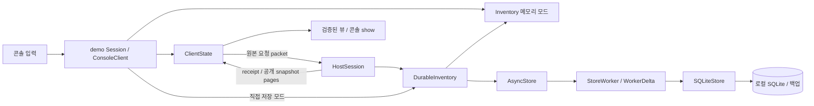
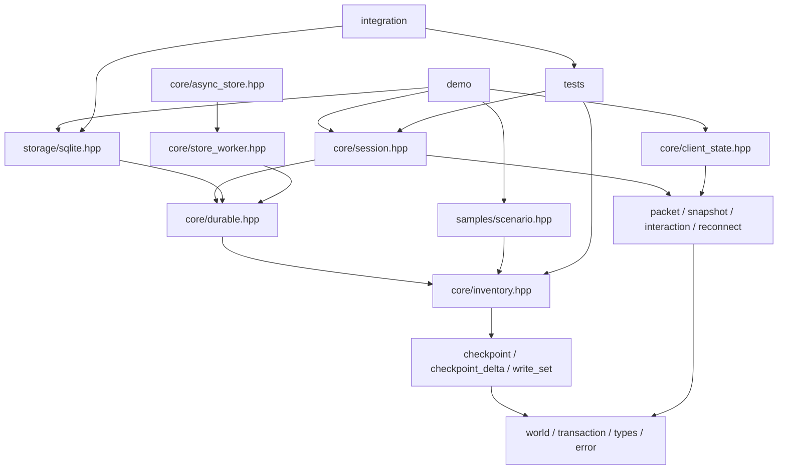
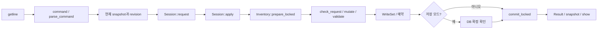
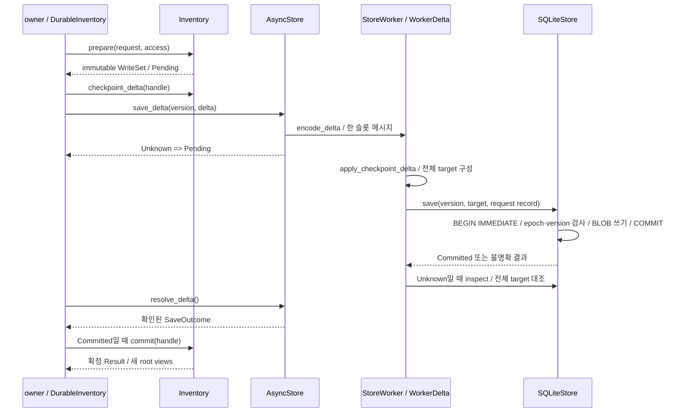
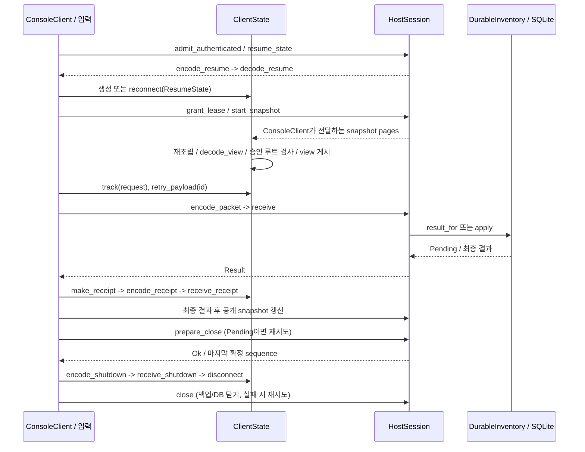

# Project Overview

## 2026-09-21 콘솔 실행 루프

`demo/transport_loop.hpp`의 transport_tick을 ConsoleClient와 코어 테스트가 공유한다.
한 tick에 명령 양방향과 스냅샷 채널당 지정한 바이트만 전달하며 poll·부분 송신 확인·양쪽 실패 정리를 한다.
페이지 Busy는 연결을 유지한다. `demo/client_loop.cpp`의 exchange가 콘솔에서 제한된 시간만 반복한다.
ClientMode의 거래·스냅샷·재접속·종료가 실제 HostTransport/ClientTransport를 사용한다.
`tests/transport_loop.cpp`가 전송량 제한·영속 거래·정체 만료·stale callback·예산/권한 실패를 검증한다.
실제 소켓/인증 및 입력 대기 중의 지속 tick은 후속 범위다. [계약](../demo/CLIENT_MODE.md).
코어 76그룹과 ClientMode 저장·재접속·백업 복원·24회 연속 조회 검증을 통과했다.

## 2026-09-21 전송 시간 제한

`core/transport_deadlines.hpp`의 고정 마감 3개(명령 수신/송신, 스냅샷)를 양쪽 어댑터가 사용한다.
`core/transport_poll.cpp`에서 만료 시 기존 disconnect로 peer·버퍼를 정리하며 ClientState의
원본 거래 보존을 재사용한다. 초기 resume 대기도 포함하고 부분 진행은 마감을 연장하지 않는다.
`tests/transport_deadlines.cpp`, `client_transport_deadlines.cpp`, `snapshot_transport_deadlines.cpp`가
경계 시각·부분 진행·원본 보존·오래된 연결 토큰·시계 역행·유휴 연결을 검증한다.
플랫폼은 매 tick과 송신 직전에 poll을 호출해야 한다. [계약](../core/TRANSPORT.md#전송-시간-제한).
코어 74그룹과 콘솔 ClientMode 저장·백업 복원 검증을 통과했다.

## 2026-09-21 스냅샷 전용 채널

`core/snapshot_control.*`가 SnapshotRequest(5)/SnapshotOffer(6)의 lease·루트·descriptor를
검증한다. HostTransport::receive → start_snapshot → snapshot_output/snapshot_sent가
전용 ordered stream으로 offer와 페이지를 보내며 ClientTransport::receive_snapshot이
ClientState의 승인 루트·재조립·원자적 게시를 재사용한다.
`core/session_snapshot.cpp`의 validate_snapshot은 매 송신 직전 현재 권한을 재검사하며
계정 예산을 소모하지 않는다. snapshot_page의 생성 예산은 유지한다. Busy만 재시도하고
철회/만료/손상/미완료 EOF는 연결을 해제한다. 자동 tick과 네트워크 I/O는 플랫폼 책임이다.
`tests/snapshot_control.cpp`, `transport_snapshots.cpp`, `transport_snapshot_failures.cpp`,
`transport_snapshot_pages.cpp`가 codec·부분 I/O·조회 후 거래/새 뷰·권한 철회·다중 페이지를 보호한다.
코어 71그룹과 기존 콘솔 ClientMode 저장·백업 복원 검증을 통과했다.
[스냅샷 transport 계약](../core/SNAPSHOT_TRANSPORT.md).

## 2026-09-21 클라이언트 I/O와 종료 전달

`core/client_transport.hpp`, `client_transport.cpp`, `client_transport_receive.cpp`가
ClientState를 소유하고 인증 후 SessionResume → 요청 부분 송신 → receipt 검증을 연결한다.
새 연결마다 토큰/decoder를 갱신하며 이전 callback이 새 연결에 영향을 주지 않는다.
`core/transport_shutdown.cpp`는 prepare_close 성공 이후만 종료 통지를 만들고,
HostTransport::sent가 마지막 바이트 송신 시 peer를 해제한다. DB close는 외부 관리자 책임이다.
`tests/client_transport*.cpp`, `tests/transport_shutdown.cpp`가 양방향 1바이트 I/O,
응답 유실·재접속, 오래된 callback, 손상/절단 입력, 종료 순서를 검증한다. 코어 67그룹 통과.
스냅샷 채널은 위 후속 항목에 추가했다. 인증/소켓·시간 제한·종료 ACK·실제 다중 참가자·UE 통합은 미구현이다.
[클라이언트 계약](../core/CLIENT_TRANSPORT.md), [호스트 계약](../core/TRANSPORT.md).

## 2026-09-18 공통 transport 어댑터

`core/transport.hpp`/`transport.cpp`의 HostTransport가 신뢰된 인증 결과를
HostSession의 새 연결에 묶는다. SessionResume → 분할 요청 수신 → HostSession::receive
→ receipt 부분 송신을 연결하고, 송신 대기는 한 프레임으로 제한한다.
EOF/오류/소멸에서 peer를 해제하며 재접속은 새 객체·연결 ID를 사용한다.
`tests/transport.cpp`와 `transport_failures.cpp`가 응답 유실 후 재접속·중복 저장 방지,
부분/결합 I/O, 손상 입력, admission 실패, 슬롯 정리와 소유 스레드 검사를 보호한다.
클라이언트 I/O·종료 전달은 위 2026-09-21 항목에 추가했다. 실제 소켓/인증과 스냅샷 채널은 남아 있다.
[공통 어댑터 계약](../core/TRANSPORT.md)을 참고한다.

## 2026-09-16 후속 구현

이 지도는 최초 분석 이후 코드 변경 시 함께 갱신한다. 아래 Git SHA/초기 분석 수치는
분석 당시 기준이며, 현재 working tree에는 정상 종료 통지 구현이 추가되어 있다.
`core/shutdown.hpp`, `shutdown_codec.cpp`, `client_shutdown.cpp`에서 messageType=4의
40B SessionClosing을 처리하고 `demo/client_view.cpp`의 close가 실제 codec을 사용한다.
이어서 `core/stream.hpp`/`stream.cpp`에 4B 길이 prefix와 연결별 StreamDecoder를 추가했다.
부분 수신·연속 프레임·과대 길이·절단 EOF를 처리하고 내부 보관은 한 프레임으로 제한한다.
`tests/stream_session.cpp`가 요청/응답/스냅샷/종료를 1바이트 단위로 전달한다.
총 62개 코어 테스트 그룹이 통과했다. [스트림 계약](../core/STREAM.md)을 참고한다.

다음 작업 순서는 인증된 연결에 codec을 전달하는 transport 통합, 연결 상실/재접속 및
종료 전달 확인, 실제 다중 참가자 시험, UE 관측값·메뉴 연결이다. 소켓/인증 구현체 선택은
별도 설계가 필요하며 현재 콘솔의 고정 identity/관측값을 실제 인증으로 사용하지 않는다.

분석일: 2026-09-16 (Asia/Seoul). 대상은 **현재 로컬 작업 폴더**이며 clone, checkout, commit, push와 production 기능 변경은 수행하지 않았다.

| 항목 | 확인값 |
| --- | --- |
| Git repository / 프로젝트 루트 | `C:/Users/USER/OneDrive/Desktop/not_work_file/astra_game` |
| origin | `https://github.com/yyb-01/Vibe_test.git` |
| branch | `codex/add-astra-game` |
| HEAD | `c061fe6a7e03a070e46d6c50706ce930a70f01bb` |
| 시작 시 git status | `?? .upload-repo/` |
| GitNexus repository 이름 | `Vibe_test` — 폴더명 `astra_game`과 다름 |
| 분석 범위 | 현재 루트의 core, storage, demo, tests, integration, samples, benchmark, scripts, CMake 및 문서 |
| 제외 | 기존 별도 Git 복사본 `.upload-repo/`, 도구 `.tools/`, 산출물 `.build/`, saves |

실행 가능한 제품은 **C++20 인벤토리 콘솔 샌드박스**다. UE 없이 원자적 인벤토리 거래, SQLite 저장, 비동기 worker, 세션 정책, packet/receipt/snapshot/reconnect codec과 클라이언트 상태 모델을 실행한다. 20인 오픈 월드 게임은 목표이며 UE 리슨 서버, 렌더링, 실제 네트워크는 아직 없다.

근거는 실제 소스, [README](../README.md), [구현 현황](../IMPLEMENTATION_STATUS.md), [명세](../SURVIVAL_TECHNICAL_SPECIFICATION.md), 각 모듈 계약 문서, CMake/PowerShell 및 GitNexus MCP 조회다. 문서의 완료율은 게임 전체 완성도로 사용하지 않는다.



이 다이어그램은 실제 한 프로세스 내 연결이다. ClientState 자체가 송신하지 않으며 ConsoleClient가 codec과 HostSession 호출을 연결한다.

# Current Implementation Status

| 기능 | 코드에서 확인한 상태 / 제한 |
| --- | --- |
| 인벤토리 | Move/Swap/Split/Merge/Drop/Pickup, revision/epoch/actionSeq/lease/권한, 원자적 실패 롤백 |
| 준비·확정 | `Inventory::prepare_locked`가 WriteSet/예약/행 노드를 준비하고 `commit_locked`가 게시. 확정 전 스냅샷 불변 |
| 독립 루트 | 계정당 1개 pending, 겹치지 않는 루트 동시 준비. API 내부 실행은 mutex 하나 |
| 저장 | `DurableInventory`가 디스크 확정 후 메모리 확정. Unknown은 Pending, 재조회로 settle |
| SQLite | WAL/FULL, OS 월드 잠금, epoch/origin 증가 복구, 전체 checkpoint BLOB 한 행과 요청 원장 |
| 비동기 | 한 worker, 한 in-flight 작업, 64MiB mailbox 예산. delta 메시지이나 실제 DB는 전체 checkpoint 쓰기 |
| 종료·백업·복원 | admission 중단 → pending 정리 → 클라이언트 해제 → 정상 백업/close. 정상 백업 최근 3개. 새 파일 복원 |
| 세션 정책 | 방장 포함 20슬롯, 신뢰된 인증 결과 admission, 계정/Pawn 중복 검사, 계정별 10회/초 burst 20 |
| 권한 | 관측값의 Pawn/생존/작업/거리/LOS 검사, 연결당 5초 lease. 실제 관측은 외부 어댑터 책임 |
| 클라이언트 | 요청 원본 최대 8개, 최종 receipt 보존, 공개 스냅샷 원자적 게시, 재접속 식별자/순번 검사 |
| 네트워크 | wire codec/ACK window/정책 구현. 소켓·신뢰 수립·암호화·플랫폼 인증·NAT/relay 없음 |

# Directory Structure

| 경로 | 역할 |
| --- | --- |
| `CMakeLists.txt` | C++20 core/demo/tests, 선택 SQLite 타깃 |
| `core/` | 데이터, 거래, 저장 추상 경계, worker, 세션, codec, 클라이언트. 각 `*.md`는 계약 |
| `storage/` | SQLite 구현, 잠금, 백업/복원, 저장·성능 문서 |
| `demo/` | 프로세스 진입, 입력 파싱/표시, 메모리·저장·ClientMode 선택, 종료 |
| `tests/` | C++ 단위·복합 시나리오 62그룹, fault/allocation probe |
| `integration/` | 실제 SQLite 재시작·실패·백업·복원·강제 종료/프로세스 잠금 runner |
| `samples/scenario.hpp` | 샘플 Catalog/World/ID/MoveEntry 생성. 데모·테스트·benchmark가 공유 |
| `benchmark/` | 단계별 저장 측정 C++와 과거 CSV. 게임 틱 성능 시험이 아님 |
| `scripts/` | Zig/SQLite 준비, 빌드, 콘솔 실행, 프로세스 시험, benchmark |
| `assets/concepts/` | 좀비 컨셉 PNG와 prompt. 런타임 에셋 검증/cook 파이프라인이 아님 |
| `verify_spec.py` | 문서 POD/산술/SQL 발췌 검사. C++ 기능이나 영속 복구 검증이 아님 |
| `docs/` | 이 프로젝트 지도 |
| `.gitnexus/` | 로컬 LadybugDB graph, metadata, parser cache, `run.cjs` |
| `.claude/skills/` | analyze가 생성한 GitNexus 스킬. Codex 전역 스킬은 `~/.agents/skills/` |
| `AGENTS.md`, `CLAUDE.md` | GitNexus 관리 context. AGENTS 앞부분은 프로젝트 작업 원칙 |
| `.tools/`, `.build/` | 기존 로컬 toolchain/SQLite와 빌드·시험 산출물. 소스 그래프 제외 |
| `.upload-repo/` | 작업 시작 전부터 있던 별도 `.git` 포함 복사본. 현재 분석 대상 아님 |

초기 tracked 파일은 186개다. 초기 GitNexus file hash 대상 180개와 차이나는 PNG/CSV는 소스 symbol 추출 대상과 다르다. core/storage/demo/tests/integration/samples/benchmark/scripts와 CMakeLists.txt/verify_spec.py에서 문서·CSV를 제외한 163개 파일을 metadata와 대조해 누락 0개, SHA-256 불일치 0개를 확인했다. 해당 경로의 `git diff HEAD`도 비어 있다.

# Build Structure

| 타깃 | 소스 / 링크 |
| --- | --- |
| `astra_core` | `core/*.cpp`, public `core/`, C++20, `Threads::Threads` |
| `astra_tests` | `tests/*.cpp` → astra_core; CTest `astra_core` |
| `astra_demo` | `demo/*.cpp` → astra_core; CTest `astra_demo --smoke` |
| `astra_sqlite_engine` | `ASTRA_SQLITE=ON`일 때 `.tools/sqlite-amalgamation-3530400/sqlite3.c`, C 언어 활성화 |
| `astra_sqlite` | `storage/sqlite*.cpp` → astra_core + astra_sqlite_engine |
| `astra_saved_demo` | demo 소스 + `ASTRA_DEMO_SQLITE` → astra_sqlite |
| `astra_sqlite_tests` | `integration/sqlite*.cpp` → astra_sqlite |
| `astra_storage_benchmark` | `benchmark/main.cpp` → astra_sqlite |

Windows에서 SQLite CTest는 `scripts/test-sqlite.ps1`, `scripts/test-demo.ps1`의 기본/ClientMode를 실행한다. MinGW 데모/benchmark는 `-municode`로 `wmain`에 진입한다.

실제 프로젝트 스크립트는 Zig 0.15.2 `c++`로 소스를 직접 묶는다. `build.ps1`은 기본 tests를 빌드·실행하고, `build-sqlite.ps1`은 SQLite C object와 core/storage/지정 타깃을 빌드한다. 테스트는 `-O0 -g -Wall -Wextra -Werror`, benchmark는 `-O2`다. SQLite 버전은 소스 경로와 `sq::configure`의 `3053004` 검사에 고정돼 있다.

```powershell
./scripts/build.ps1
./scripts/test-sqlite.ps1
./scripts/test-demo.ps1
./scripts/test-demo.ps1 -ClientMode
# CMake 대안 (기존 도구 준비 후)
cmake -S . -B .build/cmake -DASTRA_SQLITE=ON
cmake --build .build/cmake
ctest --test-dir .build/cmake -C Debug --output-on-failure
```

이번 작업은 분석·설정·문서화만 수행한다. 위 명령은 향후 관련 변경 검증 경로이며 이번 보고서의 존재만으로 새 빌드/시험 성공을 주장하지 않는다.

# Entry Points

| 진입점 | 호출 시작과 모드 |
| --- | --- |
| `demo/main.cpp` `wmain/main` | `Session` 생성 → getline → `command` → 종료 시 `try_shutdown` |
| `demo/open.cpp` `Session::Session` | save 없으면 Inventory; save 있으면 AsyncStore(SQLiteStore factory) → DurableInventory; ClientMode면 ConsoleClient |
| `tests/main.cpp` `main` | 함수 포인터 배열의 62개 테스트 그룹 순차 실행, 첫 실패에서 1 반환 |
| `integration/sqlite_main.cpp` `main` | suite/hold/locked/crash-before/crash-after/empty/recover |
| `benchmark/main.cpp` `wmain/main` | 동기 단계 측정 또는 `benchmark_async` |
| `scripts/play.ps1` | 빌드 → 선택 복원 → --save/--client 또는 메모리 데모 |
| `verify_spec.py` | 명세 발췌 검사 top-level 실행 |

# Core Modules

| 모듈 | 핵심 파일과 책임 |
| --- | --- |
| 값/월드 | `types.hpp`, `world.hpp`, `transaction.hpp`, `error.hpp`: Id, ItemState, ContainerState, Placement, World, Request/Access/Result |
| 불변식 | `catalog.cpp`, `grid.hpp`, `ancestry.cpp`, `validate.cpp`, `check_request.cpp`: 정의·배치·부모 경로·질량/부피·권한·버전 |
| 거래 | `inventory.cpp`, `inventory_commit.cpp`, `mutate.cpp`, `merge.cpp`, `mutation.hpp`: 예약, 시뮬레이션, 확정/취소 |
| 변경/조회 | `write_set.*`, `copy_roots.cpp`, `account_sequence.cpp`, `request_result.cpp`: 변경 전후 행, 루트 공유, 순번/중복 결과 |
| 영속 경계 | `durable.*`, `durable_close.cpp`, `checkpoint*`, `delta_*`: acquire/prepare/save/resolve/commit, wire와 복구 검사 |
| worker | `async_store*`, `async_delta.cpp`, `store_worker.*`, `worker_delta.hpp`: owner/DB 스레드 분리와 한 슬롯 상태기계 |
| 세션 | `session*`, `interaction*`, `transaction_budget.hpp`: admission, dispatch, lease, 공개 조회, resume, 종료 |
| 전송 데이터 | `wire.hpp`, `encode/decode.cpp`, `packet*`, `receipt*`, `reconnect*`, `snapshot*`: wire 검증과 재조립 |
| 클라이언트 | `client_state.hpp`, `client_requests.cpp`, `client_snapshot.cpp`, `client_reconnect.cpp`: 원본 요청·receipt·뷰 상태 |

# Important Symbols

아래 inbound/outbound는 MCP context를 먼저 조회한 뒤 구현을 직접 대조한 결과다. 그래프가 놓친 연결은 명시적으로 표시했다.

| symbol / 정의 | inbound | outbound / 의미 |
| --- | --- | --- |
| `Inventory::prepare_locked` — `core/inventory.cpp:48` | 실제 `apply`, `prepare`; graph는 내부 `lock`을 가짜 함수로 표시 | encode → check_request → ancestry → copy_roots → mutate → describe_changes → partition_roots; 아직 게시하지 않음 |
| `Inventory::commit_locked` — `core/inventory_commit.cpp` | apply/commit | before 행 검사 → 미리 확보한 노드/루트 교체 → 원장/순번 업데이트 → pending 해제 |
| `DurableInventory::finish` — `core/durable.cpp:43` | 실제 apply/resolve_locked; graph는 일부만 연결 | Unknown/Pending 유지, definite abort, fencing, DB 확정 때 Inventory::commit 및 결과 대조 |
| `validate_checkpoint` — `core/checkpoint.cpp:5` | checkpoint codec/복구/delta/SQLite acquire | verify_world, request decode/encode, 계정/actionSeq/확정 sequence/생성 ID 검사 |
| `encode_checkpoint` — `core/checkpoint_codec.cpp:5` | SQLite 저장·백업·미확정 비교·worker·테스트 | validate_checkpoint → 필드별 little-endian → checksum |
| `ancestry` — `core/ancestry.cpp:5` | check_request, mutate, partition_roots, copy_roots, recalculate | 부모 컨테이너 경로; cycle/depth/deleted 검사 |
| `HostSession::dispatch` — `core/session_commands.cpp:17` | receive/apply_local 모두 graph 확인 | result_for 먼저, 신규 요청만 authorize → DurableInventory::apply; 마지막 두 멤버 호출은 graph 누락 |
| `HostSession::authorize` — `core/session_lease.cpp` | dispatch/view/snapshot_page | token/시간/interaction_roots 일치 → trusted Access |
| `SQLiteStore::save` — `storage/sqlite_save.cpp:5` | WorkerDelta/직접 DurableStore/benchmark; graph UNKNOWN | encode_checkpoint, sq::configure/load/write, COMMIT. 가상 함수 연결은 소스로 보완 |
| `StoreWorker::run` — `core/store_worker.cpp:58` | worker 생성자의 thread lambda | condition_variable → execute → factory가 만든 DurableStore |
| `ClientState::receive_page` — `core/client_snapshot.cpp:25` | ConsoleClient::snapshot 및 client tests; graph UNKNOWN | SnapshotAssembly → decode_view → 승인 루트 대조 → view_/published_ 교체 |
| `DurableInventory::prepare_close_locked` — `core/durable_close.cpp:8` | prepare_close/close | admission 차단, resolve_locked; 아직 store close 하지 않음 |
| `require` — `core/error.hpp:12` | 검증 전반의 공통 허브 | 실패 시 Violation. 오류 정책 수정은 광범위 영향 |

공유 타입 `Id`는 128bit, `ItemState`/`ContainerState`는 64B, `Placement`는 48B이며 `types.hpp` static_assert가 ABI 크기를 검사한다. `WriteSet`은 immutable shared_ptr로 소유권과 before/after 행을 전달한다. 저장 `Checkpoint`, 전송 `RootSnapshot`, 클라이언트 `World` 뷰는 공개 범위와 포함 정보가 다르다.

# Module Dependencies

GitNexus `File -IMPORTS-> File` 275개를 조회했다. **Markdown 링크도 IMPORTS에 포함**되므로 코드 의존성 집계에서는 `.cpp/.hpp`만 사용한다. 주요 방향은 다음과 같다.



core의 production 코드에는 storage/demo/tests include가 없다. storage가 core의 DurableStore를 구현하고 demo가 구체 저장소를 factory로 주입한다. `demo/input.hpp → console.hpp → session.hpp → client.hpp → core/session.hpp`처럼 콘솔 타입은 비교적 넓게 결합한다. `samples/scenario.hpp`는 샘플 제공자이지 production 전역 월드가 아니다.

MCP 커뮤니티 멤버 확인: `comm_7`(20개)은 Writer/encode 계열, `comm_6`(19개)은 Reader/decode 계열, `comm_21`(10개)은 worker/가상 저장 경계, `comm_3`(10개)은 AsyncStore 상태기계, `comm_46`(4개)은 세션 명령이다. 자동 클러스터는 빌드 모듈과 같지 않다. 최초 metadata는 50 communities지만 실제 Community Cypher 반환은 47개였다. 따라서 50을 물리 저장된 독립 모듈 수로 해석하지 않는다.

# Major Execution Flows

## 1. 입력 → 로직 → 상태 → 출력

`demo/main.cpp` → `command` → `parse_command` → `Session::snapshot`으로 revision 확보 → `Session::request`로 계정 다음 actionSeq/요청 ID 확보 → `Session::apply` → 선택된 메모리/영속/클라이언트 경로 → Result 출력. `show`는 선택된 snapshot을 `show(World)`로 표시한다. `input.hpp`의 from_chars가 범위·부호·남는 문자, end_command가 여분 인수를 거절한다.



## 2. 거래와 중복 재전송

`prepare_locked`는 epoch/account → canonical payload → 기존 결과/대기 요청 → 계정 순서/상한 → revision/lease/루트 접근 → 루트 충돌 → 해당 루트 복사·mutate·validate 순서다. 실패 결과도 WriteSet으로 저장될 수 있다. Busy는 계정 순서를 소비하지 않으며, 확정된 정상 형식 거절은 actionSeq를 소비한다. 성공 준비 event와 최종 commit sequence는 별개다. 독립 루트를 역순 commit해도 최신 다른 루트를 덮어쓰지 않는다.

## 3. GitNexus로 실제 확인한 경로

- trace: `HostSession::receive → dispatch → authorize → interaction_roots` (3 hops, confidence 0.85/0.5/0.5).
- trace: `prepare_locked → ancestry` (1 hop, confidence 0.5).
- process `StoreWorker → Save`: 생성자 → run → execute → WorkerDelta::save → DurableStore::save (5단계). SQLiteStore로의 동적 구현 선택은 demo factory로 확인했다.
- process `Copy_backup → Checked_backup`: copy_backup → 지역 lambda same → checked_backup (3단계).
- `Lock → Mutate`, `Lock → Finish` 자동 process의 `lock`은 실제 진입 함수가 아닌 지역 lock_guard다. 호출자로 표시된 enclosing apply/prepare/resolve를 소스로 확인했다.

process는 동적 실행 로그나 모든 분기·스레드 순서의 증명이 아니다. 표와 그림은 이 그래프 단서에 실제 소스 제어 흐름을 결합했다.

# Persistence Flow



- **복구:** SQLiteStore 생성 시 WorldLock → acquire가 schema/catalog/checkpoint 검사 → epoch와 origin 증가 → StoredWorld → Inventory(checkpoint)가 요청 결과와 accountSeq 복원. corrupt DB를 seed로 덮어쓰지 않는다.
- **DB 구조:** `world(singleton, version, checkpoint)` 한 행. checkpoint에 Catalog, 모든 World 행, 요청 원장이 함께 들어간다. `version == requests.size()`이며 성공 world sequence와는 별개다.
- **Unknown:** pending handle/target을 유지한다. 같은 version이면 Aborted, 다음 version이고 전체 target 같으면 Committed, epoch/target 불일치면 Fenced. 불명확한 결과를 임의로 abort하거나 성공으로 표시하면 안 된다.
- **close:** Session/HostSession prepare_close → 신규 입력 차단·pending resolve → encode_shutdown → ClientState::receive_shutdown → disconnect → DurableInventory::close → AsyncStore Close → SQLiteStore::close → 검증된 Backup API 사본 게시 → 정상 백업 최근 3개 → WorldLock 해제. 통지는 DB close 성공이나 개별 거래 성공을 뜻하지 않는다. 원본 요청은 보존하며 중복 통지와 DB 종료 재시도를 허용한다.
- **복원:** restore_sqlite_backup → 원본/대상 잠금·잔여 journal/기존 파일/catalog/무결성 검사 → copy_backup으로 새 대상 게시. 기존 파일을 보존하며, 실행 시 acquire가 epoch/origin을 증가시킨다. 복원본과 원본 사이 자산 병합/ID 전역 유일성은 제공하지 않는다.

# Network / Session Flow

transport 준비: `encode_stream` → 분할/결합된 bytes → `StreamDecoder::receive` →
`complete`/`take` → 기존 codec/세션 처리. 기본 packet 한도 1,200B, snapshot 전용
논리 스트림은 65,536B로 생성한다. EOF의 finish는 절단 프레임을 거절한다.
타입 다중화·인증·소켓·시간 제한은 외부 책임이며 현재 production 콘솔은 직접 codec을
사용한다. 스트림 통합 실행 근거는 tests/stream_session.cpp다.

1. 외부 인증 어댑터가 AuthenticatedPeer를 제공한다. `admit_authenticated`는 인증 자체가 아니라 SessionInfo와 account/Pawn/슬롯 정책을 검사한다.
2. 서버 관측 InteractionState → grant_lease. 1~16개 루트, finite 거리 0~2.5m, LOS/접근허용, Pawn/생존/작업 가능 조건을 검사한다.
3. `receive`는 owner 확인 → admit_command(계정 예산) → decode_packet → dispatch. 손상 패킷/replay도 예산을 소비한다. 로컬 방장은 apply_local에서 같은 dispatch로 간다.
4. dispatch는 기존 요청 결과를 먼저 조회한다. 원래 payload의 재전송은 lease가 폐기돼도 저장 결과 확인이 가능하다. 신규 요청만 authorize를 통과한다.
5. `start_snapshot`은 승인 루트만 encode_view하고 연결당 전송본 하나를 보관한다. snapshot_page마다 다시 authorize한다.
6. disconnect는 연결/lease/snapshot을 제거하나 계정 예산은 유지한다. resume_state는 인증 연결에 바인딩된 계정의 identity/epoch/sequence/nextActionSequence를 반환한다.
7. prepare_close가 Ok이면 SessionClosing(40B)을 전송한다. receive_shutdown은 epoch와 확정/게시 순번을 검증한 뒤 표시를 비우고 미확정 요청을 Resolving으로 보존한다. 실제 transport는 현재 인증 연결의 메시지만 전달해야 한다. 통지의 전역 순번은 개별 요청 결과를 대신하지 않는다.

wire: 요청 공통 header 32B + `44+88N`(N=1..8), receipt 전체 70B, resume 전체 112B. datagram 예산 상한 1200B. snapshot은 별도 reliable-stream용 페이지 포맷으로 페이지 64KiB/전체 2MiB 상한이다. **reliable transport 구현 자체는 없다.** PacketWindow의 32개 ACK bitmap도 거래의 디스크 확정을 대신하지 않는다. PacketWindow는 현재 HostSession/ConsoleClient 송수신 경로에 통합되지 않은 독립 코어다.

# Client / Server Flow



ClientState는 receipt 수신만으로 로컬 인벤토리 mutate를 다시 실행하지 않는다. confirmed_ 이상 sequence인 공개 뷰를 받아야 갱신된다. timeout/늦은 응답은 확정 상태를 되돌리지 않는다. disconnect 후 원본 payload를 보존하고 reconnect 시 동일 account/world/catalog 및 비후퇴 epoch/순번을 검사한다. 오래된 lease를 포함한 원본 replay를 정리한 다음 새 lease/뷰를 받는다.

ConsoleClient의 `created` 출력은 호스트 진단 Result를 사용한다. 70B wire에는 생성 ID/변경 행이 없다. ConsoleClient의 고정 identity/catalogHash/관측값을 실제 인증·hash 검증으로 해석하면 안 된다.

# Shared State

| 소유자 | 상태 / 동시성 규칙 |
| --- | --- |
| Inventory | mutex_ 아래 world_, roots_, records_, accountSeq_, pending_, sequence_/nextId_/nextEvent_; 외부에는 const snapshot |
| DurableInventory | mutex_ 아래 waiting_/version_/epoch_/fenced_/closing_/closed_; 월드당 한 영속 pending |
| AsyncStore | 생성 owner 스레드 전용. reply_, active_, running_/uncertain_/deltaPending_ 등 |
| StoreWorker | job_/reply_/occupied_/stopping_을 mutex+condition_variable로 보호; DB store와 WorkerDelta는 worker 소유 |
| HostSession | 생성 owner 스레드 전용 peers_[20], 계정 budgets_, lease/snapshot 번호, closing_ |
| ClientState | owner/UI 스레드 사용 계약. requests_/roots_/assembly_/view_/published_/confirmed_/identity_; 자체 mutex 없음 |
| SQLiteStore | 파일별 WorldLock, epoch_. DB Connection은 작업별 RAII. 별도 DB 서버 없음 |
| const World snapshots | shared_ptr 수명만큼 이전 버전 유지. 오래 잡으면 메모리를 유지하므로 권한 해제 시 UI 참조도 제거 |

production의 가변 게임 상태는 위 객체에 속하며 단일 전역 World singleton은 없다. 전역 상수와 inline codec/helper는 존재한다. `tests/allocation_probe.cpp`의 thread_local 및 operator new 대체는 테스트 전용이며 core/demo에 링크하지 않는다.

# High Coupling Areas

1. **`core/inventory.hpp`와 기본 타입:** checkpoint/write_set/World/Request가 거래·저장·세션·샘플로 전파된다. 타입 변경은 wire, DB 복구, 테스트까지 확인한다.
2. **checkpoint codec/검증:** 저장·복구·delta 적용·Unknown 대조·백업·공개 snapshot의 행 codec이 공유된다. 저장 포맷을 바꾸면 재시작 호환성과 공개 정보 범위를 함께 검토한다.
3. **`require`/Error/receipt mapping:** 여러 신뢰 경계의 공통 오류 정책. 단순 이름 변경도 영향이 넓다.
4. **DurableInventory ↔ AsyncStore ↔ WorkerDelta:** 하나의 pending/target/version 약속과 owner-thread 게시 순서에 결합한다. 큐 확장은 한 파일 변경이 아니다.
5. **HostSession ↔ ClientState ↔ ConsoleClient:** lease, 원본 request, resume actionSeq, committed sequence, snapshot ID 수명이 서로 맞아야 한다.
6. **샘플 fixture:** samples/scenario.hpp를 tests/demo/benchmark가 공유해 fixture 변경이 여러 검증에 영향을 준다. 게임 데이터 저장소로 확장된 구조는 아니다.

# Change Impact Guide

실제 MCP `impact`, `direction=upstream`, `maxDepth=3`(기본), `includeTests=true`, `summaryOnly=true` 결과다. 숫자는 그래프에서 도달한 symbol 수이며 런타임 호출량/확정 변경 파일 수가 아니다.

| target (정의 파일로 disambiguate) | 직접 / 전체 영향 | GitNexus risk | 해석 |
| --- | --- | --- | --- |
| require — core/error.hpp | 125 / 220 | CRITICAL | 공통 검증 허브 |
| encode_checkpoint — core/checkpoint_codec.cpp | 17 / 29 | CRITICAL | 저장·비교·백업 공통 포맷 |
| validate_checkpoint — core/checkpoint.cpp | 4 / 28 | CRITICAL | 복구와 원장 불변식 |
| ancestry — core/ancestry.cpp | 7 / 26 | CRITICAL | 중첩/권한/루트 분할 |
| finish — core/durable.cpp | 1 / 7 | LOW | 실제로는 데이터 게시 핵심; 그래프 누락으로 과소평가 |
| prepare_locked — core/inventory.cpp | 2 / 2 | LOW | lock_guard 오탐과 상위 호출 누락; 낮은 변경 위험을 뜻하지 않음 |
| dispatch — core/session_commands.cpp | 2 / 2 | LOW | 로컬/원격 공통 보안·저장 경계 |
| prepare_close_locked — core/durable_close.cpp | 2 / 2 | LOW | 종료 보증에 영향; caller를 실제 enclosing 함수로 대조 |
| save — storage/sqlite_save.cpp | 0 / 0 | UNKNOWN | 가상 호출 누락. WorkerDelta/DurableStore/benchmark를 반드시 읽음 |
| receive_page — core/client_snapshot.cpp | 0 / 0 | UNKNOWN | ConsoleClient·테스트 caller 존재. 미사용 판단 금지 |

변경 전 context로 UID를 확보해 동일 이름의 선언/정의를 구분하고 upstream/downstream을 확인한다. graph의 HIGH/CRITICAL은 먼저 알리고 관련 흐름·테스트 범위를 정한다. UNKNOWN/빈 관계는 소스로 보완한다. `partial`/`truncated` 결과로 영향 없음 판정을 하지 않는다.

# Tests by Module

아래 표는 테스트 본문·fixture와 production 코드를 대조한 보호 범위다. MCP test→production CALLS도 조회했지만 멤버 호출 누락이 많아 그것만으로 coverage를 판정하지 않았다. 현재 62그룹은 tests/main.cpp 등록 수이며 코드 줄 coverage 비율은 측정하지 않았다.

| 테스트 파일 (`tests/` 접두 생략) | 보호하는 production 경로 / 보증 |
| --- | --- |
| transactions.cpp, rejections.cpp, boundaries.cpp | inventory/check_request/mutate/merge/validate/grid/ancestry: 조작·실패 원자성·권한·경계·overflow |
| concurrency.cpp | Inventory::apply, 불변 snapshot; 20스레드 경쟁과 1000회 보존성 |
| prepared.cpp | prepare/commit/abort, WriteSet before/after, 위조 핸들·취소·중복·예약 |
| roots.cpp | copy_roots/prepare/commit; 독립 루트 역순 확정·예약·계정/아이템 한도 |
| snapshots.cpp + allocation_probe.* | root snapshot 공유·확정 할당 0·prepare bad_alloc 롤백·읽기 동시성 |
| validation_paths.cpp | validate/verify_world; 원본 보존, 가방 이동 후 부모 경로, 없는 컨테이너/cycle |
| account_sequence.cpp, request_results.cpp | account_sequence/request_result/checkpoint 복구·payload 변조·타 계정 결과 조회 |
| wire.cpp | encode/decode/Reader/Writer; 길이/예약 비트/오염/상한 |
| checkpoints.cpp, checkpoint_deltas.cpp | checkpoint/delta codec·복구·before 충돌·상태/원장 재구성 |
| async_store.cpp, async_limits.cpp, async_budget.cpp, async_deltas.cpp | DurableInventory/AsyncStore/StoreWorker/WorkerDelta; owner 게시·Unknown·예산·한 슬롯·fencing·메시지 크기 |
| packets.cpp | packet envelope/PacketWindow; epoch/MTU/길이/ACK wrap |
| stream.cpp, stream_session.cpp | StreamDecoder 분할/결합/한도/절단 EOF/오류 후 재사용 거절 및 기존 session/client codec 왕복 |
| shutdown_codec.cpp, client_shutdown.cpp | 종료 codec 길이/epoch/MTU/예약 비트/순번, 잘못된 입력의 뷰 보존, Pending 정리→통지→DB 닫기, 원본 요청 보존·중복 통지·종료 실패 재시도 |
| session_admission.cpp, session_commands.cpp, session_shutdown.cpp | HostSession admission/예산/로컬·원격 dispatch/재접속/prepare_close와 close 재시도 |
| session_leases.cpp, session_lease_replay.cpp | interaction/lease; NaN/거리/LOS/만료/권한 분리·철회 뒤 Pending/replay |
| receipts.cpp, receipt_reasons.cpp, session_receipts.cpp | receipt codec/오류 정규화·상태 조합·HostSession 영속 결과 연결 |
| snapshot_wire.cpp, snapshot_pages.cpp, session_snapshots.cpp | 공개 정보 제한·페이지 크기/재조립·송신 중 권한 재검사 |
| client_requests.cpp, client_snapshot.cpp, client_publication.cpp | ClientState 원본/최종 응답 보존·오래된 뷰·다중 페이지 원자성·ACK 후 stale 조립 취소 |
| client_reconnect.cpp, client_restart.cpp, reconnect_codec.cpp | 재접속 identity/epoch/actionSeq, 원본 replay, SessionResume wire |
| console_shutdown.cpp | demo/shutdown.hpp; 예외/Pending 이후 성공 재시도 |

실제 DB 검증은 `integration/sqlite_restart.cpp`(복구·idempotency), `sqlite_failures.cpp`(SQL rollback/lost reply), `sqlite_rejections.cpp`(catalog/schema/corrupt/overflow), `sqlite_async.cpp`(실제 비동기 저장), `sqlite_backups.cpp`/`sqlite_backup_failures.cpp`(백업·정리 재시도), `sqlite_shutdown.cpp`(미확정 종료), `sqlite_restore.cpp`(원본 보존/새 파일 복원)이다. `sqlite_fault_store.hpp`의 LostReply는 실제 SQLiteStore를 감싼 fault adapter다.

`scripts/test-sqlite.ps1`은 위 suite 외에도 commit 전/후 프로세스 강제 종료 및 별도 프로세스 월드 잠금을 검증한다. `scripts/test-demo.ps1`은 기본/ClientMode 콘솔의 입력·재시작·replay·128bit ID·EOF·백업/복원·손상 보존을 검사하며 ClientMode에서는 disconnect/reconnect/submit와 예산 소진 뒤 결과 보존을 추가한다.

소스에 테스트가 존재함과 이번 세션에서 실행해 통과함은 구분한다. 실제 UE/transport/물리/전원 차단/다른 OS/렌더 포함 60Hz/20만 아이템 검증은 이 테스트들로 증명되지 않는다.

# Implemented vs Planned

| 명세 영역 | 실제 구현 | 남은 범위 |
| --- | --- | --- |
| A 인벤토리 | POD/6종 거래/예약·불변 뷰/원장·검증/저장 | Socket·Escrow 실행, 확장 상태 stack 분할/병합, 유연 가방 압축, 낙하 Actor/낙관 UI |
| A/E 영속화 | SQLite checkpoint BLOB/복구/비동기 메시지/백업/복원 | 정규화 item/container/placement/event 테이블, DB 행별 delta, 다중 거래 큐, 자산 격리 |
| 0/2 세션·네트워크 | 20슬롯 정책, lease, codec/receipt/snapshot/resume/종료 통지, in-process ClientMode | 실제 인증·소켓·암호화·방 생성/참가·NAT/relay·UE 관측·원격 종료 전달/확인·UI |
| B 총기·탄도 | 샘플 소총 아이템과 명세만 | 조립·fixed-point solver·충돌/관통/rewind |
| C 방어구·생체 | 아이템 상태 필드 일부 | 방어 zone·wound·대사·환경 시뮬레이션 |
| D 차량 | 명세만 | 프레임/관성/타이어/구동/Chaos/예측 |
| E 제작·전력·하우징 | 저장/종료 부분만 | 제작 stage/escrow·전력·열·소음·구조/환경 사건 |
| F AI 에셋 | 컨셉 이미지/prompt와 명세 | validator/cook/조립·PBR/LOD/golden-scene 검사 |
| G 출시 게이트 | standalone 테스트·합성 저장 benchmark | 실제 19원격 참가자·게임 부하·엔진/다중 플랫폼·실제 전원 차단 |

Socket/Escrow enum 또는 reserved 필드가 있다는 사실은 기능 구현 근거가 아니다. validate는 컨테이너 kind를 Grid/Slot/World로 제한한다. verify_spec.py의 문서 SQL 실행은 실제 DB schema가 item 테이블이라는 뜻이 아니다.

문서 불일치: README 일부의 “클라이언트 연결은 아직 없습니다”, 구현 현황의 이전 날짜 단락에 있는 “페이지/클라이언트 게시 미구현”은 이후 구현보다 오래됐다. 현재 코드에는 ClientState/ConsoleClient 왕복과 reconnect codec이 있다. 다만 실제 transport/UI는 여전히 없다. 이번에는 기존 문서를 일괄 수정하지 않고 이 지도에서 구분했다.

# Debugging Guide

| 증상 | 먼저 추적할 경로 |
| --- | --- |
| Busy | HostSession 계정 budget/closing → DurableInventory waiting/closing → Inventory 계정/루트 예약/상한. 원인을 하나로 단정하지 않음 |
| Pending이 끝나지 않음 | AsyncStore::status → worker reply/failure → resolve_delta/WorkerDelta::resolve → SQLite inspect. handle/target 유지 |
| RevisionConflict/SequenceMismatch | Request revisions/baseline → check_request → accountSeq/next_action_sequence → resume codec. requestId와 actionSeq/commit sequence를 혼동하지 않음 |
| EpochMismatch/InvalidState 뒤 저장 중지 | DurableInventory fenced_, DB epoch/version/전체 target 불일치. 성공으로 우회하지 않고 복구 경로 확인 |
| NotAccessible | connection/Pawn → 현재 관측값/lease/token/시간/루트 → snapshot 페이지 권한. 이미 접수된 요청이면 원래 payload인지 확인 |
| client stale/빈 화면 | connected/approved roots → confirmed_/published_ → begin_snapshot ID/epoch → assembly → decode_view; receipt만으로 world가 바뀌지 않음 |
| 중복 거래/수량 문제 | canonical payload와 account+requestId → records_/pending_ → SQLite 원장 → 새 actionSeq. replay payload의 lease도 유지 |
| 종료 실패 | Session::close/try_shutdown → prepare_close → resolve → AsyncStore Close → 백업 게시/정리/WorldLock. 대화형은 retry, EOF는 실패 반환 |
| 복원 실패 | source/target canonical 경로·잠금·잔여 journal·기존 대상·catalog·integrity. 기존 저장 파일을 삭제해 우회하지 않음 |

먼저 graph context/impact를 보고 해당 소스·테스트를 읽는다. 런타임 진단 시 requestId/account/actionSeq/epoch/commit sequence/store version/lease token을 구분한다. `.build`의 fault fixture를 이용하고 실제 saves를 손상 시험 대상으로 쓰지 않는다.

# Where To Modify What

바이트 스트림 경계/수신 메모리 한도는 `core/stream.hpp`, `core/stream.cpp`를 수정하고
`tests/stream.cpp`, `tests/stream_session.cpp`를 확인한다. 실제 연결/인증은 아직 없으며
`core/STREAM.md`의 소유 스레드·수신 suffix·EOF 계약을 지키는 transport가 필요하다.

| 변경 목적 | 시작 파일 | 같이 확인할 파일/테스트 |
| --- | --- | --- |
| 이동/분할/병합 규칙 | core/check_request.cpp, mutate.cpp, merge.cpp | inventory.cpp, validate.cpp, write_set.cpp; transactions/prepared/checkpoint_deltas |
| 중첩·질량·부피·grid | core/ancestry.cpp, validate.cpp, grid.hpp | copy_roots.cpp, mutation.hpp; boundaries/roots/validation_paths/snapshots |
| 예약·확정·순번 | core/inventory.cpp, inventory_commit.cpp | account_sequence.cpp, request_result.cpp, checkpoint.cpp; prepared/roots/concurrency |
| 영속 확정/Unknown | core/durable.cpp | async_delta.cpp, worker_delta.hpp, storage/sqlite_save.cpp; async_*/sqlite_failures |
| 저장 포맷 | core/checkpoint_codec.cpp, checkpoint_wire.hpp | checkpoint.cpp, delta_codec.cpp, snapshot codecs, storage/sqlite_db.cpp; checkpoint/restore/restart |
| worker/큐 | core/store_worker.cpp, async_store* | durable.cpp, worker_delta.hpp; async_budget/async_limits/async_deltas |
| 접속·rate limit | core/session.cpp, transaction_budget.hpp | session_commands.cpp, session_resume.cpp; session_admission/session_commands |
| 권한·lease | core/session_lease.cpp, interaction.cpp | session_commands.cpp, session_snapshot.cpp; session_leases/session_lease_replay |
| packet/receipt | core/packet_envelope.cpp, packet.cpp, receipt* | wire.hpp, reconnect_codec.cpp, ClientState; packets/receipts/receipt_reasons |
| client 뷰/재접속 | core/client_*.cpp | snapshot_*.cpp, reconnect_codec.cpp, demo/client*.cpp; client_*/reconnect_codec/test-demo |
| 종료/백업/복원 | core/durable_close.cpp, shutdown.hpp, shutdown_codec.cpp, client_shutdown.cpp, storage/sqlite_close.cpp, sqlite_backup.cpp, sqlite_restore.cpp | demo/shutdown.hpp, demo/client_view.cpp, demo/session.cpp; shutdown_codec/client_shutdown/console_shutdown/session_shutdown/integration |
| 콘솔 명령 | demo/command.cpp, parse.cpp, input.hpp, show.cpp | demo/session.cpp, client*.cpp; test-demo.ps1, --smoke |
| 빌드·실행 옵션 | CMakeLists.txt, scripts/build*.ps1, play.ps1 | 양쪽 소스/매크로/타깃 일치; 기본·SQLite 모드 |

# GitNexus Usage Guide

## 연결·저장 상태

- CLI `1.6.12`, Node `v22.19.0`. `npx --yes gitnexus setup -c codex` 및 현재 루트의 `npx --yes gitnexus analyze` 실행 완료.
- `~/.codex/config.toml`의 `[mcp_servers.gitnexus]`: `C:\Users\USER\AppData\Roaming\npm\gitnexus.cmd`, args `["mcp"]`.
- 전역 Codex skills: `C:/Users/USER/.agents/skills/`의 GitNexus 12개. analyze가 `.claude/skills/`와 AGENTS/CLAUDE context를 생성했다. 전역 스킬이 있으므로 같은 스킬을 수동으로 프로젝트 `.agents`에 중복 복사하지 않았다.
- hooks: `~/.codex/hooks.json`, `~/.codex/hooks/gitnexus/` adapter. PreToolUse `Grep|Glob|Bash`, PostToolUse `Bash` 등록. 설치 상태와 hook 파일 존재를 확인했다. **이 Codex desktop 세션이 실제 자동 hook 이벤트를 발생시켰다는 증거는 없다.** 수동 freshness/context 확인도 유지한다.
- MCP SDK로 실제 stdio 서버를 실행하고 initialize/tools/list, list_repos, resources/read, query/context/impact/cypher/trace를 호출해 응답을 확인했다. 현재 대화의 기본 도구 목록에는 새 GitNexus 도구가 자동 추가되지 않았으므로 앱 자체의 새 세션 연결과 직접 MCP 검증을 구분한다. 새 작업에서도 도구가 보이지 않으면 Codex 재시작 후 확인하고 CLI를 사용한다.
- `.gitnexus/lbug`에 graph 저장, `gitnexus.json`/`meta.json`에 root/HEAD/branch/hash 기록. `.git/info/exclude`에 `.gitnexus/`가 추가되어 인덱스는 로컬 보관된다. `.gitignore`의 기존 production 설정은 유지했다.
- 최초 분석: `2026-09-16T00:26:03.983Z`, 파일 180, 노드 1705, 관계 5733, 자동 클러스터 50, process 71. graph/FTS available, embeddings 0. 이 수치는 문서 추가 전 기준이며 최신 값은 metadata/status가 기준이다.
- `.build/gitnexus-evidence/*.json`은 이번 직접 MCP 조회의 원문 진단 산출물이며 `.build` 정리 시 사라질 수 있다. 장기 참조는 이 문서와 재조회 가능한 로컬 index를 사용한다.

## 정확도 한계 — 반드시 읽을 것

초기 metadata의 `incomplete_reasons`는 빈 배열이지만 C++ 분석 정확성까지 완전하다는 뜻은 아니다. `nameFallbackEdges.totalGuessed=1353`(365 file/name 쌍), `unresolvedReceiverMembers.totalSites=468`이다. 이름 추정 edge의 confidence 0.5가 많다.

- 지역 `std::lock_guard lock(...)`, `sq::Connection db(...)`가 함수로 추출된 사례가 있다.
- 선언 `core/inventory.hpp:mutate`와 정의 `core/mutate.cpp:mutate`가 분리돼 호출 경로가 헤더에서 끝나기도 한다.
- `tests/main.cpp`의 함수 포인터 `run()`이 `StoreWorker::run`으로 연결된 오탐이 있다. 테스트가 worker를 직접 호출한다는 증거가 아니다.
- SQLiteStore 가상 호출, ClientState 멤버 호출은 누락됐다. 빈 callers/UNKNOWN을 unused나 low-risk로 해석하지 않는다.
- raw Cypher 및 single-repo trace의 line은 0-based, context/query/impact는 1-based다. 편집기에서 원문 위치를 대조한다.
- process 리소스는 자동 이름으로 조회한다. `proc_...` ID로 조회하면 not found일 수 있으므로 ID는 Cypher `p.id`에 사용한다.
- PDG/embedding은 이번 분석에 활성화하지 않았다. graph/FTS와 실제 소스 확인으로 문서를 작성했으며 데이터 흐름/taint 완전 분석을 주장하지 않는다.

## 다음 Codex 작업 순서

1. `list_repos` → path/branch/commit 확인. 이 checkout은 `repo: "Vibe_test"`를 명시한다.
2. repository context/status와 이 문서의 관련 모듈을 읽는다. stale이면 analyze한다.
3. query로 기능/흐름 탐색 → context로 파일+symbol(가능하면 UID) 확정 → inbound/outbound 확인.
4. 핵심/다중 파일 변경은 upstream impact → 필요 시 downstream/trace/process 및 직접 source caller 검증.
5. 위 Tests by Module에서 관련 시험을 선택한다. graph에서 못 찾았다고 테스트가 없다고 결론내리지 않는다.
6. 허용된 변경과 관련 검증 후 다시 analyze한다. commit/push는 별도 사용자 요청 범위에서만 수행한다.

```javascript
list_repos({})
// READ gitnexus://repo/Vibe_test/context
query({repo: "Vibe_test", search_query: "checkpoint async save"})
context({repo: "Vibe_test", name: "prepare_locked", file_path: "core/inventory.cpp"})
impact({repo: "Vibe_test", target: "validate_checkpoint", file_path: "core/checkpoint.cpp",
        direction: "upstream", includeTests: true, maxDepth: 3})
trace({repo: "Vibe_test", from: "receive", from_file: "core/session_commands.cpp",
       to: "interaction_roots", to_file: "core/interaction.cpp"})
// READ gitnexus://repo/Vibe_test/process/StoreWorker%20%E2%86%92%20Save
```

```powershell
# 현재 루트에서 실행; 원격 clone/pull 불필요
node .gitnexus/run.cjs status
node .gitnexus/run.cjs analyze
node .gitnexus/run.cjs context prepare_locked --file core/inventory.cpp --repo .
node .gitnexus/run.cjs impact validate_checkpoint --file core/checkpoint.cpp --direction upstream --repo .
# 실행기 부재 시
npx gitnexus analyze
```

주요 Cypher 재조회 예시:

```cypher
MATCH (a:File)-[:CodeRelation {type:'IMPORTS'}]->(b:File)
RETURN a.filePath, b.filePath;

MATCH (caller)-[:CodeRelation {type:'CALLS'}]->(f:Function)
WHERE f.name = 'encode_checkpoint'
RETURN caller.name, caller.filePath;

MATCH (s)-[r:CodeRelation {type:'STEP_IN_PROCESS'}]->(p:Process)
WHERE p.id = 'proc_3_storeworker'
RETURN s.name, s.filePath, r.step;
```

도구 사용법은 설치된 1.6.12 help/스킬/실제 MCP schema를 기준으로 했다. 일반 upstream 안내는 [GitNexus 공식 저장소](https://github.com/abhigyanpatwari/GitNexus/tree/main/gitnexus)에 있으며 버전 변화 시 로컬 `--help`와 실제 schema를 우선 확인한다.
