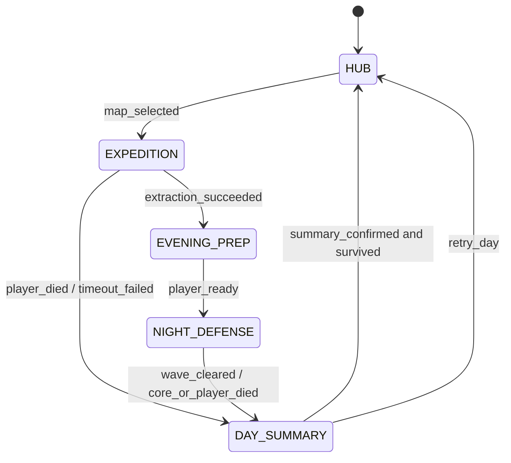
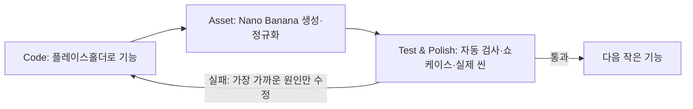

# 낮 파밍–밤 기지 디펜스 게임 시스템 아키텍처 및 기술 명세

> 대상: Godot 4.x / GDScript / 2D Isometric `TileMapLayer`
>
> 문서 상태: 구현 기준선 v2.0  
> 우선순위: 정확한 코어 루프 → 플레이 가능한 세로 조각 → 콘텐츠 확장  
> 범위 밖: 멀티플레이, 절차 생성, ECS, 모딩, 3D 전환, 범용 DI/서비스 프레임워크

---

## 0. 설계 원칙과 기준 결정

### 0.1 목표

이 문서는 AI가 단계별로 코드를 생성할 때 파일 위치, 책임, 데이터 소유권, 좌표계, 상태 전환 규칙을 임의로 바꾸지 않도록 하는 단일 기준 문서다. 첫 구현은 **2D Isometric 세로 조각**에 집중한다.

### 0.2 확정 기술 선택

| 항목 | 기준 |
|---|---|
| 엔진 | Godot 4.x stable, GDScript |
| 월드 | 2D Canvas 좌표계 + 다이아몬드형 Isometric `TileMapLayer` |
| 물리 | `CharacterBody2D`, `Area2D`, `StaticBody2D` |
| 정적 맵 이동 | `NavigationRegion2D` + `NavigationAgent2D` |
| 건축 셀 판정 | `TileMapLayer.local_to_map()` / `map_to_local()` |
| 건축 경로 사전 검증 | `AStarGrid2D` 기반 점유 그리드 |
| 데이터 정의 | Godot Custom `Resource` (`.tres`) |
| 런타임 전역 데이터 | Autoload `GameManager`, `InventoryManager` |
| 느슨한 알림 | Autoload `EventBus`의 신호 |
| 저장 | Autoload `SaveManager`, `user://save.json`, 원자적 교체 |
| 입력 | 이동은 화면 축 기준, 조준은 마우스의 월드 좌표 기준 |
| 그래픽 제작 | 플레이스홀더 우선, Nano Banana 2 + 승인형 PNG 파이프라인 |
| 반복 개발 | `Code → Asset → Test & Polish`를 Phase마다 완료 |

`AStarGrid2D`는 건축 버튼을 누르는 순간의 동기식 길막힘 검사에만 사용한다. 좀비의 실제 이동은 `NavigationAgent2D`가 담당한다. 동일 문제를 두 시스템이 독립적으로 해석하지 않도록 `BuildGrid`의 점유 데이터가 둘의 공통 입력이다.

### 0.3 코어 루프

```text
HUB(오전: 원정 선택)
  → EXPEDITION(오전/오후: 파밍·가방·타이머·탈출)
  → EVENING_PREP(저녁: 언로드·건축·정비)
  → NIGHT_DEFENSE(밤: 웨이브·코어 방어·직접 전투)
  → DAY_SUMMARY(새벽: 정산·저장·난이도 증가)
  → HUB(Day + 1)
```

패배 조건은 플레이어 사망 또는 기지 코어 체력 0이다. 패배 시 해당 날짜 시작 스냅샷으로 복귀하되, 그날 획득한 가치의 일부를 `legacy_scrap`으로 변환하고 이미 해금한 청사진을 유지한다. 일반 보관 자원과 원정 가방을 그대로 복제하지 않는 이 작은 메타 루프가 실패 진행의 기준이다. 복수 세이브 슬롯과 영구 사망은 별도 요구 전까지 만들지 않는다.

---

## A. 프로젝트 파일/폴더 구조

```text
res://
├─ project.godot
├─ docs/
│  └─ game_system_architecture.md
├─ art_source/
│  └─ nano_banana/
│     ├─ .gdignore
│     ├─ style_reference.png
│     ├─ prompts/{tiles,props,entities,icons}/
│     └─ raw/{tiles,props,entities,icons}/
├─ assets/
│  ├─ art/
│  │  ├─ placeholders/
│  │  ├─ tiles/{ground,overlays}/
│  │  ├─ characters/{player,zombies}/
│  │  ├─ structures/
│  │  ├─ props/{forest,city}/
│  │  ├─ items/
│  │  └─ vfx/
│  ├─ audio/{music,sfx}/
│  └─ shaders/occluder_fade.gdshader
├─ data/
│  ├─ items/*.tres
│  ├─ maps/*.tres
│  ├─ structures/*.tres
│  ├─ waves/*.tres
│  └─ tech/*.tres
├─ scripts/
│  ├─ core/
│  │  ├─ game_manager.gd
│  │  ├─ game_state_machine.gd
│  │  ├─ event_bus.gd
│  │  ├─ inventory_manager.gd
│  │  └─ save_manager.gd
│  ├─ data/
│  │  ├─ item_data.gd
│  │  ├─ map_data.gd
│  │  ├─ structure_data.gd
│  │  ├─ wave_data.gd
│  │  ├─ wave_spawn_entry_data.gd
│  │  └─ tech_data.gd
│  ├─ systems/
│  │  ├─ inventory.gd
│  │  ├─ isometric_grid_building_system.gd
│  │  ├─ build_grid.gd
│  │  ├─ combat_system.gd
│  │  └─ target_selector.gd
│  └─ components/
│     ├─ health_component.gd
│     └─ hitbox_component.gd
├─ scenes/
│  ├─ main.tscn
│  ├─ base/
│  │  ├─ base.tscn
│  │  ├─ base_controller.gd
│  │  ├─ isometric_tile_layers.tscn
│  │  └─ building_manager.tscn
│  ├─ expedition/
│  │  ├─ expedition.tscn
│  │  ├─ expedition_controller.gd
│  │  ├─ city.tscn
│  │  ├─ forest.tscn
│  │  ├─ resource_node.tscn
│  │  └─ extraction_zone.tscn
│  └─ defense/
│     ├─ wave_controller.tscn
│     ├─ wave_controller.gd
│     ├─ zombie_spawner.tscn
│     └─ zombie_spawner.gd
├─ entities/
│  ├─ player/{player.tscn,player.gd}
│  ├─ zombies/{zombie.tscn,zombie.gd}
│  ├─ structures/
│  │  ├─ structure_base.tscn
│  │  ├─ structure_base.gd
│  │  ├─ turret.tscn
│  │  ├─ barricade.tscn
│  │  └─ spike_trap.tscn
│  └─ combat/{projectile.tscn,projectile.gd}
├─ ui/
│  ├─ hud/{hud.tscn,hud.gd}
│  ├─ inventory/{inventory_panel.tscn,inventory_panel.gd}
│  ├─ expedition_map/{map_select.tscn,map_select.gd}
│  ├─ building/{build_panel.tscn,build_panel.gd}
│  └─ summary/{day_summary.tscn,day_summary.gd}
├─ tests/
│  ├─ test_core.gd
│  ├─ grid_building_test.tscn
│  ├─ navigation_test.tscn
│  └─ inventory_test.tscn
└─ tools/
   ├─ asset_pipeline/validate_assets.gd
   └─ asset_test/{asset_test_scene.tscn,asset_test_scene.gd}
```

### A.1 파일 책임 규칙

- `scripts/data/`: 상태 없는 데이터 스키마만 둔다. 게임 진행 로직을 넣지 않는다.
- `data/`: 디자이너가 수정하는 `.tres` 인스턴스다. ID는 파일명과 같게 유지한다.
- `scripts/core/`: 씬이 바뀌어도 살아 있어야 하는 상태와 전환만 둔다.
- `scripts/systems/`: 여러 씬에서 재사용하는 순수 로직 또는 월드 서비스다.
- `scenes/`: 레벨 조합과 해당 레벨의 흐름 제어다.
- `entities/`: 독립적으로 생성·제거되는 플레이어, 적, 구조물, 투사체다.
- `ui/`: 표시와 사용자 의도 전달만 담당한다. 재고 차감, 상태 전환을 직접 수행하지 않는다.
- `art_source/nano_banana/`: 생성 원본, 기준 이미지, 프롬프트 기록이다. `.gdignore`로 런타임 임포트에서 제외한다.
- `assets/art/`: 크기·알파·피벗 검사를 통과한 승인본만 둔다. 게임 씬은 `raw/`를 절대 참조하지 않는다.
- `tools/asset_test/`: 그래픽 승인용 쇼케이스이며 출시 씬에 포함하지 않는다.
- 한 기능을 위해 추상 인터페이스와 구현체를 동시에 만들지 않는다. 두 번째 구현이 실제로 생길 때 분리한다.

### A.2 Autoload 등록 순서

```text
EventBus        res://scripts/core/event_bus.gd
InventoryManager res://scripts/core/inventory_manager.gd
SaveManager     res://scripts/core/save_manager.gd
GameManager     res://scripts/core/game_manager.gd
```

`GameManager`가 최종 조정자다. 다른 Autoload는 서로 직접 참조하지 않고, 필요한 데이터는 명시적 메서드 인자로 받거나 `GameManager`가 전달한다.

---

## B. Isometric 공간 좌표 및 렌더링

### B.1 좌표계 정의

| 명칭 | 타입 | 의미 |
|---|---|---|
| 화면 좌표 | `Vector2` | Viewport 좌상단 기준 마우스 픽셀 |
| Canvas 전역 좌표 | `Vector2` | `Camera2D` 변환이 적용된 월드 좌표 |
| TileMap 로컬 좌표 | `Vector2` | 특정 `TileMapLayer` 원점 기준 좌표 |
| 셀 좌표 | `Vector2i` | 다이아몬드 그리드의 정수 인덱스 |

다이아몬드 타일의 표시 폭을 `W`, 표시 높이를 `H`, 셀을 `(i, j)`라 하면 원점 오프셋을 제외한 셀 중심의 개념식은 다음과 같다.

```text
screen_x = (i - j) × W / 2
screen_y = (i + j) × H / 2

i = screen_x / W + screen_y / H
j = screen_y / H - screen_x / W
```

이 수식은 디버그 표시와 이해를 위한 것이다. TileSet의 타일 모양, 레이아웃, 오프셋, 노드 변환까지 반영하는 **실제 판정은 반드시 엔진 API 하나로 통일**한다.

```gdscript
var local_mouse := ground_layer.get_local_mouse_position()
var cell := ground_layer.local_to_map(local_mouse)
var local_center := ground_layer.map_to_local(cell)
var world_center := ground_layer.to_global(local_center)
```

다른 노드가 가진 Canvas 전역 좌표를 셀로 바꿀 때는 다음 순서를 지킨다.

```gdscript
var cell := ground_layer.local_to_map(
    ground_layer.to_local(world_position)
)
```

규칙:

- 모든 점유 데이터 키는 `Vector2i` 셀 좌표다.
- 구조물 저장 위치도 픽셀 좌표가 아니라 기준 셀과 회전값이다.
- `map_to_local()` 결과는 셀 중심이며 개별 타일의 `texture_origin`은 반영하지 않으므로 게임플레이 기준점으로만 쓴다.
- 월드 경계 밖 셀은 `ground_layer.get_used_rect().has_point(cell)`로 거부한다.
- 바닥, 장식, 구조물 프리뷰는 같은 TileSet 크기와 원점을 공유한다.

### B.2 권장 `TileMapLayer` 구성

```text
IsometricWorld (Node2D, y_sort_enabled=true)
├─ GroundLayer       # z_index=-20, y_sort_enabled=false
├─ GroundDecoLayer   # z_index=-10, y_sort_enabled=false
├─ WorldLayer        # z_index=0,  y_sort_enabled=true
├─ Actors            # z_index=0,  월드 엔티티 루트
├─ RoofLayer         # z_index=10, 필요 시 반투명
└─ EffectsFront      # z_index=20, 화면 최전면 효과만
```

- TileSet: `tile_shape = ISOMETRIC`, 다이아몬드형, 프로젝트 전체에서 동일한 타일 크기 사용.
- 바닥과 장식은 Y-Sort하지 않는다. 캐릭터와 높이가 있는 구조물만 `z_index=0` Y-Sort 공간에 둔다.
- 서로 Y-Sort되어야 하는 `CanvasItem`은 동일한 `z_index`여야 한다.
- `TileMapLayer.y_sort_origin`은 타일 그래픽의 발 위치에 맞춘다. 서로 다른 높이 층은 별도 레이어와 `z_index`로 분리한다.

### B.3 Y-Sort 피벗 규칙

Y-Sort 키는 엔티티 루트 `Node2D.position.y`다. 루트는 항상 **바닥 접점**에 둔다.

| 대상 | 루트 피벗 | 자식 비주얼 배치 |
|---|---|---|
| 플레이어/좀비 | 양발 중앙 | `Sprite2D`를 위쪽으로 오프셋 |
| 바리케이드/터렛 | 점유 footprint의 화면상 앞쪽 중앙 | 스프라이트 원점을 바닥 접점에 정렬 |
| 대형 2×2 구조물 | footprint의 가장 아래쪽 다이아몬드 경계 중앙 | 충돌체는 점유 셀 전체를 덮음 |
| 투사체 | 지면에 투영된 정렬점 | 탄환 비주얼은 높이만큼 위로 오프셋 |
| 드랍 아이템 | 바닥 그림자 중앙 | 아이콘/스프라이트를 위로 오프셋 |

피벗 보정을 위해 매 프레임 `z_index`를 계산하지 않는다. 피벗을 바로잡으면 엔진의 Y-Sort로 충분하다. UI, 조준선, 피해 숫자는 별도 `CanvasLayer`에 둔다.

### B.4 가림 처리

MVP는 복잡한 화면 공간 실루엣 마스크 대신 **가리는 구조물 자체를 반투명화**한다.

1. 벽/지붕의 상단 시각 영역에 `Area2D`를 둔다.
2. 플레이어 또는 좀비의 가슴 기준 `OcclusionProbe`가 영역에 들어오면 해당 구조물의 시각 노드만 알파 0.35로 Tween한다.
3. 영역을 벗어나면 1.0으로 복구한다.
4. 여러 대상/영역 중첩은 진입 카운터로 관리해 하나가 나갔다고 즉시 복구하지 않는다.
5. 충돌체, 그림자, 선택 하이라이트는 투명화하지 않는다.

플레이어 위치 파악이 여전히 어렵다는 플레이테스트 결과가 있을 때만 플레이어 복제 스프라이트 + 단색 셰이더로 가림 실루엣을 추가한다. `LightOccluder2D`는 조명 그림자용이며 캐릭터 가림 판정의 대체물이 아니다.

### B.5 이동 입력 표준

두 조작 방식 중 **화면 축 기준**을 표준으로 채택한다.

| 방식 | W/S, A/D 체감 | 장점 | 단점 | 채택 |
|---|---|---|---|---|
| 화면 축 기준 | 위/아래, 좌/우 | 마우스 조준과 일치, 즉시 이해 가능 | 타일 축과 대각선 관계 | 표준 |
| Isometric 축 기준 | 두 대각선 축 | 셀 단위 이동에 직관적 | 액션 전투에서 낯섦 | 그리드 편집에만 사용 |

```gdscript
var input := Input.get_vector("move_left", "move_right", "move_up", "move_down")
velocity = input * move_speed
move_and_slide()
```

`Input.get_vector()`가 길이를 1로 제한하므로 대각선 속도 보정 코드를 추가하지 않는다. 이동은 화면 공간 8방향이고, 지형 충돌은 `CharacterBody2D`가 처리한다.

### B.6 마우스 조준과 8방향 스프라이트

```gdscript
var aim := get_global_mouse_position() - global_position
var angle := wrapf(aim.angle(), 0.0, TAU)
var direction_index := int(round(angle / (TAU / 8.0))) % 8
```

- 논리적 사격 방향은 정규화된 연속 벡터를 사용한다. 8방향 분할은 애니메이션 선택에만 사용한다.
- `look_at()`은 회전 가능한 무기 피벗/터렛에 사용하고, 캐릭터 루트 전체를 돌리지 않는다.
- 기본 인덱스 기준은 `0=E, 1=SE, 2=S, 3=SW, 4=W, 5=NW, 6=N, 7=NE`로 고정한다. Godot의 양의 Y가 화면 아래쪽임을 전제로 한다.
- 마우스가 피벗과 거의 같아 `aim.length_squared() < 1.0`이면 마지막 유효 방향을 유지한다.

---

## C. Custom Resource 데이터 모델

### C.1 공통 규칙

- 모든 ID는 소문자 `snake_case` `StringName`이며 저장 데이터의 영구 키다.
- UI 이름과 설명은 ID와 분리한다.
- `.tres`는 정의 데이터이며 런타임에 직접 수정하지 않는다. 체력, 탄약, 수량은 별도 런타임 객체가 소유한다.
- Godot 4.x 소버전 호환을 위해 직렬화 컨테이너는 기본 `Array`/`Dictionary`를 사용하고, 로드 시 키와 값 타입을 검증한다.
- 중복 ID, 음수 수량, 존재하지 않는 참조 ID는 시작 시 `assert` 기반 데이터 검증에서 실패시킨다.

### C.2 `ItemData`

```gdscript
class_name ItemData
extends Resource

enum Category { RESOURCE, MATERIAL, EQUIPMENT }
enum RegionTag { CITY, FOREST, BOTH }

@export var id: StringName
@export var display_name: String
@export var category: Category
@export_range(1, 999) var max_stack: int = 1
@export var icon: Texture2D
@export var region_tag: RegionTag = RegionTag.BOTH
@export_range(0, 1000) var meta_value: int = 1
```

계약:

- `EQUIPMENT`는 기본 `max_stack = 1`이다.
- 인벤토리와 제작식은 `ItemData` 객체가 아니라 `id`로 참조한다.
- 아이템 드랍 확률은 맵 데이터가 소유하며 아이템 데이터에 넣지 않는다.
- `meta_value`는 패배 시 `legacy_scrap` 환산에만 쓰며 상점 가격이나 제작 수량을 대신하지 않는다.

### C.3 `MapData`

```gdscript
class_name MapData
extends Resource

enum MapType { CITY, FOREST }

@export var id: StringName
@export var display_name: String
@export var map_type: MapType
@export var scene: PackedScene
@export var resource_spawn_weights: Dictionary # item_id: StringName -> weight: float
@export_range(1.0, 3600.0) var time_limit_seconds: float = 600.0
@export var extraction_cells: Array[Vector2i]
```

계약:

- 가중치는 0 이상이며 합계가 1일 필요는 없다. 선택 시 전체 양수 가중치 합으로 정규화한다.
- 탈출 구역 좌표는 씬의 기준 `TileMapLayer` 셀 좌표다.
- 도시 기본 태그: 기계/전자 부품, 철재, 의약품. 숲 기본 태그: 목재, 석재, 식량.
- 실제 자원 노드 수와 재생성 여부는 씬의 스폰 포인트가 결정한다.

### C.4 `StructureData`

```gdscript
class_name StructureData
extends Resource

enum Kind { BARRICADE, BARBED_WIRE, TURRET, TRAP }

@export var id: StringName
@export var display_name: String
@export var kind: Kind
@export var scene: PackedScene
@export var footprint: Vector2i = Vector2i.ONE
@export var required_materials: Dictionary # item_id: StringName -> amount: int
@export_range(1, 100000) var max_health: int = 100
@export_range(0.0, 4096.0) var attack_range: float = 0.0
@export_range(0.0, 100000.0) var attack_damage: float = 0.0
@export_range(0.0, 100.0) var attacks_per_second: float = 0.0
@export var blocks_navigation: bool = true
```

계약:

- `footprint`는 회전 전 셀 크기다. 90°/270° 회전 시 X/Y를 바꾼다.
- `required_materials`의 수량은 양수 정수다.
- 공격하지 않는 구조물은 사거리/공격력/공격 속도를 모두 0으로 둔다.
- 터렛의 공격 속도는 초당 공격 횟수이며 쿨다운은 `1.0 / attacks_per_second`다.
- 설치된 구조물 런타임 상태는 `{structure_id, anchor_cell, rotation_quarters, current_health, ammo}`만 저장한다.

### C.5 `WaveSpawnEntryData`와 `WaveData`

```gdscript
class_name WaveSpawnEntryData
extends Resource

enum EntryDirection { NORTH, EAST, SOUTH, WEST, RANDOM }

@export var zombie_id: StringName
@export_range(1, 10000) var count: int = 1
@export_range(0.05, 60.0) var spawn_interval: float = 1.0
@export var entry_direction: EntryDirection = EntryDirection.RANDOM
@export_range(0.0, 3600.0) var start_delay: float = 0.0
```

```gdscript
class_name WaveData
extends Resource

@export_range(1, 10000) var day: int = 1
@export var entries: Array[WaveSpawnEntryData]
@export_range(0.0, 3600.0) var completion_delay: float = 3.0
```

계약:

- `entries`의 각 항목은 좀비 종류, 물량, 주기, 진입 방향을 완전히 정의한다.
- 같은 날 여러 항목이 동시에 실행될 수 있다.
- 정의된 날짜 데이터가 없으면 마지막 정의를 기준으로 `count × (1 + 0.12 × 초과 일수)`, 체력/공격력 `× (1 + 0.08 × 초과 일수)`를 적용한다. 계수는 밸런스 상수 한곳에서만 관리한다.
- 밤 종료 조건은 모든 항목의 생성 완료 **그리고** 생존 좀비 수 0이다.

### C.6 `TechData`

```gdscript
class_name TechData
extends Resource

@export var id: StringName
@export var display_name: String
@export var icon: Texture2D
@export_range(1, 100) var required_level: int = 1
@export_range(0, 100000) var legacy_scrap_cost: int = 0
@export var prerequisite_ids: Array[StringName]
@export var unlock_ids: Array[StringName] # StructureData/ItemData ID
```

계약:

- 테크 그래프는 순환할 수 없으며 시작 시 DFS 한 번으로 검증한다.
- `required_level`은 구매 가능 조건, `legacy_scrap_cost`는 실제 영구 비용이다.
- `unlock_ids`는 새 구조물/장비 제작식만 열고 직접 수치 보너스를 누적하지 않는다.
- 해금 상태는 `TechData`를 수정하지 않고 `GameManager.unlocked_blueprints`에 ID로 저장한다.

---

## D. 게임 상태 머신과 전역 데이터

### D.1 상태와 허용 전환



| 상태 | 소유 씬 | 진입 작업 | 종료 조건 |
|---|---|---|---|
| `HUB` | `base.tscn` | 저장된 기지/보관함 로드, 맵 UI 활성화 | 맵 선택 확정 |
| `EXPEDITION` | `expedition.tscn` + 선택 지역 | 빈/보존된 가방 준비, 타이머 시작 | 탈출 성공, 사망, 실패 |
| `EVENING_PREP` | `base.tscn` | 가방을 보관함으로 원자적 언로드 | 준비 완료 버튼 |
| `NIGHT_DEFENSE` | `base.tscn` + 방어 컨트롤러 | 야간 조명, 웨이브 시작 | 클리어 또는 패배 |
| `DAY_SUMMARY` | 요약 UI | 보상·손실·통계 확정, 저장 | 다음 날 또는 재시도 |

### D.2 `GameManager`

책임:

- 현재 `GameState`, `day`, 선택한 `map_id`, 날짜 결과를 소유한다.
- 영구 메타 값 `legacy_scrap`, `survivor_xp`, `survivor_level`, `unlocked_blueprints`와 날짜 시작 스냅샷을 소유한다.
- `GameStateMachine`에 전환을 요청하고 허용된 전환만 실행한다.
- 씬 교체를 한 곳에서 수행한다.
- 상태 진입 전에 필요한 런타임 데이터를 준비하고, 완료 후 `EventBus.game_state_changed`를 발행한다.
- 일차 증가와 난이도 스케일 적용은 `DAY_SUMMARY → HUB` 생존 전환에서 한 번만 수행한다.
- 패배 정산은 일반 자원 복구와 메타 보상을 분리해 한 번만 적용한다.

전환 API:

```gdscript
request_expedition(map_id: StringName) -> bool
complete_expedition(success: bool) -> void
start_night() -> bool
complete_night(survived: bool) -> void
confirm_summary() -> void
settle_failure(acquired_items: Dictionary) -> int
can_unlock_tech(tech: TechData) -> bool
unlock_tech(tech: TechData) -> bool
```

UI는 `change_state()`를 직접 호출하지 않는다. 위 의도 API만 호출한다.

### D.3 `GameStateMachine`

- 상태 전환표를 가진 작은 일반 클래스이며 Autoload가 아니다.
- 같은 상태 재진입과 허용되지 않은 전환을 거부한다.
- 전환 중 두 번째 요청을 거부하는 `is_transitioning` 가드가 있다.
- 씬 로드 성공 후에만 현재 상태를 갱신한다. 실패하면 이전 상태와 데이터를 유지한다.

### D.4 `InventoryManager`

씬 전환에서 사라지지 않는 유일한 아이템 수량 소유자다.

```text
storage: Dictionary       # item_id -> amount, 기지 영구 보관함
expedition_bag: Inventory # 슬롯 수/스택 제한이 있는 원정 가방
equipped: Dictionary      # slot_id -> item_id
```

필수 API:

```gdscript
can_add_to_bag(item_id, amount) -> bool
add_to_bag(item_id, amount) -> int          # 실제 추가 수량 반환
remove_from_bag(item_id, amount) -> bool
unload_bag_to_storage() -> void             # 전체 성공 또는 변경 없음
has_materials(costs: Dictionary) -> bool
consume_materials(costs: Dictionary) -> bool
refund_materials(costs: Dictionary) -> void
to_save_data() -> Dictionary
load_save_data(data: Dictionary) -> bool
```

규칙:

- 원정 중 획득은 가방에만 들어간다.
- 탈출 성공 시에만 가방을 보관함으로 옮긴다. 사망/실패 정책은 첫 버전에서 가방 전량 손실이다.
- 건축은 `has_materials()` 확인 후 `consume_materials()`를 한 번 호출한다.
- 설치 실패 시 차감하지 않는다. 설치 후 예외가 발생하면 같은 비용을 즉시 환불하고 점유를 롤백한다.
- UI는 인벤토리 사본을 수정하지 않고 신호를 받아 다시 그린다.

### D.5 `EventBus`

신호는 알림에만 사용하고 명령을 숨기지 않는다.

```gdscript
signal game_state_changed(previous, current)
signal day_changed(day: int)
signal inventory_changed(container: StringName)
signal health_changed(entity: Node, current: float, maximum: float)
signal structure_placed(structure: Node, cells: Array[Vector2i])
signal structure_removed(structure: Node, cells: Array[Vector2i])
signal wave_started(day: int)
signal wave_progress(spawned: int, total: int, alive: int)
signal wave_completed(day: int)
signal meta_progress_changed(level: int, xp: int, legacy_scrap: int)
```

건축 요청, 피해 적용, 상태 전환 같은 반환값이 필요한 동작은 신호로 보내지 않고 해당 소유자의 메서드를 직접 호출한다.

### D.6 저장 명세

저장 시점:

- `DAY_SUMMARY` 정산 완료 직후 자동 저장.
- 매일 `HUB` 진입 완료 시 패배 복구용 `day_start_snapshot`을 갱신한다.
- 설정 메뉴의 명시적 저장은 HUB/EVENING_PREP에서만 허용.
- 원정 중 자동 저장하지 않아 가방 복제와 세이브 스컴 경계를 단순화한다.

최소 저장 스키마:

```json
{
  "version": 2,
  "day": 3,
  "state": "HUB",
  "meta": {
    "legacy_scrap": 18,
    "survivor_xp": 420,
    "survivor_level": 4,
    "unlocked_blueprints": ["turret_basic"]
  },
  "storage": {"wood": 24, "scrap_metal": 7},
  "equipped": {"primary": "pistol"},
  "structures": [
    {"id": "barricade_wood", "cell": [4, 8], "rot": 0, "hp": 80, "ammo": 0}
  ],
  "core_health": 900,
  "day_start_snapshot": {
    "day": 3,
    "storage": {"wood": 20, "scrap_metal": 7},
    "structures": [],
    "core_health": 1000
  }
}
```

`SaveManager`는 Dictionary를 JSON으로 직렬화하고 임시 파일에 완전히 쓴 다음 기존 저장 파일을 교체한다. 로드 시 `version`, 필수 키, 값 범위, 알려진 ID를 검증한다. 손상된 저장은 덮어쓰지 않고 새 게임 선택지를 표시한다.

패배 정산 규칙:

- 원정 가방과 그날 사용한 소모품은 복구하지 않는다.
- 기지·보관함·장비는 `day_start_snapshot`으로 되돌린다.
- 그날 새로 획득한 원시 자원의 `amount × ItemData.meta_value` 합계 중 10%를 `legacy_scrap`으로 변환하며 일일 상한을 둔다.
- 이미 구매한 `unlocked_blueprints`는 유지한다.
- 성공한 밤의 생존 보상은 `survivor_xp`를 올리고, 요구 XP 테이블을 넘으면 `survivor_level`을 올린다. 레벨은 테크 구매 조건만 열고 전투 수치를 자동 증가시키지 않는다.
- `legacy_scrap`은 시작 보급 또는 영구 청사진 해금에만 쓰며 일반 건축 재료를 대체하지 않는다.
- 10%와 일일 상한은 밸런스 상수 한곳에서 조정하고 저장 데이터에 복제하지 않는다.

---

## E. 핵심 시스템 인터페이스 및 로직

## E.1 `IsometricGridBuildingSystem`

### 노드 구성

```text
BuildingManager (Node2D)
├─ GridCursor (Node2D)
│  ├─ ValidCells (TileMapLayer 또는 MultiMesh 대체 전 단순 draw_polygon)
│  └─ InvalidCells
├─ PreviewRoot (Node2D)
└─ RebuildTimer (Timer, one_shot)
```

### 상태

```text
selected_structure: StructureData
anchor_cell: Vector2i
rotation_quarters: int
preview_cells: Array[Vector2i]
occupied: Dictionary            # cell -> structure instance id
reserved_cells: Dictionary      # 출입구, 코어, 스폰 금지 셀
```

### 공개 인터페이스

```gdscript
select_structure(data: StructureData) -> void
rotate_preview(clockwise: bool) -> void
get_footprint_cells(anchor, footprint, rotation_quarters) -> Array[Vector2i]
validate_placement(data, anchor, rotation_quarters) -> BuildResult
try_place(data, anchor, rotation_quarters) -> bool
remove_structure(structure: Node) -> bool
```

`BuildResult`는 첫 버전에서 별도 클래스 대신 `{valid: bool, reason: StringName, cells: Array}` Dictionary로 충분하다. 이유 코드는 `ok`, `out_of_bounds`, `occupied`, `reserved`, `insufficient_materials`, `blocks_required_route`다.

### 프레임별 하이라이트

1. `_unhandled_input()` 또는 `_process()`에서 마우스 셀을 구한다.
2. 셀이 바뀌었을 때만 footprint와 판정을 다시 계산한다.
3. 유효 셀은 초록, 무효 셀은 빨강 반투명 다이아몬드로 그린다.
4. 프리뷰 구조물은 `map_to_local(anchor)`에 배치하고 알파 0.55를 적용한다.
5. UI 위 마우스, 선택 없음, NIGHT_DEFENSE 상태에서는 프리뷰를 숨긴다.

### 설치 판정 순서

```text
1. 상태가 EVENING_PREP인가?
2. footprint 전체가 맵 경계 안인가?
3. occupied/reserved 셀과 겹치지 않는가?
4. 재료가 충분한가?
5. BuildGrid의 모든 필수 스폰 입구에서 코어 접근이 가능한가?
6. 씬 생성과 점유 등록이 성공했는가?
7. 재료 차감 → 내비게이션 갱신 예약
```

5번 검사 중 후보 셀은 임시 점유로 표시한 뒤 검사 후 반드시 원복한다. 공격 불가능한 영구 장애물로 모든 길을 막는 배치는 거부한다. 파괴 가능한 바리케이드는 높은 통과 비용을 가진 셀로 유지하여 아래의 돌파 비용 평가에 사용한다.

### 내비게이션 동적 갱신

- 구조물 배치/제거 시 충돌체와 `BuildGrid`를 즉시 갱신한다.
- `NavigationRegion2D.bake_navigation_polygon(true)`는 기본 비동기 실행한다.
- 연속 건축마다 굽지 않고 one-shot Timer를 0.15초로 재시작하여 마지막 변경을 묶는다.
- `bake_finished` 전까지 좀비는 기존 경로를 유지하되 새 구조물의 물리 충돌체에 막히면 공격/재경로 상태로 전환한다.
- 한 번에 베이크가 프레임 예산을 넘으면 맵을 고정 구역별 `NavigationRegion2D`로 나누는 최적화를 검토한다. 첫 버전에는 넣지 않는다.

### 건축 트랜잭션

```text
validate → instantiate → occupy cells → consume materials → schedule bake → emit signal
```

어느 단계든 실패하면 생성 노드 제거, 점유 해제, 재료 환불을 수행한다. 동일 입력 프레임의 중복 클릭은 `placing` 가드로 막는다.

## E.2 Zombie Horde와 Isometric Pathfinding

### 좀비 상태

```text
SPAWN → SEEK → MOVE → ATTACK → SEEK
                  ↘ DEAD
```

- `SEEK`: 목표와 경로를 계산한다.
- `MOVE`: `NavigationAgent2D.get_next_path_position()` 방향으로 `CharacterBody2D.velocity`를 설정한다.
- `ATTACK`: 공격 범위 안의 플레이어, 코어 또는 구조물에 쿨다운 기반 피해를 준다.
- `DEAD`: 충돌과 에이전트를 끄고 사망 연출 후 제거한다.

### 내비게이션 규칙

- 경로 목표 좌표는 `target.global_position`이다.
- 새 목표 지정 후 내비게이션 맵 동기화를 위해 첫 물리 프레임 이전에 경로를 강제 조회하지 않는다.
- `path_desired_distance`와 `target_desired_distance`는 좀비 반지름보다 약간 크게 설정한다.
- 군집 회피는 `NavigationAgent2D.avoidance_enabled`로 시작하되, 대규모 웨이브 성능이 부족하면 모든 좀비가 아니라 화면 근처/선두만 활성화한다.
- 경로 재계산은 매 프레임이 아니라 목표 변경, 구조물 변경, 일정 간격(기본 0.4초 ± 개체별 지터)에만 수행한다.

### 목표 우선순위

후보 목표는 코어, 플레이어, 현재 경로의 파괴 가능한 구조물이다. 플레이어가 공격 가능 거리 `player_aggro_radius` 안에 있으면 플레이어를 우선하되, 그렇지 않으면 코어를 기본 목표로 한다.

바리케이드 돌파와 우회는 `BuildGrid`에서 다음 예상 시간을 비교한다.

```text
route_cost = 이동 거리 / 이동 속도
           + Σ(경로상 구조물 현재 HP / 좀비 유효 DPS)
```

- 파괴 가능한 구조물 셀은 막힌 셀이 아니라 높은 비용 셀로 탐색한다.
- 우회 비용이 더 작으면 `NavigationAgent2D`로 우회한다.
- 돌파 비용이 더 작으면 경로에서 처음 만나는 구조물의 인접 접근 셀로 이동한 뒤 공격한다.
- 목표가 파괴되거나 플레이어가 유인 범위를 벗어나면 `SEEK`로 돌아간다.
- 모든 좀비가 같은 프레임에 전체 격자를 탐색하지 않도록 결과를 `BuildGrid.revision`별로 짧게 공유한다. 프로파일링 전에는 더 복잡한 플로우 필드를 만들지 않는다.

### 스폰

- `ZombieSpawner`는 NORTH/EAST/SOUTH/WEST별 `Marker2D` 배열을 가진다.
- `RANDOM`은 활성 방향 중 하나를 선택한다.
- 스폰 셀이 점유되었으면 같은 방향의 다음 Marker를 시도하며, 모두 실패하면 다음 틱으로 미룬다.
- `WaveController`가 생성 수/생존 수를 단독 집계하고 개별 좀비는 사망 신호만 보낸다.

## E.3 Combat System

### 충돌 레이어 기준

| Layer | 이름 | 사용 |
|---:|---|---|
| 1 | World | 벽, 맵 장애물 |
| 2 | Player | 플레이어 본체 |
| 3 | Enemy | 좀비 본체 |
| 4 | Structure | 구조물/코어 |
| 5 | PlayerHit | 플레이어 공격 판정 |
| 6 | EnemyHit | 적 공격 판정 |
| 7 | Pickup | 자원/아이템 |
| 8 | Trigger | 탈출/스폰/오클루전 영역 |

### 원거리 발사

```gdscript
var direction := (get_global_mouse_position() - muzzle.global_position).normalized()
projectile.global_position = muzzle.global_position
projectile.velocity = direction * projectile_speed
```

규칙:

- 영점 벡터이면 발사하지 않는다.
- 투사체는 `_physics_process(delta)`에서 `velocity * delta`만큼 이동하고 `Area2D` 또는 ray query로 충돌을 검사한다.
- 빠른 탄환은 한 프레임 이동 구간을 raycast해 터널링을 방지한다.
- 판정은 Canvas 월드 좌표에서 수행하므로 별도의 역 Isometric 변환을 하지 않는다.
- 지면 정렬용 루트가 Y-Sort를 받고, 탄환 시각 노드만 비행 높이만큼 위로 배치한다. 물리 판정과 렌더 순서를 결합하지 않는다.
- 피격 시 `HealthComponent.apply_damage(amount, source)`만 호출한다. 투사체가 직접 체력을 수정하지 않는다.

### 터렛

- 범위 `Area2D` 안의 살아 있는 적 중 `global_position.distance_squared_to()`가 가장 작은 대상을 선택한다.
- 매 프레임 전체 적 그룹을 검색하지 않는다.
- 대상 상실, 사망, 범위 이탈 시에만 재선정한다.
- `attacks_per_second == 0`이면 공격을 비활성화한다.

### 근접 부채꼴 판정

1. 공격 반경의 `CircleShape2D`로 후보를 한 번 조회한다.
2. 자기 자신, 사망 대상, 적대 레이어가 아닌 대상을 제거한다.
3. 각 후보에 대해 아래 조건을 검사한다.

```text
to_target = (target - attacker).normalized()
inside_cone = facing.dot(to_target) >= cos(cone_angle / 2)
```

4. 벽 너머 공격을 막아야 하는 무기는 공격자→대상 raycast가 World 레이어에 막히는지 추가 검사한다.
5. 한 번의 공격에서 같은 `HealthComponent`에는 한 번만 피해를 준다.

### 체력 계약

```gdscript
apply_damage(amount: float, source: Node) -> bool # 실제 피해가 적용되면 true
heal(amount: float) -> float                     # 실제 회복량 반환
signal died(source: Node)
```

체력은 `[0, max_health]`로 제한하고 `died`는 한 번만 발생한다. 플레이어, 좀비, 코어, 구조물은 동일한 `HealthComponent`를 재사용한다.

## E.4 원정 시스템

### 흐름

```text
MapSelect → MapData.scene 로드 → 자원 노드 활성화
→ 타이머/가방 HUD 시작 → 채집 → ExtractionZone 진입 및 상호작용
→ 성공: EVENING_PREP / 실패: DAY_SUMMARY
```

### 자원 스폰

- 맵 씬에 배치된 `ResourceSpawnPoint`마다 `MapData.resource_spawn_weights`로 하나를 선택한다.
- 가중치 0인 항목은 제외한다.
- 자원 노드는 `item_id`, `remaining_amount`, `interaction_time`만 가진다.
- 가방에 들어가지 못한 초과 수량은 월드에 남긴다.

### 탈출

- `ExtractionZone` 안에 플레이어가 있고 상호작용 버튼을 지정 시간 유지하면 성공한다.
- 타이머 0 시 즉시 실패시키지 않고, 이미 탈출 상호작용 중이면 짧은 유예를 주지 않는다. 규칙은 단순히 0에서 종료한다.
- 성공 콜백은 한 번만 허용하고 입력을 잠근 뒤 상태 전환을 요청한다.

## E.5 저녁 정비와 야간 연출

- `EVENING_PREP` 진입 시 원정 가방을 먼저 언로드하고 결과 UI를 표시한다.
- 건축, 철거, 수리, 탄약 보충은 이 상태에서만 가능하다.
- `NIGHT_DEFENSE` 진입 시 건축 UI와 구조물 이동을 잠근다.
- 야간 연출은 `CanvasModulate` 색상 Tween + `PointLight2D`를 사용한다. 상태 로직과 애니메이션 완료를 결합하지 않는다.
- 웨이브 완료 후 남은 투사체와 임시 효과를 제거하고 `DAY_SUMMARY`로 전환한다.

---

## F. 게임플레이 루프 엔지니어링

### F.1 루프 설계 계약

모든 루프는 다음 여섯 칸이 연결되어야 구현 완료다.

```text
Trigger → Player Action → System Response → Visual/Audio Feedback
        → State Change → Next Meaningful Choice
```

- 피드백만 있고 상태 변화가 없으면 장식이다.
- 상태 변화가 있는데 즉시 피드백이 없으면 버그처럼 느껴진다.
- 보상이 다음 선택에 쓰이지 않으면 루프가 닫히지 않는다.
- 아래 시간과 비율은 최초 튜닝값이며 플레이테스트 지표로 조정한다.

### F.2 마이크로 루프: 초~분 단위

| 루프 | 입력과 판정 | 즉시 피드백 | 상태 변화 | 검증 지표 |
|---|---|---|---|---|
| 조준→사격→명중 | 마우스 방향, 발사 쿨다운, ray/Area 충돌 | 1프레임 총구 섬광, 반동, 탄피/파편, 60ms 피격 플래시, 레이어별 효과음 | 탄약 감소, 대상 HP 감소 | 입력→총구 섬광 50ms 이하, 명중 판정과 플래시 동일 프레임 |
| 채집→획득 | 상호작용 유지 또는 도구 타격 | 오브젝트 흔들림, 작은 파편, 진행 링, 마지막 타격의 큰 파편 | 자원 노드 잔량 감소, 가방 수량 증가 | 입력 취소/가방 초과 시 수량 보존 |
| 피격→회복 행동 | 적 공격 범위와 쿨다운 | 캐릭터 플래시, 짧은 넉백/경직, 방향성 파편, 저강도 카메라 흔들림 | HP 감소, 거리 재형성 또는 회복 아이템 선택 | 피해 신호 1회, 조작 잠금 120ms 이하에서 시작 |
| 건축→작동 | 셀 선택, 판정, 설치 | footprint 색, 설치 스냅, 먼지 파편, 작동음 | 재료 감소, 점유/경로/방어력 변화 | 화면 판정과 실제 판정 불일치 0건 |

시각 효과는 승인 에셋과 엔진 효과를 조합한다. 피격 플래시는 셰이더/`self_modulate`, 작은 파편은 `GPUParticles2D`, 카메라 흔들림은 코드로 처리해 매 상호작용마다 별도 이미지를 만들지 않는다. 화면 흔들림과 플래시는 접근성 설정에서 강도 0까지 줄일 수 있어야 한다.

### F.3 코어 루프: 하루 단위


#### 자원 공급과 소모

| 자원 | 주 공급처 | 저녁 핵심 소모 | 루프 역할 |
|---|---|---|---|
| 목재 | 숲: 나무 | 목재 바리케이드, 초기 수리 | 저비용 즉시 방어 |
| 석재 | 숲: 바위 | 코어 보강, 함정 기초 | 내구 업그레이드 |
| 식량 | 숲: 베리/식량 상자 | 체력 회복, 원정 준비 | 다음 원정 안정성 |
| 철재/기계부품 | 도시: 차량/고철 | 철제 방어물, 터렛 프레임 | 중기 방어력 |
| 전자회로 | 도시: 자판기/전자 잔해 | 터렛, 센서, 테크 해금 | 자동화 성장 |
| 탄약 | 도시: 상자/군수 잔해 | 플레이어/터렛 사격 | 밤의 직접 소모 |
| 의약품 | 도시: 의료 상자 | 회복 아이템 | 실패 위험 완충 |

경제 규칙:

- 한 지역은 모든 재료를 주지 않는다. 다음 밤의 예상 손실과 원하는 업그레이드가 원정지 선택을 만든다.
- 하루 기대 획득량은 `예상 수리 + 예상 탄약 + 의미 있는 업그레이드 1개 + 15% 비축`을 목표로 시작한다.
- Day 1은 목재 방어물 1개와 기본 탄약을 보장해 잘못된 첫 맵 선택으로 진행이 막히지 않게 한다.
- 구조물 철거 환급은 기본 50%다. 배치 실수는 완전 환급할 수 있는 5초 취소 창으로 처리한다.
- 제작식 하나에 지역 고유 희귀 자원을 2종 이상 요구하지 않는다. 반복 강제 왕복을 피한다.
- 정산 UI는 `획득 → 소비 → 손실 → 잔여 → 다음 밤 예상 압력`을 한 화면에 보여 다음 선택으로 연결한다.

밸런스 검증은 아이템 총량 보존식으로 시작한다.

```text
기말 보관량 = 기초 보관량 + 성공 반입량 + 보상량 - 제작량 - 수리량 - 소모량
```

차이가 발생하면 UI 문제가 아니라 인벤토리 트랜잭션 오류로 취급한다.

### F.4 매크로 루프: 다일 차 진행

```text
Day 증가 → 적 압력 상승 → 자원 선택 압박 → 기지 테크 확장
          → 더 강한 밤 생존 → 새 청사진/지역 위험도 해금
```

적 압력과 플레이어 방어력을 같은 단위인 예상 생존 시간/초당 피해로 비교한다.

```text
enemy_pressure(day) = 총 적 HP × 접근 성공률 + 총 예상 DPS × 전투 시간
defense_capacity(day) = 구조물 유효 HP + 터렛 예상 피해 + 플레이어 예상 피해
pressure_ratio = enemy_pressure / max(defense_capacity, 1)
```

- 목표 `pressure_ratio`는 일반 밤 0.85~1.15에서 시작한다.
- 수량, 체력, 공격력을 같은 날 모두 크게 올리지 않는다. WaveData는 한 축을 주로 올리고 나머지는 완만하게 조정한다.
- 새 위협을 소개하는 날 직전에는 대응 청사진 또는 필요한 자원 지역을 먼저 연다.
- 3일 이동 평균의 코어 잔여 HP, 탄약 잔량, 실패율을 보고 계수만 조정한다. 시스템을 추가해 숫자 문제를 숨기지 않는다.

### F.5 실패와 메타 진행

메타 진행은 실패를 무효화하지 않고 다음 시도의 선택 폭만 넓힌다.

- 영구 값: `legacy_scrap`, `survivor_xp`, `survivor_level`, `unlocked_blueprints`.
- 비영구 값: 일반 자원, 구조물 현재 체력, 그날 원정 가방, 탄약 소비.
- 패배 시 그날 획득 가치의 10%를 `legacy_scrap`으로 바꾸고 날짜 시작 스냅샷으로 복귀한다.
- 메타 청사진은 새 전략을 열되 기본 장비보다 무조건 강한 수치 보너스를 쌓지 않는다.
- 성공한 새벽의 XP는 테크 티어 조건을 열고, `legacy_scrap`과 선행 기술을 충족해야 실제 청사진을 구매할 수 있다.
- 동일 Day 3회 연속 실패 시에만 선택형 시작 보급을 제안한다. 자동 난이도 하향은 하지 않는다.

### F.6 루프 계측

`GameManager.day_result`는 해당 날짜의 권위 있는 시스템에서 다음 값만 모아 `DAY_SUMMARY`와 밸런스 검증에 사용한다.

```text
selected_map, expedition_seconds, items_acquired, items_spent,
structures_built, structures_lost, ammo_spent,
shots_fired, hits, damage_dealt, damage_taken,
zombies_killed, core_health_end, survived
```

- UI 클릭 수가 아니라 인벤토리·전투·웨이브 소유자가 확정된 결과를 기록한다.
- `shots_fired == 0`일 때 명중률은 0으로 처리한다.
- Day Summary는 획득/소비/손실과 `pressure_ratio`를 보여준다.
- 개발 빌드에서는 최근 10일 CSV를 `user://debug/`에 내보낼 수 있다.
- 외부 분석 SDK, 계정 추적, 온라인 대시보드는 실제 요구와 동의 설계가 생길 때까지 추가하지 않는다.

---

## G. Nano Banana 그래픽 에셋 생성 및 통합 파이프라인

### G.1 도구 역할과 고정하지 않을 것

2026년 기준 제작 기본값은 다중 참조와 반복 편집 일관성이 좋은 **Nano Banana 2**다. Lite는 빠른 아이디어 변형, Pro는 기준 캐릭터·복잡한 구조물의 최종 재작업처럼 실제 품질 차이가 확인될 때만 쓴다. 모델 ID, API 호출, 계정 플랜은 게임 런타임에 들어가지 않는다.

보존할 산출물은 다음뿐이다.

```text
스타일 기준 이미지 + 최종 프롬프트 + 생성 원본 + 사람이 승인한 RGBA PNG
```

생성 결과는 초안이다. 정확한 크기, 알파, 피벗, 방향 일관성, 상업 이용 가능성은 파이프라인이 별도로 검증한다. 생성 원본의 SynthID/C2PA 등 출처 정보와 프롬프트 기록을 보존하고, 보이는 워터마크 제거를 자동화하지 않는다. 배포 전 사용한 서비스의 최신 약관, 상업 이용권, 상표·저작권 유사성을 사람이 검토한다.

### G.2 Isometric 규격

이 프로젝트의 “Isometric”은 게임 아트에서 흔히 부르는 **2:1 dimetric diamond**다.

- 셀 표시 크기: `128×64 px`.
- 다이아몬드 변의 화면 기울기: 수평 기준 `±26.565°`.
- 프롬프트 카메라: orthographic, azimuth 45°, fixed 2:1 game-isometric view.
- `style_reference.png`의 카메라와 조명이 숫자 설명보다 우선한다.
- 1 Godot 월드 픽셀 = 최종 에셋 1픽셀, 기본 표시 배율 1.0.

| 카테고리 | 최종 캔버스 | 게임 기준점 | 규칙 |
|---|---:|---:|---|
| 바닥 타일 | 128×64 | (64, 32) 셀 중심 | 다이아몬드 네 꼭짓점 고정, 불투명 영역이 경계 밖으로 나가지 않음 |
| 오버레이 타일 | 128×64 | (64, 32) | RGBA, 균열/얼룩만 표시 |
| 캐릭터/일반 좀비 | 128×128 | (64, 128) | 발 접점 bottom-center, 그림자 별도 |
| 대형 러너 좀비 | 192×192 | (96, 192) | 발 접점 bottom-center |
| 1×1 자원/구조물 | 128×192 | (64, 192) | 바닥 접점 bottom-center |
| 2×2 구조물/코어 | 256×320 | (128, 320) | footprint의 화면상 최전방 중앙 |
| UI 아이콘 | 64×64 | 중앙 | 6px safe area, 그림자·텍스트 없음 |
| VFX 프레임 | 128×128 | 중앙/효과별 지정 | RGBA, 6~8프레임 전 추가 필요성 검증 |

피벗 규칙:

- 캐릭터, 좀비, 구조물, 자원은 루트 `Node2D`가 발/바닥 접점이고 `Visual` 자식만 위로 오프셋한다.
- `Sprite2D.centered = true`이면 높이 `H` 에셋의 기본 `offset.y = -H / 2`다.
- 충돌체, 상호작용 영역, 사거리, 내비게이션 점유는 이미지 크기에서 생성하지 않는다.
- 생성 이미지에 바닥 그림자를 굽지 않는다. 공용 타원형 shadow Sprite/셰이더를 루트에 둔다.
- 투명 여백을 임의 trim하지 않는다. 캔버스 크기와 bottom-center가 교체 계약이다.

### G.3 화풍 및 프롬프트 표준

확정 화풍:

```text
dark cartoon survival game, stylized low-poly forms rendered as a clean 2D sprite,
orthographic 2:1 game-isometric view, strong readable silhouette,
desaturated cool environment palette with warm interaction accents,
key light from upper-left, soft ambient occlusion, medium detail,
no photorealism, no pixel art, no text, no logo, no watermark-shaped decoration
```

색과 조명 기준:

- 광원은 항상 화면 좌상단, 그림자는 우하단 방향이다.
- 바닥은 저대비, 상호작용 가능한 자원은 중대비, 적과 위험은 가장 높은 실루엣 대비를 갖는다.
- 플레이어 포인트 컬러는 황색, 자원 상호작용은 청록, 위험은 적색 계열로 시작한다. 색만으로 상태를 구분하지 않고 모양/아이콘을 함께 쓴다.
- 새 생성마다 스타일을 다시 설명하되 `style_reference.png`를 “화풍·카메라·조명 기준”으로 첨부한다.

공통 프롬프트 템플릿:

```text
ROLE: Create one production candidate for a Godot 4 2D isometric survival game.
REFERENCE: Use Image A only for art style, camera, palette, and upper-left lighting.
SUBJECT: {object_name}, {material}, {condition}, {recognizable_gameplay_feature}.
VIEW: Orthographic 2:1 game-isometric, {direction}, fixed camera matching Image A.
COMPOSITION: One isolated object, centered on a {canvas_w}×{canvas_h} canvas,
ground contact at exact bottom-center, readable at gameplay size.
STYLE: Dark cartoon survival, stylized low-poly forms rendered as a clean 2D sprite,
desaturated cool palette, warm interaction accent, strong silhouette, medium detail.
OUTPUT: Transparent background with real alpha, clean edge colors, no baked shadow.
MUST NOT INCLUDE: environment, floor plane, border, text, logo, UI, extra objects,
cropped parts, perspective camera, watermark-shaped decoration.
```

Nano Banana가 정확한 PNG 캔버스나 실제 알파를 보장한다고 가정하지 않는다. 결과를 승인 캔버스에 배치하고 배경을 실제 alpha 0으로 정리한 뒤 RGBA PNG로 내보낸다. 체크무늬가 픽셀로 그려졌거나 흰/검은 matte fringe가 있으면 반려한다.

방향 시트 템플릿:

```text
Use Image A for style and Image B for the exact character identity.
Create an 8-view turnaround of the same character: E, SE, S, SW, W, NW, N, NE.
Keep outfit, body proportions, weapon, palette, camera elevation, scale, and lighting identical.
Neutral standing pose, one isolated full-body figure per cell, feet on one shared baseline.
No labels inside the artwork; transparent background; no cast shadows.
```

방향 인덱스와 파일 순서는 `e,se,s,sw,w,nw,n,ne`다. 첫 패스는 방향별 정지 1프레임만 만든다. 실제 게임에서 실루엣과 피벗이 통과한 뒤에만 walk/attack/death 프레임을 생성한다.

아이콘 템플릿:

```text
One inventory icon of {item}, three-quarter isometric object view matching Image A,
single centered silhouette, 6px safe margin at 64×64 final size,
transparent background, no text, no badge, no border, no cast shadow.
```

### G.4 카테고리별 생성 목록

| 분류 | 필수 에셋 ID | 수량/방향 | 최종 규격 |
|---|---|---:|---:|
| 바닥 | `ground_grass_01..03`, `ground_dirt_01..03`, `ground_asphalt_01..03` | 재질별 3 변형 | 각 128×64 |
| 기지 구조물 | `barricade_wood`, `barricade_metal`, `turret_basic`, `base_core` | 구조물당 1, 회전은 필요한 방향만 별도 | 1×1 또는 2×2 규격 |
| 숲 자원 | `tree_01..02`, `rock_01..02`, `berry_bush_01..02` | 각 2 실루엣 변형 | 128×192 |
| 도시 자원 | `abandoned_car_01`, `broken_vending_machine_01`, `scrap_pile_01..02`, `loot_crate_01` | 차량은 SE/SW 2방향 | 128×192 또는 256×192 |
| 플레이어 | `player_survivor` | E/SE/S/SW/W/NW/N/NE 정지 | 방향별 128×128 |
| 일반 좀비 | `zombie_basic` | 8방향 정지 | 방향별 128×128 |
| 대형 러너 | `zombie_brute_runner` | 8방향 정지 | 방향별 192×192 |
| 숲 아이콘 | `icon_wood`, `icon_stone`, `icon_food` | 각 1 | 64×64 |
| 도시 아이콘 | `icon_machine_parts`, `icon_electronics`, `icon_ammo`, `icon_medicine` | 각 1 | 64×64 |

생성 순서는 `바닥 3종 → 플레이어 8방향 → 구조물 4종 → 상호작용 자원 → 좀비 → 아이콘`이다. 각 묶음이 `Asset_Test_Scene`에서 승인되기 전 다음 묶음을 대량 생성하지 않는다.

### G.5 파일명과 임포트

- 파일명: `{category}_{id}_{direction}_{state}_{frame:02}.png`; 없는 필드는 생략한다.
- 예: `player_survivor_se_idle_00.png`, `zombie_basic_n_idle_00.png`, `ground_grass_02.png`.
- 승인 파일: RGBA PNG, sRGB, 무손실, 1배 해상도.
- 다크 카툰 화풍은 기본 Linear 필터, 반복 해제, mipmap 해제로 시작한다. 카메라 축소에서 계단/떨림이 보일 때만 mipmap을 검토한다.
- TileSet source ID와 atlas 좌표는 수동으로 고정한다. 파일 검색 순서로 ID를 만들지 않는다.
- 원본 생성 파일은 `art_source/nano_banana/raw/`, 승인본만 `assets/art/`에 복사한다.
- 프롬프트 파일에는 모델 표시명, 날짜, 참조 이미지명, 원문 프롬프트, 선택/반려 사유를 기록한다. API 응답 전체를 런타임 저장소에 넣지 않는다.

### G.6 생성→승인→통합 절차

```text
1. Placeholder로 게임 기능과 화면 점유 검증
2. style_reference + 카테고리 템플릿으로 후보 2~4개 생성
3. 실루엣·카메라·재질 일관성 검토, 하나만 선택
4. 정확한 캔버스에 정렬, 실제 알파 정리, RGBA PNG export
5. validate_assets.gd로 크기·알파·파일명 검사
6. Asset_Test_Scene에서 피벗·Y-Sort·방향·게임 배율 검사
7. 기존 Texture/SpriteFrames 리소스만 교체
8. 관련 기능 테스트와 실제 씬 smoke test 재실행
```

후보 생성 개수에 상한을 두고 반려 이유를 프롬프트에 반영한다. 무한 변형 생성보다 승인 기준을 먼저 고친다.

### G.7 `Asset_Test_Scene` 명세

```text
AssetTestScene (Node2D)
├─ GroundLayer (TileMapLayer)       # 잔디/흙/아스팔트 5×5 샘플
├─ GridOverlay (Node2D)             # 128×64 다이아몬드와 anchor 표시
├─ YSortWorld (Node2D, y_sort_enabled=true)
│  ├─ PlayerProbe                   # 키보드 이동 가능
│  ├─ DirectionTurntable            # 8방향 나란히 표시
│  ├─ StructureGallery
│  └─ PropGallery
├─ IconGallery (CanvasLayer)
├─ LightingRig                      # 낮/밤 토글
└─ ValidationPanel                  # 파일명/크기/알파/피벗 결과
```

필수 조작:

- `1/2/3`: 바닥 재질 전환.
- 방향키/WASD: `PlayerProbe`를 구조물 앞뒤로 이동.
- `Q/E`: 방향/구조물 회전.
- `L`: 낮/밤 조명 전환.
- `G`: 그리드·피벗·캔버스 경계 표시.
- `F8`: 검증을 다시 실행하고 콘솔/패널에 PASS/FAIL 출력.

승인 조건:

- 바닥 꼭짓점이 128×64 그리드와 1px 이내로 일치한다.
- 발/바닥 접점이 bottom-center 기준에서 2px 이내다.
- 플레이어가 모든 구조물의 앞/뒤를 지날 때 정렬이 뒤집히는 지점이 접점과 일치한다.
- 8방향의 키, 무기, 색, 신체 비율과 화면 점유 크기가 일관된다.
- 흰 배경, 체크무늬 픽셀, matte fringe, 잘린 실루엣, 불필요한 내장 그림자가 없다.
- 아이콘을 64×64 실제 UI 배율에서 식별할 수 있다.

### G.8 플레이스홀더 교체 계약

- 플레이어/좀비 씬은 이름이 고정된 `AnimatedSprite2D` 자식 `Visual`을 가진다. 코드는 애니메이션 이름과 방향만 요청한다.
- 플레이스홀더와 승인 에셋은 같은 `SpriteFrames` 애니메이션 키를 사용한다.
- 구조물/자원은 `Visual`의 `Texture2D`만 교체한다.
- TileMap은 같은 source ID/셀 의미를 유지한 채 텍스처만 교체한다.
- 충돌체, footprint, 사거리, HP, 드랍 테이블은 그래픽 리소스를 참조해 계산하지 않는다.
- 에셋 교체로 게임 코드 diff가 발생하면 분리 계약 위반이다. `.tres`, `.tscn`, 이미지 리소스 변경만 허용한다.

---

## H. 코드·에셋 엔지니어링 및 Agentic 검증 루프

### H.1 Phase 공통 3박자



각 Phase는 Code만 끝내고 다음으로 넘어가지 않는다. Asset이 아직 필요 없는 백엔드 기능은 플레이스홀더 승인으로 Asset 단계를 통과한 것으로 기록한다.

### H.2 AI 작업 단위

AI 에이전트는 기능 하나마다 다음 순서를 지킨다.

1. 관련 문서와 현재 호출 흐름을 읽는다.
2. 플레이스홀더로 가장 작은 실행 가능한 변경을 만든다.
3. headless 자가 검사를 실행하고 실제 결과를 기록한다.
4. 필요한 에셋 목록과 정확한 규격을 산출한다.
5. 생성/승인 에셋을 기존 리소스 슬롯에 교체한다.
6. `validate_assets.gd`와 `Asset_Test_Scene`을 실행한다.
7. 실제 게임 씬 smoke test로 루프가 다시 닫히는지 확인한다.
8. 통과 명령, 결과, 남은 수동 확인만 보고한다.

실패 시 전체를 재작성하지 않는다. 코드 판정 실패, 리소스 계약 실패, 시각 승인 실패 중 가장 가까운 원인 하나만 고친다.

### H.3 모듈별 `_run_debug_tests()`

비자명 핵심 시스템은 에디터/디버그 빌드에서 직접 실행 가능한 작은 검사를 가진다.

```gdscript
func _ready() -> void:
    if OS.is_debug_build() and run_debug_tests:
        _run_debug_tests()
```

- `run_debug_tests`는 테스트 씬에서만 켠다.
- release export에서는 자동 실행하지 않는다.
- 검사는 실제 공개 API를 호출하며 테스트용 우회 메서드를 제품 코드에 만들지 않는다.
- 무작위 입력은 seed를 고정하고 실패 시 입력값을 출력한다.
- 하나의 모듈 파일이 커지면 검사를 `tests/` 씬 스크립트로 이동한다.

| 테스트 씬 | 자동 검증 | 눈으로 검증 |
|---|---|---|
| `grid_building_test.tscn` | 1×1/2×2 회전, 점유, 비용 차감, 마지막 경로 차단, 롤백 | 프리뷰 셀 색과 실제 footprint 일치 |
| `navigation_test.tscn` | 경로 존재, revision 후 재탐색, 우회/돌파 비용 선택 | 20개 좀비의 끼임·진동·정렬 |
| `inventory_test.tscn` | 스택 분할, 초과 반환, 원자적 소비/언로드, 저장 왕복 | 슬롯 수량과 툴팁 갱신 |
| `asset_test_scene.tscn` | 크기, 파일명, 알파, 방향 누락 | 피벗, Y-Sort, 화풍, 64px 아이콘 가독성 |

### H.4 `validate_assets.gd`

Godot 내장 `Image` 로더만 사용해 승인 폴더를 검사한다.

```text
입력: assets/art/**.png
검사: 파일명 규칙, 카테고리별 width/height, RGBA alpha 존재,
      완전 불투명 배경 여부, 캔버스 밖/가장자리 잘림 징후,
      8방향 세트 누락, bottom-center 주변의 접점 픽셀
출력: 에셋별 PASS/FAIL과 이유, 실패 개수에 따른 프로세스 종료 코드
```

색감, 캐릭터 동일성, 가짜 체크무늬, 의미상 방향 오류는 픽셀 규칙으로 확정하지 않고 쇼케이스에서 사람이 승인한다. 깨지기 쉬운 스크린샷 픽셀 비교는 만들지 않는다.

### H.5 루프별 회귀 게이트

| 변경 | 반드시 다시 실행할 것 |
|---|---|
| 타일/피벗/구조물 이미지 | asset validator + Asset Test + 건축 테스트 |
| 플레이어/좀비 방향 이미지 | Asset Test + 전투 smoke test |
| 인벤토리/제작식 | inventory test + 하루 자원 보존식 |
| 구조물 footprint/충돌 | grid test + navigation test + 1회 밤 웨이브 |
| WaveData/난이도 계수 | 웨이브 종료 검사 + 3일 시뮬레이션 요약 |
| 저장 스키마/메타 진행 | 저장 round-trip + 패배 복구 + Day 증가 1회 |

---

## I. 단계별 구현 로드맵과 실행 프롬프트

각 단계는 이전 단계가 실행되고 검증된 상태에서만 시작한다. 모든 단계는 반드시 `[Code: 플레이스홀더 기능] → [Asset: 생성·정규화·교체] → [Test & Polish: 자동 검사·쇼케이스·실제 씬]` 순서로 끝낸다. AI에게 아래 제목과 지침 블록을 그대로 전달할 수 있다.

## Phase 1 — Isometric 기반과 플레이어 세로 조각

**프롬프트 제목:** `Phase 1: Godot 4.x Isometric 월드·데이터·플레이어 기반 구현`

**핵심 지침:**

> `docs/game_system_architecture.md`를 기준으로 Phase 1만 구현하라. **Code:** Godot 4.x stable의 `TileMapLayer`와 컬러 도형 플레이스홀더로 128×64 다이아몬드 테스트 맵, 화면 축 8방향 `CharacterBody2D` 이동, 마우스 연속 조준, 8방향 인덱스, 발 피벗 Y-Sort를 만든다. 데이터 스키마와 최소 Autoload만 추가한다. **Asset:** 잔디/흙/아스팔트 각 1개와 플레이어 8방향 정지 에셋을 Nano Banana 파이프라인으로 생성·정규화하되 플레이스홀더 `SpriteFrames` 슬롯만 교체한다. **Test & Polish:** `tests/test_core.gd`, `validate_assets.gd`, `Asset_Test_Scene`으로 좌표 왕복, 상태 전환, 스택, 128×64 정렬, bottom-center, 8방향 일관성을 검증한다. 빈 미래 기능, 범용 프레임워크, 외부 애드온은 만들지 않는다.

**완료 기준:**

- 테스트 맵에서 WASD 이동과 마우스 조준이 가능하다.
- 플레이어가 구조물 앞/뒤에서 올바르게 Y-Sort된다.
- 셀→월드→셀 왕복 검사가 통과한다.
- 잘못된 상태 전환과 잘못된 데이터가 거부된다.
- 승인 에셋 교체 후 게임 코드 diff 없이 동일 동작한다.

## Phase 2 — 원정 파밍·가방·탈출

**프롬프트 제목:** `Phase 2: 도시/숲 원정, 자원 파밍, 제한 시간과 탈출 구현`

**핵심 지침:**

> Phase 1 결과를 재사용해 `HUB → EXPEDITION → EVENING_PREP/DAY_SUMMARY`만 구현하라. **Code:** 컬러 박스로 도시/숲 스폰 포인트, 슬롯/스택 가방, 가중치 자원, 타이머, 채집, 탈출과 원자적 언로드를 구현한다. **Asset:** 나무/바위/베리 덤불, 차량/자판기/고철/상자와 7개 자원 아이콘을 규격에 맞게 생성하고 `Visual`/아이콘 Texture만 교체한다. 채집 파편은 공용 `GPUParticles2D`로 시작한다. **Test & Polish:** 인벤토리 테스트로 스택 초과·언로드·실패 손실·가중치 0 제외·자원 보존식을, Asset Test로 자원 피벗과 64px 아이콘 가독성을 검증한다. UI는 데이터를 직접 수정하지 않는다.

**완료 기준:**

- 맵 선택부터 파밍, 탈출, 기지 복귀가 끊김 없이 동작한다.
- 도시/숲 자원 풀이 다르다.
- 가방 초과 획득이 유실되지 않고 월드에 남는다.
- 실패와 성공의 자원 처리 규칙이 재현 가능하다.
- 채집 타격, 수량 변화, 파편/플래시가 동일 판정 프레임에 반응한다.

## Phase 3 — Isometric 기지 건축

**프롬프트 제목:** `Phase 3: 셀 점유·길막힘 검증·동적 Navigation 베이크 건축 구현`

**핵심 지침:**

> Phase 1~2 결과 위에 `EVENING_PREP` 건축만 구현하라. **Code:** 컬러 footprint와 도형 구조물로 하이라이트, 회전, 경계/점유/예약/재료/필수 경로 판정, `AStarGrid2D`, debounce된 `NavigationRegion2D` 베이크, 완전 롤백을 구현한다. **Asset:** 목재/철재 바리케이드, 기본 터렛, 기지 코어를 Nano Banana 규격으로 생성하고 구조물 `Visual` Texture만 교체한다. **Test & Polish:** grid building test, navigation test, asset validator, Asset Test를 실행해 1×1/2×2 피벗, 앞뒤 Y-Sort, 중복 점유, 마지막 경로 차단, 재료 롤백과 저장 복원을 검증한다.

**완료 기준:**

- 프리뷰 색이 판정과 일치한다.
- 구조물 설치/철거 후 충돌과 경로가 갱신된다.
- 경로를 완전히 막는 영구 구조물 배치가 거부된다.
- 저장 후 구조물 배치가 같은 셀에 복원된다.
- 구조물 이미지 교체가 footprint와 충돌체를 바꾸지 않는다.

## Phase 4 — 전투·좀비·웨이브 디펜스

**프롬프트 제목:** `Phase 4: 마우스 사격, 좀비 경로/돌파 판단, 야간 웨이브 구현`

**핵심 지침:**

> Phase 1~3 결과 위에 `NIGHT_DEFENSE`를 구현하라. **Code:** 도형 좀비와 공용 효과로 투사체/raycast, 근접 부채꼴, `HealthComponent`, 터렛, `NavigationAgent2D`, 우회/돌파 비용, WaveData 스폰/종료를 구현한다. **Asset:** 일반 좀비와 대형 러너의 8방향 정지 에셋을 먼저 생성·승인하고, 걷기 애니메이션은 정지 실루엣이 통과한 경우에만 확장한다. 피격 플래시와 작은 파편은 셰이더/파티클을 재사용한다. **Test & Polish:** 전투 검사, navigation test, asset validator, Asset Test, 실제 1회 밤을 실행해 부채꼴 경계, 사망 신호 1회, 웨이브 종료, 방향 일관성, Y-Sort, 입력→피드백 지연을 검증한다. 매 프레임 전체 검색을 금지한다.

**완료 기준:**

- 플레이어와 터렛이 좀비를 공격한다.
- 좀비가 우회 또는 구조물 공격을 비용에 따라 선택한다.
- 코어/플레이어 사망은 패배, 적 전멸은 승리로 정산된다.
- 웨이브 진행 HUD가 실제 집계와 일치한다.
- 총구 섬광·피격 플래시·HP 감소가 같은 판정과 일치한다.

## Phase 5 — 전체 루프·저장·밸런스·출시 전 안정화

**프롬프트 제목:** `Phase 5: Day 전체 루프 통합, 저장 복구, 난이도 스케일과 성능 안정화`

**핵심 지침:**

> Phase 1~4를 새 구조로 재작성하지 말고 전체 루프를 완성하라. **Code:** Day 증가를 한 위치에서 처리하고 WaveData 스케일, v2 저장 검증, 날짜 시작 스냅샷, 패배 시 `legacy_scrap` 10% 변환과 청사진 유지, 정산 경제 보존식을 구현한다. **Asset:** 승인된 전체 묶음의 누락 방향/아이콘만 보충하고 오클루더, 낮/밤 조명, 공용 VFX와 오디오를 실제 플레이 배율에서 조정한다. **Test & Polish:** 모든 모듈 테스트, asset validator, Asset Test, 3일 전체 루프, 패배 복구, 손상 저장, 접근성(키 재매핑·UI 탐색·색 외 표시), profiler를 검증한다. 측정된 병목만 수정하고 검증되지 않은 객체 풀/플로우 필드를 추가하지 않는다.

**완료 기준:**

- 최소 3일을 연속 플레이하고 재시작 후 동일 상태를 복원한다.
- 같은 입력으로 Day가 두 번 증가하지 않는다.
- 손상 저장이 기존 파일을 덮어쓰지 않는다.
- 패배 후 일반 자원은 스냅샷으로 복귀하고 `legacy_scrap`/청사진만 규칙대로 유지된다.
- 목표 플랫폼에서 합의한 동시 좀비 수로 프레임 목표를 충족한다.

---

## J. 구현 공통 계약

### J.1 성능 예산의 초기값

측정 전 복잡한 최적화는 하지 않는다. 최초 검증 목표는 데스크톱 60 FPS, 동시 좀비 100, 구조물 200, 투사체 200이다.

- 경로 재계산: 좀비당 최대 평균 2.5회/초.
- 내비게이션 베이크: 건축 변경 묶음당 1회.
- UI 갱신: 신호 기반, 매 프레임 재구성 금지.
- 거리 비교: 제곱 거리 사용.
- 객체 풀: 프로파일러가 생성/해제를 병목으로 지목할 때만 추가.

### J.2 오류 처리

- 정의 데이터 오류는 개발 빌드 시작 시 즉시 실패한다.
- 플레이어 저장 오류는 메시지를 표시하고 원본을 보존한다.
- 상태 전환/건축 같은 트랜잭션은 실패 시 이전 상태로 롤백한다.
- 존재하지 않는 ID를 임의 기본값으로 바꾸지 않는다.

### J.3 최소 테스트 전략

외부 테스트 프레임워크 없이 `tests/test_core.gd`를 headless 씬/스크립트로 실행한다.

필수 검사:

1. Isometric 셀 좌표 왕복.
2. 상태 머신 허용/거부 전환.
3. 인벤토리 스택, 원자적 비용 차감/언로드.
4. footprint 회전과 점유 롤백.
5. 부채꼴 경계와 사망 신호 1회.
6. 웨이브 완료 조건과 Day 증가 1회.
7. 저장 round-trip 및 손상 저장 거부.
8. 패배 메타 보상 중복 방지와 날짜 스냅샷 복구.
9. 승인 에셋 크기·알파·방향 누락 검사.

수동 검사는 Y-Sort, 가림, 조작감, UI 포커스, 낮/밤 연출처럼 시각·체감이 필요한 항목만 맡는다.

### J.4 완료 정의

각 Phase는 다음을 모두 만족해야 완료다.

- 요구 범위가 실제 게임 씬에서 실행된다.
- 새 비자명 로직에 최소 한 개의 실행 가능한 검사가 있다.
- 오류 없이 headless 부팅된다.
- 파일 책임과 데이터 소유권이 이 문서와 일치한다.
- 해당 Phase의 Nano Banana 승인 에셋 또는 명시적 플레이스홀더가 Asset Test를 통과한다.
- Code → Asset → Test & Polish 증거가 남는다.
- 다음 Phase용 빈 클래스, 임시 추상화, 새 외부 의존성을 추가하지 않는다.

---

## K. 공식 문서 기준

- [`TileMapLayer.local_to_map()` / `map_to_local()`](https://docs.godotengine.org/en/stable/classes/class_tilemaplayer.html)
- [CanvasItem Y-Sort와 Z Index](https://docs.godotengine.org/en/stable/classes/class_canvasitem.html)
- [TileSet/TileMapLayer의 Isometric 타일 구성](https://docs.godotengine.org/en/stable/tutorials/2d/using_tilesets.html)
- [`NavigationRegion2D` 런타임 베이크](https://docs.godotengine.org/en/stable/classes/class_navigationregion2d.html)
- [2D Navigation Mesh 사용법](https://docs.godotengine.org/en/stable/tutorials/navigation/navigation_using_navigationmeshes.html)
- [Google AI for Developers: Nano Banana 이미지 생성·편집](https://ai.google.dev/gemini-api/docs/image-generation)
- [Gemini Apps Help: Nano Banana 모델별 용도와 다중 참조 편집](https://support.google.com/gemini/answer/14286560)
- [Google 공식 Nano Banana 프롬프트 팁](https://blog.google/products-and-platforms/products/gemini/prompting-tips-nano-banana-pro/)

이 문서에 없는 구현 선택은 먼저 Godot 내장 기능과 현재 코드베이스의 기존 패턴을 확인한 뒤, 가장 작은 변경으로 결정한다.
