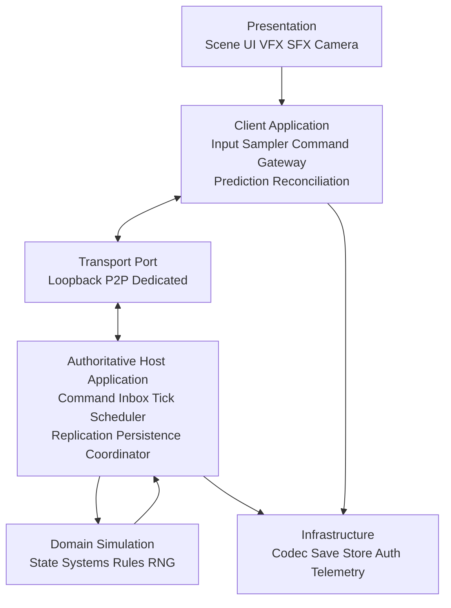
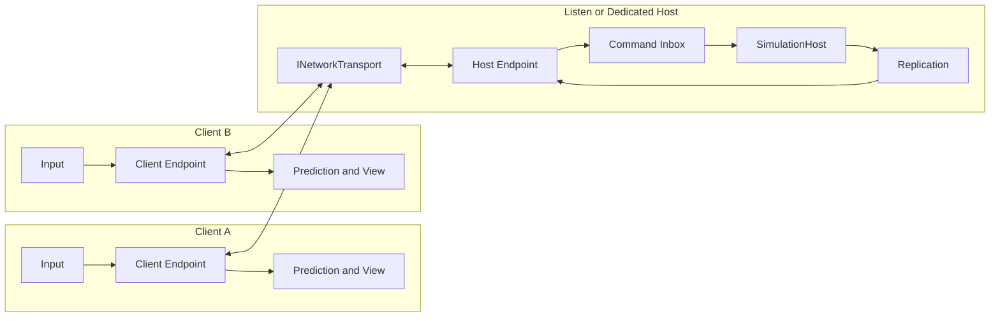
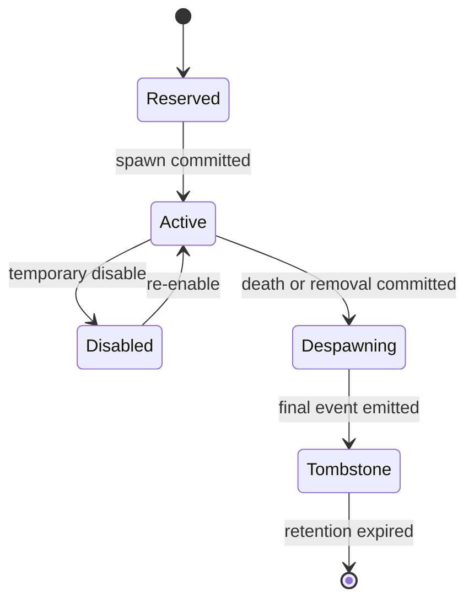
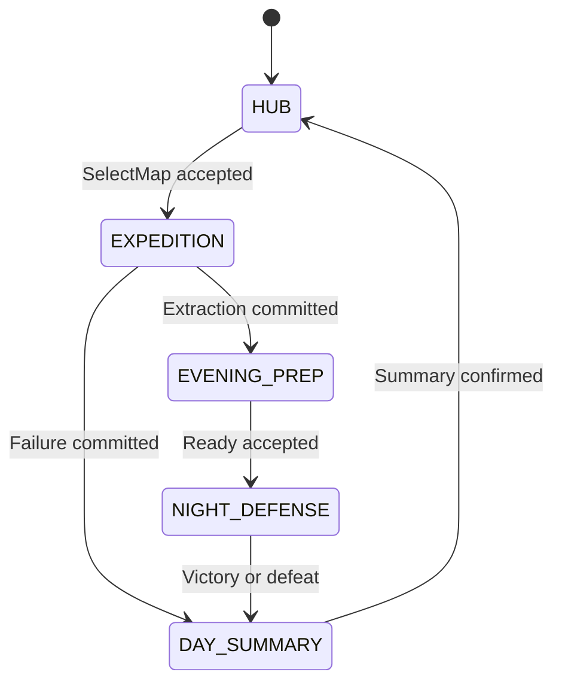
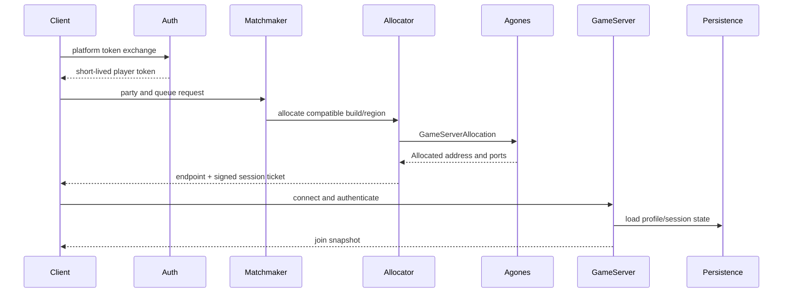

# Vivv 게임 시스템 아키텍처

## Single-player First, Multiplayer-Ready

> 대상: Godot 4.x stable / GDScript 우선 / 2D Isometric 액션·기지 디펜스
>
> 문서 상태: 목표 아키텍처 기준선 v3.0
>
> 출시 전략: Phase 1 순수 싱글플레이 → Phase 2 Listen Server Co-op → Phase 3 Dedicated Server
>
> 적용 방식: 기존 세로 조각을 일괄 폐기하지 않고, 호환 파사드 뒤에서 권위와 통신 경계를 순차 이전한다.

이 문서는 현재 구현을 그대로 묘사하는 문서가 아니라, 현재 코드에서 도달해야 하는 **규범적 목표 구조**와 무중단 이전 순서를 함께 정의한다. 문서의 `MUST`, `SHOULD`, `MAY`는 각각 필수, 권장, 선택 규칙을 뜻한다.

---

## 1. 아키텍처 개요 및 설계 철학

### 1.1 목표

Phase 1은 네트워크 연결 없이 출시한다. 그러나 게임 규칙은 처음부터 다음 형태로 실행한다.

```text
로컬 입력 클라이언트
  → 직렬화 가능한 Command
  → LocalLoopbackTransport
  → 권위 SimulationHost
  → DomainEvent + StateDelta
  → 로컬 프레젠테이션 클라이언트
```

Phase 2와 Phase 3에서는 권위 게임 로직을 유지한 채 `LocalLoopbackTransport`를 P2P 또는 원격 전송 구현으로 교체하고, 로비·인증·배포 어댑터를 바깥에 추가한다. 입력, 게임 규칙, 엔티티 수명 주기, 저장 스냅샷, 프레젠테이션 구독 계약은 유지한다.

### 1.2 변경하지 않는 게임 도메인

```text
HUB
  → EXPEDITION
  → EVENING_PREP
  → NIGHT_DEFENSE
  → DAY_SUMMARY
  → HUB(Day + 1)
```

- `GameStateMachine`의 상태와 허용 전환은 권위 호스트가 단독 소유한다.
- `ItemData`, `MapData`, `StructureData`, `WaveData`는 디자이너용 불변 정의 데이터다.
- 건축 점유의 표준 좌표는 `Vector2i` 셀이다.
- 이동·조준·물리 판정의 표준 공간은 Godot Canvas 월드 좌표다.
- 128×64 Isometric 표현은 프레젠테이션 규칙이며, 권위 데이터에는 셀 또는 월드 좌표만 저장한다.

### 1.3 핵심 결정

| ID | 결정 | 이유 |
|---|---|---|
| ADR-001 | 서버 권위 상태 복제를 사용하고 결정론적 락스텝은 사용하지 않는다. | Godot 물리·내비게이션의 플랫폼 간 비트 단위 결정성을 전제로 하지 않기 위해서다. |
| ADR-002 | 싱글플레이도 Command가 직렬화된 Loopback 경계를 통과한다. | 로컬 직접 호출이 네트워크 전환 시 남는 것을 막는다. |
| ADR-003 | 시뮬레이션 상태에는 단일 작성자 `SimulationHost`만 존재한다. | 경쟁 상태, 이중 정산, 클라이언트 치팅 경계를 제거한다. |
| ADR-004 | 연속 상태는 Snapshot/Delta, 불연속 사실은 DomainEvent로 보낸다. | 이동 이벤트 폭증과 이벤트 유실에 의한 영구 상태 오류를 피한다. |
| ADR-005 | 런타임 `EntityId`는 호스트가 발급하며 `NodePath`나 인스턴스 ID를 프로토콜에 넣지 않는다. | 씬 트리와 네트워크 수명을 분리한다. |
| ADR-006 | `.tres`는 제작 포맷으로 유지하고 런타임에 Simulation/View 카탈로그로 분리한다. | 기존 데이터 호환성과 전용 서버의 그래픽 비의존성을 동시에 보장한다. |
| ADR-007 | 전체 이벤트 소싱은 하지 않는다. | 스냅샷과 제한된 Command Journal만으로 저장, 재접속, 호스트 이전 요구를 충족한다. |
| ADR-008 | 현재 Autoload는 즉시 삭제하지 않고 호환 파사드로 축소한다. | 기존 UI·테스트를 유지하며 내부 소유권을 점진적으로 이전한다. |

### 1.4 비목표

Phase 1에서는 다음을 구현하지 않는다.

- 실제 소켓 연결, 로비, 매치메이킹, 계정 서버
- 범용 ECS, 범용 DI 컨테이너, 서비스 로케이터
- 모든 월드 상태의 영구 이벤트 소싱
- 플랫폼 간 완전 결정론을 위한 전면 고정소수점 물리
- 측정 전 Interest Management, 플로우 필드, 분산 시뮬레이션
- 클라이언트가 판정한 위치, 피해, 재고, 건축 결과의 신뢰

### 1.5 권위와 단일 소유권

| 데이터 | 권위 소유자 | 클라이언트 보유 형태 | 쓰기 경로 |
|---|---|---|---|
| 세션 단계, Day, 결과 | `SessionSystem` | 읽기 전용 복제본 | Command → Host |
| 플레이어 위치·속도 | `MovementSystem` | 예측 상태 + 권위 스냅샷 | MoveIntent → Host |
| HP, 쿨다운, 상태 이상 | `CombatSystem` | 읽기 전용 복제본 | AbilityCommand → Host |
| 개인 가방·장비 | `InventorySystem` | 읽기 전용 복제본 | InventoryCommand → Host |
| 기지 공용 보관함 | `InventorySystem` | revision 포함 복제본 | TransactionCommand → Host |
| 구조물·점유 셀 | `BuildingSystem` | 프리뷰 + 권위 복제본 | BuildCommand → Host |
| 웨이브·AI·RNG | `WaveSystem`/`AISystem` | 필요한 결과만 복제 | Host 내부 Intent |
| VFX, SFX, 카메라 | Presentation | 로컬 전용 | DomainEvent 구독 |
| 키 설정·그래픽 설정 | 로컬 클라이언트 | 원본 | 로컬 설정 저장 |
| 프로필·세이브 | `PersistenceService` | 로드된 권위 스냅샷 | Tick Barrier에서 Commit |

클라이언트는 권위 상태를 직접 수정하지 않는다. 싱글플레이의 클라이언트와 호스트가 같은 프로세스에 있어도 이 규칙은 동일하다.

---

## 2. 레이어드 구조 및 Host-Client Loopback Model

### 2.1 레이어



| 레이어 | 허용 의존성 | 금지 사항 |
|---|---|---|
| Domain Simulation | 값 타입, 정의 카탈로그, 명시적 포트 | `Node`, `SceneTree`, `Input`, 오디오, 셰이더, Autoload 접근 |
| Host Application | Domain, Transport Port, Persistence Port | UI 노드, 카메라, 로컬 입력 읽기 |
| Client Application | Input abstraction, Transport Port, View model | 권위 재고·HP·위상 직접 변경 |
| Presentation | Client view model, PresentationEvent | Command 처리, 규칙 판정 |
| Infrastructure | 파일, 암호화, 네트워크, 플랫폼 SDK | 도메인 규칙 보유 |
| Bootstrap | 구체 구현 생성과 주입 | 게임 규칙 실행 |

### 2.2 목표 파일 구조

현재 파일을 한 번에 이동하지 않는다. 새 책임이 실제로 이전될 때 다음 위치를 사용한다.

```text
res://scripts/
├─ simulation/
│  ├─ model/          # SessionState, EntityState, 값 타입
│  ├─ commands/       # Command DTO, validators, handlers
│  ├─ events/         # DomainEvent DTO
│  ├─ systems/        # movement, combat, inventory, building, wave, ai
│  └─ simulation_host.gd
├─ application/
│  ├─ client/         # input sampler, command gateway, prediction
│  ├─ host/           # tick scheduler, replication, session coordinator
│  └─ protocol/       # envelope, codec, version registry
├─ infrastructure/
│  ├─ transport/      # loopback, later P2P/remote adapters
│  ├─ persistence/    # local store, codec, migrations
│  └─ platform/       # identity, auth, lobby adapters
├─ presentation/      # entity view registry, event presenters
├─ bootstrap/         # composition root
├─ data/              # 기존 Resource 스키마
└─ core/              # 이전 기간의 호환 파사드
```

### 2.3 Composition Root와 의존성 주입

`scenes/main.gd` 또는 전용 `bootstrap/game_composition_root.gd`만 구체 구현을 조립한다.

```text
DefinitionCatalog
PersistenceService
SimulationHost
LoopbackTransport pair
HostEndpoint
ClientEndpoint
PresentationRoot
```

규칙:

- 시스템 생성자는 필요한 의존성을 명시적으로 받는다.
- 엔티티 View는 `setup(entity_id, view_services)`로 초기화한다.
- `get_node("/root/...")`, `find_child()` 또는 전역 싱글톤으로 서비스 탐색을 하지 않는다.
- DI 프레임워크는 도입하지 않는다. Composition Root의 명시적 생성 코드로 충분하다.
- 수명은 `Application > Session > World > Entity > Effect` 순서로 짧아진다.

### 2.4 Phase 1 싱글플레이 데이터 흐름

```mermaid
sequenceDiagram
    participant Input as InputSampler
    participant Client as LocalClientEndpoint
    participant Loop as SerializedLoopbackTransport
    participant Host as SimulationHost
    participant View as Presentation

    Input->>Client: raw input sample
    Client->>Client: build CommandEnvelope(tick, sequence)
    Client->>Loop: send Command bytes
    Loop->>Host: deliver at host inbox
    Host->>Host: validate and advance fixed tick
    Host->>Loop: CommandReceipt + EventBatch + StateDelta
    Loop->>Client: deliver messages
    Client->>View: update view model / presentation events
    View->>View: animation, VFX, SFX, interpolation
```

`SerializedLoopbackTransport`는 같은 프로세스에서도 실제 codec을 통과한다. 직렬화 비용이 측정상 문제가 될 때만 immutable DTO를 큐에 넣는 `ObjectLoopbackTransport`를 release용으로 추가하며, CI에서는 직렬화 경로를 계속 검증한다.

### 2.5 Phase 2/3 멀티플레이 데이터 흐름



Listen Server에서는 Host 플레이어도 원격 클라이언트와 같은 Client Endpoint를 사용한다. Host UI가 `SimulationHost`를 직접 호출하면 안 된다.

### 2.6 스레드 모델

- 시뮬레이션 상태는 고정 틱 스레드의 단일 작성자만 수정한다.
- Phase 1은 Godot 메인 물리 스레드에서 실행해 잠금을 피한다.
- 네트워크 수신 스레드는 byte buffer를 inbox에 넣기만 하며 상태를 수정하지 않는다.
- SceneTree와 물리 노드는 Godot 메인 스레드에서만 접근한다.
- 비동기 Navigation 베이크 완료 결과는 다음 틱의 명령/내부 이벤트로 반영한다.
- 전용 서버에서 시뮬레이션 스레드를 분리하더라도 같은 `ISimulationHost` 계약을 유지한다.

### 2.7 Autoload 이전 정책

현재 등록 순서는 유지한다.

```text
EventBus
InventoryManager
SaveManager
GameManager
```

목표 역할은 다음과 같다.

| 현재 Autoload | 이전 기간 역할 | 최종 역할 |
|---|---|---|
| `GameManager` | 기존 API를 Command로 변환하는 `SessionFacade` | 제거하거나 Bootstrap의 얇은 앱 파사드 |
| `InventoryManager` | 권위 InventorySystem의 읽기 모델/호환 API | Client inventory read model |
| `SaveManager` | `PersistenceService` 위의 로컬 호환 파사드 | Infrastructure adapter |
| `EventBus` | Node 기반 신호를 DTO 이벤트로 변환 | 프레젠테이션 전용 로컬 버스 |

새 Domain 코드는 이 Autoload를 직접 참조하지 않는다. 기존 API는 호출자를 한 번에 고치지 않기 위한 호환층일 뿐 새로운 기능의 진입점이 아니다.

---

## 3. 통신 계약, 시간, ID

### 3.1 시간 모델

- 권위 시뮬레이션 기본 주기는 60Hz다.
- 모든 규칙 시간은 `Tick` 정수로 저장한다. 쿨다운 `0.2초`는 60Hz에서 12틱이다.
- 프레임 `delta`, OS 시각, 클라이언트 시각은 전투·경제 판정에 사용하지 않는다.
- 렌더링은 시뮬레이션 틱 사이를 보간한다.
- 싱글플레이 Pause는 Host Clock을 정지한다. 멀티플레이 Pause는 로컬 메뉴만 열고 Host Clock을 정지하지 않는다.

### 3.2 식별자

| 타입 | 형식 | 발급자 | 용도 |
|---|---|---|---|
| `SessionId` | 128-bit UUID | Session service | 한 게임 세션 |
| `PlayerId` | 64-bit 또는 플랫폼 매핑 ID | Auth/Local identity | 세션 참가자 |
| `ProfileId` | 128-bit UUID | Persistence/Auth | 영구 진행 소유자 |
| `EntityId` | unsigned 64-bit | 권위 Host | 런타임 엔티티 |
| `CommandSequence` | player별 uint32 증가값 | Client endpoint | 순서, 중복 제거 |
| `EventId` | session 내 uint64 증가값 | Host | 프레젠테이션 중복 제거 |
| `DefinitionId` | `snake_case` StringName | 콘텐츠 제작 | 아이템·구조물·웨이브 정의 |

`EntityId`는 `authority_epoch`와 단조 증가 counter를 조합한다. Host migration 후 epoch를 증가시켜 새 ID 충돌을 막고 기존 EntityId는 유지한다. 저장 후에도 동일해야 하는 구조물은 별도 `PersistentEntityId`를 가진다.

### 3.3 RNG

- 권위 난수는 `loot`, `wave`, `ai`, `combat`처럼 이름이 있는 스트림으로 분리한다.
- 모든 스트림 seed와 현재 상태는 저장/호스트 이전 스냅샷에 포함한다.
- Domain에서 전역 `randf()`를 직접 호출하지 않는다.
- 프레젠테이션용 파편·카메라 노이즈는 별도 로컬 RNG를 사용하며 게임 결과에 영향을 주지 않는다.
- 동일 build와 엔진에서 Command Replay가 같은 규칙 상태 checksum을 내야 한다. 플랫폼 간 물리 결과의 비트 동일성은 보장하지 않는다.

### 3.4 Message Envelope

Wire format은 클래스명이나 Godot `Variant`를 직렬화하지 않는다. 명시적 type ID와 기본 숫자·문자열·배열만 사용한다.

```json
{
  "protocol_version": 3,
  "message_type": 1001,
  "session_id": "c1d3...",
  "sender_player_id": 7,
  "client_tick": 18420,
  "sequence": 991,
  "payload": {}
}
```

필수 헤더:

```text
protocol_version
message_type
session_id
sender_player_id
client_tick 또는 server_tick
sequence 또는 event_id
payload_length
```

네트워크 단계에서는 connection에서 인증된 PlayerId를 사용하며 payload의 PlayerId를 신뢰하지 않는다.

### 3.5 Command 계약

Command는 “결과”가 아니라 “의도”다.

```text
MoveIntent      {entity_id, axis_x_i8, axis_y_i8}
AimIntent       {entity_id, angle_u16}
AbilityCommand  {entity_id, ability_id, pressed, target_hint}
InteractCommand {entity_id, target_entity_id}
BuildCommand    {builder_entity_id, structure_id, anchor_cell, rotation, expected_grid_revision}
RemoveBuild     {builder_entity_id, structure_entity_id, expected_grid_revision}
PhaseCommand    {action_id, expected_phase_revision}
InventoryCommand {action_id, item_id, amount, expected_inventory_revision}
```

규칙:

- 연속 이동·조준은 틱마다 최신 상태 하나만 유지한다.
- 발사, 대시, 상호작용, 건축은 edge command로 보존한다.
- Command payload에는 최종 위치, 최종 피해량, 최종 자원량을 넣지 않는다.
- Host는 세션 상태, 소유권, 거리, 쿨다운, 재고, revision, rate limit을 검증한다.
- 트랜잭션 Command는 `expected_revision` 불일치 시 `stale_revision`으로 거부한다.
- Host 처리 순서는 `server_tick → player_id → sequence`로 고정한다.
- 이미 처리한 sequence는 재적용하지 않고 이전 receipt를 반환한다.

### 3.6 Command Receipt

```text
CommandReceipt {
  player_id,
  sequence,
  accepted,
  reason_code,
  server_tick,
  resulting_revision
}
```

표준 거부 사유는 `invalid_state`, `not_owner`, `out_of_range`, `cooldown`, `insufficient_resource`, `occupied`, `blocked_route`, `stale_revision`, `rate_limited`, `unknown_definition`이다. UI 문자열은 reason code와 분리한다.

### 3.7 DomainEvent와 State Snapshot

DomainEvent는 이미 확정된 불연속 사실이다.

```text
EntitySpawned
EntityDespawned
AbilityStarted
ProjectileSpawned
DamageResolved
EntityDied
StructurePlaced
StructureRemoved
InventoryTransactionCommitted
PhaseChanged
WaveStarted
WaveCompleted
SaveCommitted
```

모든 이벤트는 `{event_id, server_tick, type_id, payload}`를 가진다. payload는 EntityId와 값 타입만 포함하며 Node 참조를 포함하지 않는다.

연속 상태는 Snapshot 또는 Delta로 보낸다.

```text
StateSnapshot {
  server_tick,
  baseline_id,
  world_revision,
  entities[],
  session_state,
  acknowledged_sequences{}
}
```

- 전체 Snapshot은 접속, 재접속, baseline 유실, 저장 checkpoint에 사용한다.
- Delta는 변경된 필드와 제거된 EntityId만 포함한다.
- Snapshot은 멱등 적용 가능해야 한다.
- PresentationEvent는 DomainEvent에서 로컬로 파생한다. VFX 종류나 사운드 파일 경로를 DomainEvent에 넣지 않는다.

### 3.8 채널과 전달 보장

| 채널 | 예 | 전달 방식 |
|---|---|---|
| 0 Control | 인증, join, leave, content hash, migration | Reliable Ordered |
| 1 Action/Transaction | ability edge, build, inventory, phase | Reliable Ordered |
| 2 Input State | move, aim, 최근 input 묶음 | Unreliable Sequenced |
| 3 Snapshot | transform/velocity delta | Unreliable Sequenced |
| 4 Critical Event | damage, death, spawn/despawn, wave result | Reliable Ordered |
| 5 Cosmetic Hint | 중요하지 않은 원격 VFX 힌트 | Unreliable Sequenced |

Godot `MultiplayerPeer`의 reliable/unreliable 계열과 독립 채널을 전송 어댑터가 이 의미에 매핑한다. Domain은 Godot transfer mode를 알지 않는다.

### 3.9 Protocol 호환성

- client/server는 handshake에서 `protocol_min`, `protocol_max`, `build_id`, `content_hash`를 교환한다.
- 같은 major protocol 안에서는 필드를 추가만 하고 모르는 필드는 무시한다.
- 필드 의미 변경과 type ID 재사용은 금지한다.
- 지원 범위 밖 버전은 명시적 `protocol_mismatch`로 종료한다.
- Resource 경로, enum ordinal, 스크립트 클래스명은 wire contract가 아니다.
- Save schema version과 network protocol version은 서로 독립적으로 증가한다.

---

## 4. 핵심 시스템 모듈 상세 스펙

### 4.1 Authoritative World State

```text
SimulationWorld
├─ SessionState
│  ├─ phase, phase_revision, day
│  ├─ session_seed, content_hash
│  └─ wave_state, shared_storage, grid_revision
├─ Players: PlayerId → PlayerState
│  ├─ controlled_entity_id
│  ├─ expedition_bag, equipment
│  └─ last_processed_sequence
├─ Entities: EntityId → EntityState
│  ├─ definition_id, owner_player_id, lifecycle
│  ├─ transform, velocity
│  ├─ health, cooldowns, status
│  └─ type-specific state
├─ BuildGridState
└─ RngStreams
```

`SessionState.shared_storage`는 기존 기지 보관함을 수용한다. Solo에서는 Players에 한 명만 존재한다. Co-op에서는 원정 가방·장비는 Player별, 기지 보관함·구조물은 Session 공용이다.

### 4.2 Resource와 Definition Catalog

기존 Custom Resource는 디자이너 제작 포맷으로 유지한다.

```text
ItemData / MapData / StructureData / WaveData (.tres)
  → DefinitionCompiler + validation
  ├─ SimulationDefinitionCatalog
  └─ ViewCatalog
```

| 정의 | Simulation 필드 | View 전용 필드 |
|---|---|---|
| Item | id, category, max_stack, region_tag, meta_value | display_name key, icon |
| Map | id, map_type, spawn weights, time_limit, extraction cells | PackedScene, preview, localized text |
| Structure | id, kind, footprint, cost, max_health, attack stats, blocks_navigation | PackedScene, texture, animation, audio/VFX profile |
| Wave | day, zombie definition IDs, count, interval, direction, delay | UI label, warning presentation profile |
| Ability | id, cooldown ticks, cost, range, damage model, tags | animation, sound, VFX profile |

규칙:

- 기존 `snake_case` DefinitionId는 저장과 프로토콜의 영구 키이므로 변경하지 않는다.
- Simulation catalog에는 `PackedScene`, `Texture2D`, `NodePath`, `Callable`, 번역 문자열을 넣지 않는다.
- 수치 범위, 중복 ID, 존재하지 않는 참조, 순환 prerequisite는 compile 시 실패시킨다.
- catalog는 ID 순서로 canonical serialize하고 `content_hash`를 계산한다.
- client와 host의 simulation content hash가 다르면 세션 시작 전에 거부한다.
- 런타임 상태는 Resource를 수정하지 않고 EntityState와 SessionState에 저장한다.

### 4.3 고정 틱 처리 순서

각 60Hz 틱은 다음 순서를 지킨다.

```text
1. Transport poll / inbox seal
2. Command decode, dedupe, ownership and schema validation
3. Session/phase commands
4. Player and AI intent resolution
5. Movement and collision
6. Ability, projectile, melee and hit resolution
7. Health, stun, death and lifecycle
8. Building transaction and navigation revision
9. AI targeting and wave progression
10. Inventory, rewards and economy transaction
11. Spawn/despawn commit
12. DomainEvent batch and StateDelta build
13. Checksum, metrics, optional checkpoint
```

한 틱 중 생성된 상태 변화는 가능한 한 같은 틱의 후속 시스템에서 보이되, 구조 변경은 lifecycle commit 단계에서 적용해 반복 중 컬렉션 변경을 막는다.

### 4.4 엔티티/컴포넌트 수명 주기



1. Host만 EntityId를 예약한다.
2. 정의 ID와 초기 상태를 검증한 뒤 `EntitySpawned`를 방출한다.
3. Client `EntityViewRegistry`가 DefinitionId를 ViewCatalog의 PackedScene에 매핑한다.
4. View Node는 EntityId를 key로 상태를 읽고 시뮬레이션 객체를 소유하지 않는다.
5. Despawn 시 Host는 `EntityDespawned`를 먼저 확정한다.
6. Tombstone은 짧은 기간 유지해 지연된 Command와 Event가 재사용 ID를 가리키지 못하게 한다.

### 4.5 입력 → Command → Simulation

`InputSampler`는 렌더 프레임마다 장치 입력을 읽고 다음 시뮬레이션 틱의 `InputFrame`으로 접는다.

```text
Raw Device Input
  → InputFrameBuilder
  → CommandEnvelope(sequence, predicted_tick)
  → ICommandGateway
  → INetworkTransport
  → Host CommandInbox
  → Validator
  → CommandHandler
  → State mutation + DomainEvent
```

- `Input.get_vector()`는 Client에서 이동 의도를 만들 때만 사용한다.
- Player Node가 `velocity`, HP, ammo를 직접 확정하지 않는다.
- 같은 프레임의 press/release edge가 유실되지 않도록 별도 bitset으로 보존한다.
- 입력 재매핑은 로컬 설정이며 wire에는 의미 기반 `action_id`만 보낸다.

### 4.6 이동과 대시

- 권위 이동은 Host `MovementSystem`이 처리한다.
- 이동 입력은 정규화된 화면 축 의도이며 가속 3200, 마찰 2800 같은 밸런스 값은 Definition/BalanceCatalog에서 읽는다.
- 대시는 `AbilityCommand(dash)`로 요청하고 Host가 쿨다운, 상태, 방향을 검증한다.
- I-frame과 적 통과 여부는 권위 AbilityState의 tick 범위로 저장한다.
- 카메라 흔들림과 잔상은 `AbilityStarted`를 받은 클라이언트가 재생한다.
- Phase 1 Node 기반 `CharacterBody2D` 어댑터를 Host 내부 권위 구현으로 사용할 수 있다. Phase 3 headless 전환 전에는 Node 의존을 `IPhysicsWorld2D` 어댑터 뒤로 제한한다.

### 4.7 전투

```text
AbilityCommand(Fire)
  → ownership/state/cooldown/ammo validation
  → authoritative ray/projectile simulation
  → DamageRequest
  → armor/resistance/critical calculation
  → Health mutation
  → DamageResolved + optional EntityDied
```

- 피해량, 치명타, 명중 대상은 Host만 확정한다.
- 공격자는 `DamageRequest`를 만들고 `HealthSystem` 외에는 HP를 변경하지 않는다.
- 고속 투사체는 Host 물리 월드에서 sweep/raycast로 터널링을 막는다.
- 근접 공격은 원형 후보 조회, cone dot, World occlusion 순서로 판정한다.
- 히트스탑은 규칙 시간을 멈추지 않는 클라이언트 프레젠테이션 효과가 기본이다. Solo 전용 전역 time-scale 연출은 Host Clock과 분리한다.
- 0-frame 조작감은 로컬 muzzle/animation을 CommandSequence에 연결해 예측 재생한다. 피해 숫자와 hit confirmation은 `DamageResolved` 이후에만 확정한다.

### 4.8 인벤토리와 경제 트랜잭션

- 개인 `expedition_bag`와 공용 `shared_storage`를 분리한다.
- 수량은 음수가 될 수 없고 한 Transaction에서 검증과 변경을 원자적으로 수행한다.
- 모든 컨테이너는 `revision`을 가진다.
- Client는 예상 revision과 의도를 보낸다. 불일치 시 최신 컨테이너 Delta와 함께 거부한다.
- UI는 복제 read model만 표시하며 Dictionary를 직접 수정하지 않는다.
- 획득, 소비, 환불, 언로드, 실패 정산은 모두 TransactionId로 중복 적용을 막는다.

### 4.9 Isometric 건축

권위 셀 변환 규칙은 유지한다.

```gdscript
var cell := ground_layer.local_to_map(ground_layer.to_local(world_position))
var world_center := ground_layer.to_global(ground_layer.map_to_local(cell))
```

Client Preview:

- 로컬 `BuildGridReadModel`로 경계·점유·재료를 빠르게 예측한다.
- 초록/빨강 프리뷰는 힌트이며 최종 판정이 아니다.
- `BuildCommand`는 anchor cell, rotation, structure ID, expected revision을 보낸다.

Host Transaction:

```text
phase/permission
→ footprint bounds
→ occupied/reserved
→ materials
→ required route
→ allocate EntityId
→ consume + occupy atomically
→ grid_revision++
→ StructurePlaced
→ async nav bake request
```

동시 배치 충돌은 revision과 단일 Host 처리 순서로 해결한다. 먼저 commit된 Command가 승리하고 나머지는 `stale_revision` 또는 `occupied`로 거부된다.

### 4.10 AI, Navigation, Wave

- AI와 Navigation은 Host에서만 실행한다.
- Client는 적 transform, animation state, 주요 event만 받는다.
- AI는 내부 `ActorIntent`를 만들어 플레이어 Command와 동일한 Movement/Combat 시스템을 재사용한다.
- `NavigationAgent2D` 결과는 Host 권위 상태다. 클라이언트에서 같은 path를 재계산해 일치시킬 필요가 없다.
- 속도 지터와 스폰 난수는 권위 RNG stream을 사용한다.
- Staggered navigation tick, separation broad-phase, BuildGrid revision 공유를 유지한다.
- WaveController만 생성 예정 수, 생성 완료 수, 생존 수를 소유한다.
- 웨이브 완료는 `spawn_complete && alive_count == 0`일 때 한 번만 발생한다.

### 4.11 세션 상태 머신

`SessionSystem`은 현재 `GameStateMachine` 전환표를 권위 있게 실행한다.



- phase마다 증가하는 `phase_revision`을 둔다.
- 중복 완료 Command는 이전 receipt를 반환하고 재정산하지 않는다.
- Day 증가, 패배 보상, 저장 checkpoint는 한 transaction에서 순서를 고정한다.
- Co-op 준비는 Player별 ready flag를 모으되 최종 정책은 Host SessionPolicy가 결정한다.

### 4.12 이벤트 기반 Presentation

Presentation은 세 개의 입력만 받는다.

1. `StateSnapshot/Delta`: 위치, HP, ammo, phase 같은 지속 상태
2. `DomainEvent`: 사격, 피해, 사망, 설치 같은 확정 사실
3. `PredictionEvent`: 로컬 플레이어의 즉시 반응용 임시 연출

현재 `VFXPool`, `ProjectilePool`의 시각 트레일, `JuiceHelper`, `CameraTrauma`는 Client Presentation에 남긴다. 권위 투사체와 View 투사체는 같은 EntityId로 연결하되 별도 객체다.

`DamageResolved` 예시:

```text
DomainEvent
  → CombatPresenter
      ├─ target EntityView hit-flash
      ├─ pooled debris and floating text
      ├─ camera trauma if local relevance
      └─ audio cue
```

Presentation 실패는 시뮬레이션 상태를 되돌리지 않는다. EventId를 기억해 재전송된 critical event의 효과를 중복 재생하지 않는다.

### 4.13 예측과 Reconciliation

Phase 1 Loopback에서도 로컬 플레이어 이동 예측 경로를 사용할 수 있지만 필수는 아니다. Phase 2부터 다음 계약을 적용한다.

1. Client는 input sequence별 예측 상태를 저장한다.
2. Snapshot의 `acknowledged_sequence`까지 입력을 제거한다.
3. 권위 상태로 되감고 남은 입력을 다시 적용한다.
4. 작은 위치 오차는 렌더 transform만 부드럽게 보정한다.
5. 충돌, 대시 거부, 사망 같은 큰 오차는 즉시 권위 상태로 전환한다.

원격 엔티티는 예측하지 않고 snapshot buffer를 보간한다. AI 300체 전체에 rollback을 적용하지 않는다.

---

## 5. 저장 및 데이터 관리

### 5.1 저장 원칙

- 저장은 권위 `SimulationWorld`의 tick barrier snapshot만 사용한다.
- UI Node나 View transform을 저장하지 않는다.
- network DTO와 save DTO는 별도 schema다.
- 저장 중 Command를 직접 섞지 않는다. 현재 틱을 commit한 뒤 immutable snapshot을 만든다.
- 로컬, 클라우드, DB 저장은 같은 `IPersistenceStore` 의미 계약을 구현한다.

### 5.2 Save Envelope v3

```json
{
  "schema_version": 3,
  "save_id": "uuid",
  "profile_id": "uuid",
  "slot_id": "slot_01",
  "revision": 42,
  "parent_revision": 41,
  "build_id": "1.0.0+1234",
  "content_revision": "sha256:...",
  "created_at_utc": "2026-09-03T08:00:00Z",
  "updated_at_utc": "2026-09-03T09:10:00Z",
  "integrity": {
    "algorithm": "SHA-256",
    "digest": "base64"
  },
  "encryption": {
    "algorithm": "AES-256-GCM",
    "key_id": "platform-key-1",
    "nonce": "base64",
    "tag": "base64"
  },
  "payload": {
    "checkpoint_tick": 18420,
    "session": {
      "phase": "HUB",
      "phase_revision": 9,
      "day": 3,
      "session_seed": 829173,
      "rng_streams": {}
    },
    "profiles": {},
    "shared_storage": {},
    "players": {},
    "entities": [],
    "build_grid": {},
    "meta_progress": {},
    "day_start_snapshot": {}
  }
}
```

JSON은 Phase 1의 디버깅 가능한 저장 포맷으로 유지해도 된다. 파일 크기와 로드 시간이 예산을 넘을 때만 MessagePack/Protobuf 같은 binary codec을 검토한다.

### 5.3 원자적 로컬 저장

```text
authoritative snapshot
→ schema validation
→ canonical serialize
→ optional compress
→ encrypt/authenticate
→ write .tmp + flush
→ verify read-back
→ current → .bak
→ atomic replace
```

- 손상 파일은 덮어쓰지 않고 `.corrupted.<timestamp>`로 보존한다.
- 마지막 정상본과 backup을 함께 유지한다.
- 저장 실패는 현재 세션 상태를 변경하지 않는다.
- 암호화 키는 OS credential store 또는 플랫폼 SDK에 보관한다.
- 클라이언트 내부 키는 추출 가능하므로 로컬 암호화는 완전한 치팅 방지가 아니라 개인정보 보호와 변조 난이도 상승 수단이다.
- 암호 알고리즘을 직접 구현하지 않는다. 검증된 플랫폼 crypto를 사용한다.
- 암호화하지 않은 저장은 SHA-256으로 우발적 손상만 검출한다. 변조 저항이 필요하면 플랫폼 키 기반 HMAC을 사용한다.
- AES-GCM을 사용할 때는 GCM tag가 인증을 담당하므로 같은 payload에 HMAC을 중복 적용하지 않는다. envelope의 schema, profile, revision은 AAD로 인증한다.

### 5.4 스키마 Migration

- 각 migration은 `N → N+1`의 순수 변환이다.
- 원본을 복사한 뒤 migration chain을 적용하고 최종 schema를 다시 검증한다.
- migration은 두 번 적용해도 같은 결과가 나와야 한다.
- 알 수 없는 더 높은 schema는 임의로 낮추지 않고 `save_from_newer_version`으로 거부한다.
- ID rename은 명시적 alias table로 처리하고 없는 정의를 임의 기본값으로 바꾸지 않는다.
- CI는 출시된 모든 golden save fixture를 최신 버전까지 올린다.

### 5.5 Cloud Save와 충돌

`revision` 또는 backend ETag를 사용한 compare-and-swap을 적용한다.

```text
Read(slot) → revision 41
Commit(parent=41, revision=42)
  ├─ backend current == 41: success
  └─ backend current != 41: conflict
```

- 같은 lineage는 높은 revision을 선택할 수 있다.
- 분기된 월드 상태는 자동 병합하지 않는다.
- 설정·업적처럼 교환법칙이 검증된 필드만 별도 정책으로 병합한다.
- 사용자에게 local/cloud 시간, Day, playtime을 보여 선택하게 하고 폐기본을 일정 기간 보존한다.

### 5.6 Dedicated Persistence

Phase 3에서 권장 경계:

```text
Game Server
  → short-lived session result / checkpoint
  → Persistence API
  → PostgreSQL transactional profile state
  → Object Storage for large snapshots/replays
```

- Game Server가 DB credential을 클라이언트에 노출하지 않는다.
- RDBMS는 프로필, 화폐, 해금, revision 같은 트랜잭션 데이터의 기본값이다.
- Redis는 매치 세션·presence·짧은 lease처럼 유실 가능한 상태에만 선택적으로 사용한다.
- NoSQL은 실제 접근 패턴과 규모가 RDBMS 한계를 증명한 뒤 도입한다.

---

## 6. 인터페이스 스펙

아래 예시는 언어에 종속되지 않는 경계를 C#과 C++로 구체화한 것이다. Phase 1 GDScript 구현도 같은 의미 계약을 지켜야 한다.

### 6.1 C# 계약 예시

```csharp
using System;
using System.Buffers;
using System.Collections.Generic;
using System.Threading;
using System.Threading.Tasks;

public readonly record struct PeerId(ulong Value);
public readonly record struct PlayerId(ulong Value);
public readonly record struct EntityId(ulong Value);
public readonly record struct SimulationTick(ulong Value);

public enum DeliveryMode
{
    ReliableOrdered,
    UnreliableSequenced
}

public enum TransportRole
{
    Loopback,
    Client,
    Server
}

public enum PeerEventKind
{
    Connected,
    Disconnected
}

public readonly record struct TransportChannel(byte Value);
public readonly record struct TransportEndpoint(string Address, int Port);
public readonly record struct TransportConfig(
    TransportRole Role,
    TransportEndpoint Endpoint,
    int MaxPeers);
public readonly record struct PeerEvent(
    PeerId Peer,
    PeerEventKind Kind,
    string Reason);

public readonly record struct Packet(
    PeerId Source,
    TransportChannel Channel,
    DeliveryMode Delivery,
    ReadOnlyMemory<byte> Payload);

public interface INetworkTransport : IAsyncDisposable
{
    bool IsConnected { get; }
    ValueTask StartAsync(TransportConfig config, CancellationToken ct);
    ValueTask SendAsync(
        PeerId target,
        TransportChannel channel,
        DeliveryMode delivery,
        ReadOnlyMemory<byte> payload,
        CancellationToken ct);
    bool TryReceive(out Packet packet);
    bool TryDequeuePeerEvent(out PeerEvent peerEvent);
    void Poll();
    void Disconnect(string reason);
}

public interface IMessageCodec
{
    ushort ProtocolVersion { get; }
    IMemoryOwner<byte> Encode<T>(in T message);
    bool TryDecode<T>(ReadOnlySpan<byte> bytes, out T message);
}

public interface IMessageBus
{
    IDisposable Subscribe<T>(Action<T> handler);
    void Publish<T>(in T message);
}

public readonly record struct CommandEnvelope(
    ushort ProtocolVersion,
    Guid SessionId,
    PlayerId Player,
    EntityId ControlledEntity,
    SimulationTick PredictedTick,
    uint Sequence,
    ushort CommandType,
    ReadOnlyMemory<byte> Payload);

public readonly record struct CommandReceipt(
    PlayerId Player,
    uint Sequence,
    bool Accepted,
    ushort ReasonCode,
    SimulationTick ServerTick,
    ulong ResultingRevision);

public interface ICommandGateway
{
    void Submit(in CommandEnvelope command);
}

public interface ISimulationHost
{
    SimulationTick CurrentTick { get; }
    void Enqueue(in CommandEnvelope command);
    SimulationStepResult StepOneTick();
    WorldSnapshot CaptureSnapshot();
    void Restore(WorldSnapshot snapshot);
}

public readonly record struct SimulationStepResult(
    SimulationTick Tick,
    IReadOnlyList<CommandReceipt> Receipts,
    IReadOnlyList<DomainEvent> Events,
    StateDelta Delta,
    ulong StateChecksum);

public interface IPersistenceStore
{
    ValueTask<SaveReadResult> ReadAsync(
        string profileId,
        string slotId,
        CancellationToken ct);

    ValueTask<SaveCommitResult> CompareExchangeAsync(
        SaveEnvelope envelope,
        long expectedRevision,
        CancellationToken ct);
}

public interface IIdentityProvider
{
    ValueTask<IdentityToken> GetLocalIdentityAsync(CancellationToken ct);
    ValueTask<SessionTicket> GetSessionTicketAsync(
        Guid sessionId,
        CancellationToken ct);
}
```

`IMessageBus`는 한 endpoint 내부의 typed routing에만 사용한다. 네트워크 전송을 숨기는 전역 이벤트 버스로 사용하지 않는다. 반환값이 필요한 Command는 Receipt로 비동기 응답한다.

### 6.2 C++ 계약 예시

```cpp
#include <cstddef>
#include <cstdint>
#include <functional>
#include <span>
#include <string_view>

struct PeerId { std::uint64_t value; };
struct Tick { std::uint64_t value; };

enum class DeliveryMode : std::uint8_t {
    ReliableOrdered,
    UnreliableSequenced
};

enum class TransportRole : std::uint8_t {
    Loopback,
    Client,
    Server
};

struct TransportConfig;
struct PeerEvent;

struct PacketView {
    PeerId source;
    std::uint8_t channel;
    DeliveryMode delivery;
    std::span<const std::byte> payload;
};

class INetworkTransport {
public:
    virtual ~INetworkTransport() = default;
    virtual bool Start(const TransportConfig& config) = 0;
    virtual bool Send(
        PeerId target,
        std::uint8_t channel,
        DeliveryMode delivery,
        std::span<const std::byte> payload) = 0;
    virtual void Poll(
        const std::function<void(PacketView)>& on_packet,
        const std::function<void(const PeerEvent&)>& on_peer_event) = 0;
    virtual void Disconnect(std::string_view reason) = 0;
};

struct CommandEnvelope;
struct SimulationStepResult;
struct WorldSnapshot;

class ISimulationHost {
public:
    virtual ~ISimulationHost() = default;
    virtual Tick CurrentTick() const = 0;
    virtual void Enqueue(CommandEnvelope command) = 0;
    virtual SimulationStepResult StepOneTick() = 0;
    virtual WorldSnapshot CaptureSnapshot() const = 0;
    virtual bool Restore(const WorldSnapshot& snapshot) = 0;
};

struct SaveCommitResult;
struct SaveEnvelope;

class IPersistenceStore {
public:
    virtual ~IPersistenceStore() = default;
    virtual SaveCommitResult CompareExchange(
        const SaveEnvelope& envelope,
        std::int64_t expected_revision) = 0;
};
```

### 6.3 Godot/GDScript 매핑

| 계약 | Phase 1 구현 | Phase 2/3 교체 |
|---|---|---|
| `INetworkTransport` | `SerializedLoopbackTransport : RefCounted` | ENet/플랫폼 P2P/전용 소켓 adapter |
| `IMessageCodec` | 명시적 Dictionary ↔ PackedByteArray codec | binary codec 가능 |
| `IMessageBus` | endpoint별 signal/router | 동일 |
| `ISimulationHost` | 고정 틱 `RefCounted` + 필요한 Host Node adapter | headless host 구현 |
| `IPersistenceStore` | `LocalFileStore` | `CloudSaveStore` 또는 `RemotePersistenceStore` |
| `IIdentityProvider` | `LocalIdentityProvider` | 플랫폼/백엔드 identity adapter |

GDScript 4.2에는 언어 수준 interface가 없으므로 메서드 이름만 맞춘 빈 추상 클래스들을 늘리지 않는다. 소비자는 한 계약만 바라보고, 각 구현은 공통 conformance test를 통과해야 한다. 두 번째 구현이 생기는 Phase 2에서 공통 C# interface 또는 GDExtension port를 추출할 수 있다.

### 6.4 Godot Networking 사용 경계

Godot `MultiplayerPeer`는 peer, 전달 방식, 채널을 제공하므로 Transport Adapter 내부에서 활용할 수 있다. 다만 Godot의 high-level MultiplayerAPI wire protocol은 구현 세부사항이므로 외부 비-Godot 서버와의 영구 프로토콜로 간주하지 않는다. Domain Command/Event schema가 엔진 RPC signature에 종속되어서는 안 된다.

---

## 7. 멀티플레이어 전환 로드맵

### 7.1 Phase 1 — Solo / Local Loopback

배포 형태:

```text
One Process
├─ Local Client Endpoint
├─ Serialized Loopback Transport Pair
├─ Authoritative Simulation Host
└─ Local Persistence Store
```

완료 조건:

- 모든 플레이어 의도가 Command Gateway를 통과한다.
- DomainEvent payload에 Node 참조가 없다.
- Host 밖에서 HP, inventory, phase, grid를 쓰지 않는다.
- fixed tick replay와 snapshot restore가 동작한다.
- 기존 세로 조각 테스트가 호환 파사드를 통해 계속 통과한다.

### 7.2 Phase 2 — P2P / Listen Server Co-op

교체 모듈:

| Phase 1 | Phase 2 |
|---|---|
| `LocalIdentityProvider` | 플랫폼 Identity/Lobby adapter |
| `SerializedLoopbackTransport` | `PlatformP2PTransport` 또는 `ENetTransport` |
| 단일 LocalClient | Host local client + remote clients |
| 즉시 Snapshot | 60Hz simulation + 초기 20Hz replication |
| 예측 선택 | local player prediction/reconciliation 필수 |
| Local save only | Host checkpoint + 선택적 cloud sync |

기본 모델은 mesh P2P가 아니라 **한 명의 권위 Listen Host**다. 원격 클라이언트는 서로에게 게임 Command를 보내지 않는다.

#### Host migration

호스트 이전 패키지:

```text
MigrationCheckpoint {
  protocol_version,
  content_hash,
  session_id,
  authority_epoch,
  checkpoint_tick,
  world_snapshot,
  rng_states,
  last_processed_sequence_by_player,
  command_journal_tail,
  snapshot_hash
}
```

절차:

1. Host가 기본 2초마다 checkpoint를 후보 peer에 전송한다.
2. Lobby service가 차기 Host를 선출한다.
3. 입력을 잠시 buffer하고 가장 높은 검증된 checkpoint를 선택한다.
4. 새 Host가 authority epoch를 증가시키고 journal tail을 replay한다.
5. 모든 client가 새 endpoint로 연결해 snapshot hash를 확인한다.
6. ack되지 않은 로컬 Command를 sequence 기준으로 재전송한다.
7. resume tick을 합의한 뒤 시뮬레이션을 재개한다.

P2P Host는 원칙적으로 신뢰 대상이므로 악의적 Host 치팅을 완전히 막을 수 없다. 공정성·영구 경제가 핵심 요구가 되는 순간 Dedicated Server로 전환한다.

초기 Co-op에서는 전투 중 seamless migration이 안정성 예산을 넘으면 checkpoint 복구 후 최근 수초 재개를 허용한다. 메뉴나 phase 경계에서만 이전하는 정책으로 시작해도 프로토콜 형식은 유지한다.

### 7.3 Phase 3 — Dedicated Server

배포 흐름:



구성:

- 인증 서비스: 플랫폼 토큰 교환, short-lived session ticket 발급
- Party/Lobby: 멤버, ready, region, build compatibility
- Matchmaker: 모드·지역·MMR 정책
- Allocator: Agones Fleet에서 GameServer 원자 할당
- Game Server: headless `SimulationHost`, 권위 검증, replication
- Persistence API: 프로필·메타 진행의 compare-and-swap
- Telemetry: tick, network, session outcome, crash metadata

Agones `Fleet`은 준비된 GameServer 집합을 관리하고 `GameServerAllocation`은 조건에 맞는 서버 하나를 원자적으로 `Allocated` 상태로 전환한다. 세션 수요 기반 Fleet autoscaling을 우선하고, 그 아래 Kubernetes node autoscaling이 unschedulable pod를 수용한다. 일반 웹 Deployment의 CPU HPA를 게임 세션 할당 정책 대신 사용하지 않는다.

### 7.4 Scale-out 교체 매트릭스

| Port | Solo | Listen Server | Dedicated |
|---|---|---|---|
| Transport | Serialized Loopback | P2P/ENet | UDP/ENet 또는 플랫폼 relay |
| Identity | Local profile | Platform lobby identity | Backend-issued identity/token |
| Authority | In-process host | Player listen host | Headless game server |
| Persistence | Atomic local file | Host local + cloud checkpoint | Persistence API + RDBMS |
| Session discovery | Local new/load | Platform lobby | Matchmaker + allocator |
| Host recovery | Local save | Migration checkpoint | Replacement session/reconnect policy |
| Telemetry | local debug log | session metrics | centralized metrics/traces |

Domain Simulation, Command schema, Event schema, EntityId, tick order는 세 단계에서 교체하지 않는다.

---

## 8. 현재 코드베이스 이전 가이드

### 8.1 현재 결합 지점

현재 구현은 다음 직접 참조를 사용한다.

- `entities/player/player.gd`가 Input, GameManager, 물리 이동, 투사체 생성, VFX를 함께 처리한다.
- `GameManager`가 상태, 정산, InventoryManager, SaveManager, 구조물 복원을 함께 조정한다.
- `HealthComponent`와 여러 entity가 Node 기반 EventBus를 직접 호출한다.
- 건축 시스템이 재료, 점유, Node instantiate, Navigation bake를 한 객체에서 처리한다.
- EventBus payload에 `Node`가 포함된다.
- `find_child()`와 `/root/*` 조회가 런타임 의존성 주입을 대신한다.

이는 현재 싱글 세로 조각의 결함을 의미하지 않지만 그대로 네트워크 RPC로 감싸면 권위 중복과 desync가 발생한다.

### 8.2 무중단 이전 순서

#### Stage A — Characterization Gate

- 현재 275개 테스트와 성능 기준을 기준선으로 고정한다.
- 상태 전환, 인벤토리, 건축, 전투 결과를 golden fixture로 남긴다.
- 새 구조 이전 중 결과가 달라지는 경우 의도된 규칙 변경인지 분리한다.

#### Stage B — ID와 DTO 도입

- 모든 player, zombie, projectile, structure에 Host 발급 EntityId를 연결한다.
- EventBus의 Node payload 옆에 DTO event를 병행 발행한다.
- View registry를 추가해 EntityId → Node 매핑을 Presentation에만 둔다.
- 기존 Node signal은 호환 기간 유지한다.

#### Stage C — Command Gateway

- `GameManager.request_expedition()`, `Player.shoot()`, 건축 `try_place()` 앞에 Command Gateway를 둔다.
- 기존 메서드는 Command를 만들고 Receipt를 기다리는 파사드가 된다.
- LocalLoopbackTransport conformance test를 추가한다.
- UI와 Input이 권위 메서드를 직접 호출하는 경로를 제거한다.

#### Stage D — 권위 State 추출

다음 순서로 상태 소유권을 Node에서 SimulationWorld로 옮긴다.

```text
Session/Day
→ Inventory transaction
→ Health/Combat cooldown
→ BuildGrid/Structure state
→ Wave/AI
→ Movement/Physics adapter
```

각 단계에서 기존 Node는 새 state의 View/adapter가 되며 public compatibility API는 유지한다.

#### Stage E — Fixed Tick과 Replication

- SimulationHost가 모든 system을 고정 순서로 실행한다.
- Snapshot/Delta와 DomainEvent batch를 생성한다.
- Client read model이 EventBus 대신 replication을 구독한다.
- SaveManager가 Node 순회 대신 WorldSnapshot을 저장한다.

#### Stage F — Network Adapter

- Loopback을 실제 transport로 교체한다.
- packet loss, reorder, latency, duplicate를 주입한 테스트를 통과한다.
- prediction, reconciliation, reconnect, host migration을 단계적으로 활성화한다.

### 8.3 호환성 규칙

- 기존 `.tres` ID와 저장 ID를 변경하지 않는다.
- 기존 v2 save는 migration으로 v3 envelope에 넣는다.
- `GameStateMachine` 전환표는 그대로 재사용한다.
- `BuildGrid`의 셀 점유와 route validation 알고리즘을 Domain system으로 이동하되 결과 코드는 유지한다.
- `ProjectilePool`, `VFXPool`, `JuiceHelper`, `CameraTrauma`는 Presentation으로 이동하며 삭제하지 않는다.
- 기존 테스트를 새 시스템의 공개 Command/Query API로 천천히 전환한다.

### 8.4 Resource 데이터 분리

현재 `StructureData.scene` 같은 presentation 참조를 즉시 제거하지 않는다. Phase 1은 Bootstrap 시 두 카탈로그를 만들고, Dedicated export는 build 단계에서 simulation 전용 artifact를 생성한다.

```text
SimulationDefinitionCatalog
  structure_id → health, footprint, cost, attack stats, blocks_navigation

ViewCatalog
  structure_id → PackedScene, texture, animation, audio/VFX profile
```

Dedicated Server export에서는 authoring Resource 자체가 아니라 scene/texture 참조가 제거된 `SimulationDefinitionCatalog` artifact만 로드한다. ViewCatalog와 그래픽 리소스는 export에서 제외한다. `content_hash`는 simulation artifact의 canonical 값으로 계산한다.

---

## 9. 보안, 무결성, 운영

### 9.1 Client 입력 신뢰 경계

Host는 모든 Command에 대해 다음을 검증한다.

- 인증 connection과 PlayerId 일치
- 제어 Entity 소유권
- 허용된 phase와 lifecycle
- sequence 단조 증가와 duplicate
- payload 크기, 숫자 범위, 문자열 길이
- 이동축과 aim quantization 범위
- rate limit, cooldown, 거리, line of sight
- inventory/build revision과 자원 보존
- DefinitionId가 현재 content catalog에 존재하는지

검증 실패는 reason code와 metric만 남기고 민감한 내부 상태를 client에 반환하지 않는다. 인증 토큰, 세이브 암호화 키, 개인정보를 로그에 기록하지 않는다.

### 9.2 관측 지표

| 영역 | 필수 지표 |
|---|---|
| Simulation | tick p50/p95/p99, overrun, entity count, system별 시간 |
| Commands | inbox depth, accepted/rejected reason, duplicate, rate limit |
| Replication | snapshot bytes/sec, delta size, baseline miss, resend |
| Prediction | correction 거리, replay input 수, hard snap 횟수 |
| AI/Nav | active agents, nav query 수, bake 시간, stagger budget |
| Persistence | serialize/commit latency, migration version, conflict, failure |
| Session | joins, disconnects, migration, completion reason, duration |

로그 correlation key는 `session_id`, `player_id`의 비식별 내부 값, `tick`, `command_sequence`, `event_id`다.

### 9.3 장애 정책

- protocol/content mismatch: 연결 전 명시적 거부
- malformed packet: drop + strike metric, 반복 시 disconnect
- tick overrun: 다음 tick을 건너뛰지 않고 누적 경고; 지속 시 AI budget/replication rate 완화
- persistence 실패: 세션 유지, 재시도 가능한 checkpoint 보관, 사용자에게 상태 표시
- Host disconnect: Phase 2 migration 또는 checkpoint 복구
- Dedicated crash: 세션 정책에 따라 replacement allocation과 마지막 durable checkpoint 복구

---

## 10. 검증 전략과 품질 게이트

### 10.1 테스트 피라미드

| 계층 | 검사 |
|---|---|
| Domain unit | command validation, transaction, state transition, RNG seed |
| Replay | 같은 command log + seed → 같은 rule checksum |
| Loopback integration | encode/decode, receipt, event, snapshot restore |
| Presentation contract | event dedupe, EntityId view lifecycle, prediction cancel |
| Persistence | atomic write, corruption, migration, CAS conflict |
| Network chaos | latency, loss, duplicate, reorder, disconnect/reconnect |
| Host migration | checkpoint selection, journal replay, epoch increment |
| Dedicated smoke | headless boot, auth ticket, join snapshot, graceful shutdown |
| Load/soak | 150~300 AI, 200 projectile, 2~4 clients, 장시간 tick budget |

### 10.2 기존 테스트 보존

현재 다음 테스트는 이전 중 계속 통과해야 한다.

```text
tests/test_core.gd
tests/inventory_test.tscn
tests/grid_building_test.tscn
tests/combat_wave_test.tscn
tests/navigation_test.tscn
tests/full_loop_test.tscn
tests/vertical_slice_test.tscn
```

추가 최소 게이트:

```text
protocol_loopback_test
command_replay_test
entity_lifecycle_test
save_migration_v2_to_v3_test
network_chaos_test
host_migration_test
dedicated_server_smoke_test
```

### 10.3 초기 성능 예산

| 대상 | 초기 예산 |
|---|---|
| Client frame | 16.67ms at 60 FPS |
| Host simulation | 60Hz, p95 8ms 이하를 목표로 시작 |
| 동시 AI | 150~300체 목표 플랫폼 실측 |
| Snapshot | 초기 20Hz, 측정 후 조정 |
| Navigation | 개체별 staggered tick, 한 프레임 집중 금지 |
| Save | gameplay thread 밖 serialization, commit 중 권위 snapshot 불변 |

수치는 출시 하드웨어와 실제 회선 프로파일링으로 확정한다. 목표를 못 맞출 때 가장 비싼 system을 측정해 수정하며, 추측으로 새 캐시·풀·분산 계층을 추가하지 않는다.

### 10.4 Phase별 완료 정의

#### Phase 1 완료

- direct input-to-state mutation 경로가 없다.
- Loopback 직렬화 경계가 모든 Command와 Event에 적용된다.
- Host만 권위 상태를 쓴다.
- Save v3 snapshot과 v2 migration이 검증된다.
- 기존 게임 루프와 테스트가 회귀 없이 동작한다.

#### Phase 2 완료

- 2~4명 Listen Server 세션이 loss/latency 조건에서 완료된다.
- local player prediction과 reconciliation이 측정 가능하다.
- 재접속과 Host migration checkpoint가 검증된다.
- 동시 건축/재고 Command가 revision으로 충돌 해결된다.

#### Phase 3 완료

- headless build가 그래픽 리소스 없이 실행된다.
- 인증되지 않은 client가 권위 Command를 실행할 수 없다.
- Matchmaker → Allocation → Join → Persist → Shutdown 경로가 자동 검증된다.
- 롤링 배포 중 protocol/build compatibility가 지켜진다.
- 부하·장시간·장애 복구 목표가 운영 SLO로 승인된다.

---

## 11. 공식 기술 기준

- [Godot stable networking documentation](https://docs.godotengine.org/en/stable/tutorials/networking/index.html)
- [Godot `MultiplayerPeer`](https://docs.godotengine.org/en/stable/classes/class_multiplayerpeer.html)
- [Godot `OfflineMultiplayerPeer`](https://docs.godotengine.org/en/stable/classes/class_offlinemultiplayerpeer.html)
- [Godot `MultiplayerPeerExtension`](https://docs.godotengine.org/en/stable/classes/class_multiplayerpeerextension.html)
- [Agones documentation](https://agones.dev/site/docs/)
- [Agones GameServerAllocation](https://agones.dev/site/docs/reference/gameserverallocation/)
- [Agones Fleet allocation integration pattern](https://agones.dev/site/docs/integration-patterns/allocation-from-fleet/)
- [Kubernetes workload autoscaling](https://kubernetes.io/docs/concepts/workloads/autoscaling/)
- [Kubernetes node autoscaling](https://kubernetes.io/docs/concepts/cluster-administration/node-autoscaling/)

---

## 12. 최종 불변 규칙

1. **입력은 상태를 바꾸지 않는다. Command를 만든다.**
2. **Host만 권위 상태를 쓴다. Solo도 예외가 아니다.**
3. **Domain은 Node, SceneTree, Input, VFX, Autoload를 모른다.**
4. **EntityId와 값 타입만 통신한다. Node 참조를 보내지 않는다.**
5. **연속 상태는 Snapshot/Delta, 확정 사실은 DomainEvent다.**
6. **규칙 시간은 Tick, 권위 난수는 seed가 있는 stream이다.**
7. **View는 예측할 수 있지만 확정할 수 없다.**
8. **저장은 권위 WorldSnapshot이며 revision으로 commit한다.**
9. **전송·저장·인증은 adapter이며 게임 규칙이 아니다.**
10. **멀티 전환은 Transport와 배포 adapter 교체여야 하며 Domain 재작성이어서는 안 된다.**
